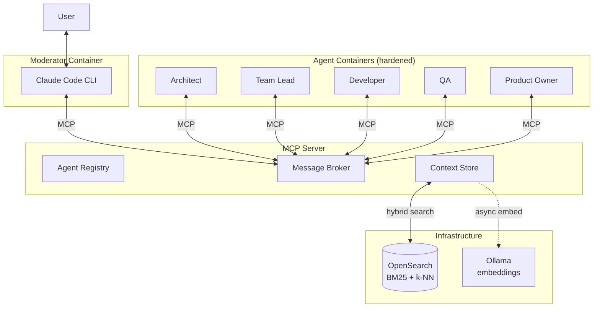

# Quorum

[](https://github.com/ia64mail/quorum/actions/workflows/ci.yml)

> **About this project.** Quorum is a case study used to research AI-agent-driven software development. It is a working system, but its primary purpose is to serve as a hands-on research vehicle, not a production product. Specifically, the project explores:
>
> - **Ticket-driven development** — treating the `tickets/` directory as an implementation timeline knowledge base, where each ticket captures the circumstances, reasoning, and approach behind a discrete unit of work and the codebase remains the source of truth for *how*.
> - **Codebase evolution metrics** — measuring how complexity, entropy, and delivery velocity behave when an autonomous, role-based agent fleet shapes the code over time (see `tools/entropy-report` and `tools/session-report`).
> - **Anthropic SDK and the Model Context Protocol** — a deep dive into the Claude Agent SDK, the MCP server/protocol, transport semantics (Streamable HTTP, sessions, elicitation), tool bridging, and per-role permission enforcement.
> - **Context management in multi-agent environments** — a pull-based context model with scoped storage (project / conversation / agent), hybrid BM25 + vector retrieval, asynchronous embedding, and context postprocessing (bootstrap assembly, summarization, token-budget control) so agents collaborate without ever forwarding full conversation histories.
>
> The methodology behind it is written up in **[Ticket-Driven Development in an Agentic World](https://github.com/ia64mail/quorum/wiki/Ticket-Driven-Development-in-an-Agentic-World)** — start there for the *why*. The remainder of this README describes the system that emerged from these experiments.

Multi-agent AI orchestration for semi-autonomous software development. Quorum coordinates a fleet of role-based AI agents — Architect, Team Lead, Developer, QA, Product Owner — that collaborate on real engineering work, mediated by a Moderator that talks to the user. The Moderator runs as a Claude Code CLI container; each agent is a NestJS app driving Claude through the Agent SDK (`@anthropic-ai/claude-agent-sdk`), with filesystem, bash, and git access. They all communicate through an MCP server using a pull-based context model, so no agent ever forwards another's conversation history.



## Key Ideas

Six things that make Quorum more than "a bunch of agents in containers." Each links to its deep dive in `docs/`.

### Agents as peers, not a pipeline
The Moderator orchestrates, but any agent can invoke any other mid-task. A Developer asks the Architect for clarification; the Architect escalates a business question to the Product Owner; the Product Owner routes a question back to the user through the Moderator's MCP elicitation channel. The Message Broker bounds the mesh with safeguards — call-depth limits, cycle detection, per-role timeouts, registry checks — so delegation can't run away. → [Agent Messaging](docs/agent-messaging.md), [Message Broker](docs/message-broker.md)

### Bidirectional MCP
Standard MCP is unidirectional: hosts call tools, tools return. Quorum agents are themselves LLMs that need to *initiate* calls. The MCP server is both a tool host (exposing `invoke_agent`, the `context_*` family, `wait_invocation`, `new_conversation`, and registration tools — nine tools and two resources in total) and a router that dispatches `POST /invoke` to each agent's registered callback URL. Sessions are pinned per client via `mcp-session-id`, idle-recycled, and reaped on disconnect. → [MCP Connectivity](docs/mcp-connectivity.md)

### Pull-based context — store decisions, not conversations
Agents start lean. Each invocation carries a task description, a correlation ID, and a small bootstrap of pre-fetched project/conversation decisions assembled by the broker — never the caller's chat history. Agents pull what else they need with `context_query`, record *named decisions* (`auth_pattern = "JWT with refresh tokens"`) with `context_store`, and budget-trim long chains with `context_summarize`. No transcripts flow between agents; only distilled facts. → [Context Management](docs/context-management.md)

### Hybrid retrieval over OpenSearch
The Context Store runs on OpenSearch with a single index that fuses BM25 full-text and k-NN vector search (weighted 0.3 / 0.7). Embeddings are computed asynchronously by a local Ollama (`mxbai-embed-large`, 1024-dim) — documents are keyword-searchable on write and semantically searchable within ~300 ms. It degrades gracefully to BM25-only when the embedder is unavailable, and swaps to an `InMemoryStore` for tests and Docker-less development. → [Context Store](docs/context-store.md)

### Role-scoped permissions, mechanically enforced
Each agent role ships with a tool profile combining Claude Code's `disallowedTools` denylist with a `canUseTool` hook for per-call gating. The container itself is hardened — read-only filesystem, dropped Linux capabilities, no-new-privileges, tmpfs scratch space — so the permission profile narrows what an agent *intends* to do, while container hardening is the actual security boundary. → [Claude Code SDK](docs/claude-code-sdk.md)

### Ticket-driven knowledge base
Every unit of work is recorded as a ticket in `tickets/`, sequenced like a timeline. Tickets capture *why* — constraints, alternatives, the reasoning behind a choice; the codebase remains the source of truth for *how*. Combined with `docs/` (the current system) and `tools/session-report` (run telemetry), the repo carries a complete provenance trail for an AI-shaped codebase. → [Knowledge Management](docs/knowledge-management.md), [Ticket Library](tickets/README.md)

## A 30-second vignette

To picture it concretely: a user asks the Moderator to *"Add authentication."* The Moderator invokes the Architect with a thin envelope —

```
{ correlationId: "task-auth-001", caller: "moderator", target: "architect",
  action: "Design the auth system", context: { constraint: "must support OAuth" } }
```

— and the Architect's window starts nearly empty. It pulls a couple of project facts (`context_query(project, "tech stack")`), drafts a design, mid-task invokes the Product Owner to clarify MVP scope, stores its decisions as named keys (`auth_pattern = "JWT with refresh tokens"`, `session_storage = "Redis"`), and returns a concise answer. When the Developer comes along on a later ticket, it pulls those same keys and never sees a word of the Architect's reasoning. Context lives in the store, not the call chain.

A full step-by-step walkthrough — with safeguards, mid-task consultation, and context housekeeping — lives in [Agent Messaging](docs/agent-messaging.md) and [Context Management](docs/context-management.md).

## Project Structure

NestJS monorepo with two applications and one shared library, plus a Claude Code CLI moderator that runs in its own container (no NestJS app of its own):

```
quorum/
├── apps/
│   ├── mcp-server/         # MCP server + Agent Registry + Message Broker + Context Store
│   └── agent/              # Single Docker image, multi-role via AGENT_ROLE env var
├── libs/
│   └── common/             # Shared types, config, prompts, logger, and LLM utils
│       └── src/
│           ├── config/         # Config factories (app, anthropic, logger, mcp)
│           ├── context-store/  # Abstract ContextStore class, types, CompositeKeyBuilder
│           ├── prompts/        # SYSTEM_PREAMBLE + per-role prompt templates
│           ├── logger/         # LoggerBuilder, QuorumLogger (dual transport)
│           ├── llm/            # tool-mapper (MCP → Anthropic schema conversion)
│           └── messaging/      # AgentRole enum, InvokeRequest/Response
├── docs/                   # Architecture documentation
├── tickets/                # Implementation timeline knowledge base
├── tools/                  # entropy-report, session-report
└── docker-compose.yml
```

## Getting Started

### Prerequisites

- Node.js
- Docker & Docker Compose
- **Anthropic API key** — agent LLM, metered API billing (`ANTHROPIC_API_KEY`)
- **Claude Code OAuth token** — moderator subscription auth, flat-rate billing (`CLAUDE_CODE_OAUTH_TOKEN`). Generate by running `claude setup-token` locally; requires a Claude.ai Pro/Max/Team/Enterprise seat
- **GitHub fine-grained PAT** (`GH_TOKEN`) — scoped to the target repo with `Contents: read+write`, `Pull Requests: read+write`, `Metadata: read`. Used by `gh` and git in every container for clone, fetch, push, and PR operations
- **Target repo URL** (`REPO_URL`) — HTTPS clone URL of the project Quorum will work on. Can be the Quorum repo itself when self-hosting

### Setup

```bash
npm install
cp .env.example .env
# Edit .env and set:
#   ANTHROPIC_API_KEY        sk-ant-…           (agents)
#   CLAUDE_CODE_OAUTH_TOKEN  sk-ant-oat01-…     (moderator)
#   GH_TOKEN                 github_pat_…       (gh CLI + git auth, all containers)
#   REPO_URL                 https://github.com/<owner>/<repo>.git
```

### Development

```bash
npm run start:dev          # Start default app in watch mode
npm run build              # Build all apps
npm run lint               # Lint and auto-fix
npm run test               # Run unit tests
npm run test:e2e           # Run end-to-end tests
```

### Docker

```bash
./scripts/start.sh        # build & start all containers
./scripts/start.sh -d     # detached mode
./scripts/moderator.sh    # attach to the running moderator (Claude Code CLI)
```

The startup script exports `HOST_UID`/`HOST_GID` from the current user so bind-mounted log files have correct ownership, then runs `docker compose build` and `docker compose up`. Extra args are forwarded to both commands.

Starts the MCP server, the moderator container (Claude Code CLI), the agent containers, and the OpenSearch + Ollama infrastructure used by the Context Store. There is **no host bind mount of your project** — on first boot the moderator and each agent container authenticate `gh`/git from `GH_TOKEN` and `git clone $REPO_URL` into their own named volumes. All containers operate on their own clones and synchronize through the GitHub remote via `git push`/`git pull`; each agent invocation runs inside an isolated `git worktree` for the requested branch. Agents register with the MCP server on startup and are ready to receive invocations.

## Documentation

| Document | What it covers |
|----------|----------------|
| [System Design](docs/system-design.md) | Architecture, containers, deployment, `quorum.md` config |
| [Agent Messaging](docs/agent-messaging.md) | Bidirectional MCP, `invoke_agent`, communication patterns |
| [MCP Connectivity](docs/mcp-connectivity.md) | Session lifecycle for agents and moderator — establish, maintain, recycle, register, reap |
| [Message Broker](docs/message-broker.md) | Routing, safeguards, transport, availability |
| [Context Management](docs/context-management.md) | MCP tools/resources API, usage patterns |
| [Context Store](docs/context-store.md) | OpenSearch backend with hybrid BM25 + vector search, async embedding pipeline, InMemoryStore for tests |
| [Knowledge Management](docs/knowledge-management.md) | Knowledge management philosophy, three domains, KB concept |
| [Claude Code SDK](docs/claude-code-sdk.md) | Claude Code SDK integration, tool bridge, permissions, hardening |
| [Ticket Library](tickets/README.md) | Ticket conventions and structure guide |

## Tech Stack

- **Runtime**: Node.js + TypeScript
- **Framework**: NestJS (monorepo, webpack)
- **LLM**: Anthropic Claude — agents via `@anthropic-ai/claude-agent-sdk`; moderator runs as Claude Code CLI in a dedicated container
- **Protocol**: Model Context Protocol via `@modelcontextprotocol/sdk` (Streamable HTTP transport)
- **Retrieval**: OpenSearch (BM25 + k-NN) with local Ollama (`mxbai-embed-large`) for embeddings
- **Containerization**: Docker Compose (multi-target Dockerfile: `default` / `agent` / `moderator`)
- **Validation**: Zod
- **Testing**: Jest
