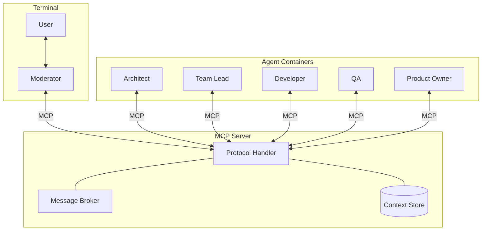
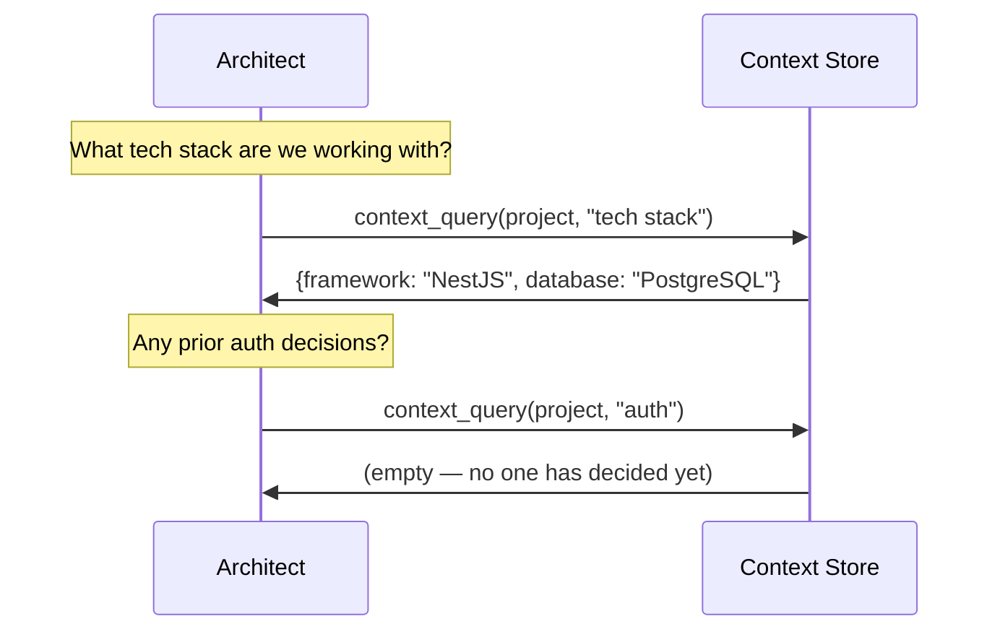
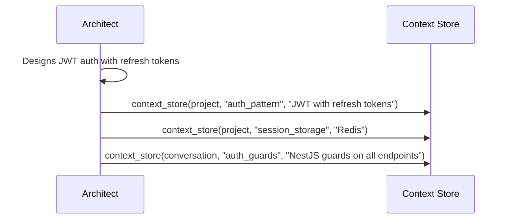
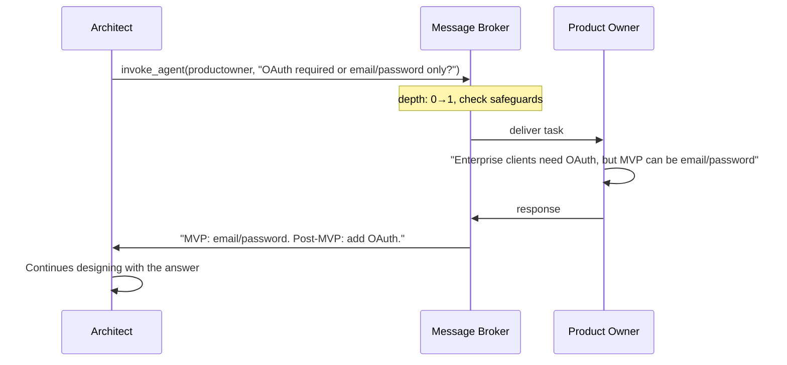
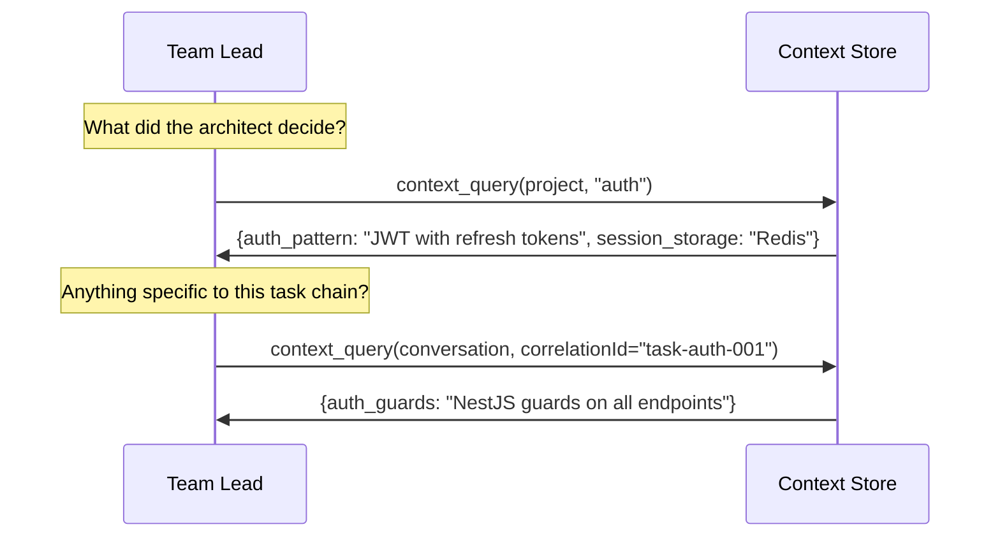
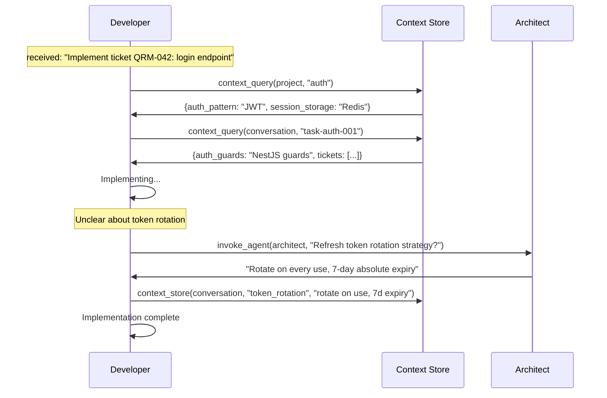
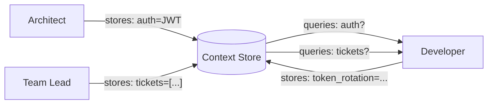

# Quorum

Multi-agent AI orchestration for semi-autonomous software development. Quorum coordinates role-based AI agents that collaborate on development tasks — each agent is an LLM with a specialized role, and they communicate, delegate, and share decisions through an MCP server without ever passing full conversation histories to each other.



A user talks to the **Moderator** through a terminal. The Moderator orchestrates specialized agents — Architect, Team Lead, Developer, QA, Product Owner — by invoking them through the MCP server. Any agent can invoke any other agent mid-task, store decisions for the team, and query decisions left by others.

## Life of a Request

To understand how Quorum works, follow what happens when a user asks: *"Add user authentication to the project."*

The Moderator decides this needs a design first and invokes the Architect. But the Architect doesn't receive the Moderator's conversation history, or any accumulated context blob. It receives a thin envelope:

```
{
  correlationId: "task-auth-001",
  caller: "moderator",
  target: "architect",
  action: "Design the auth system for the project",
  context: { constraint: "must support OAuth" },
  depth: 0
}
```

A task description, a correlation ID to trace the chain, and an optional handful of key-value hints. That's it. The Architect's context window starts nearly empty.

This is the first principle: **agents start lean**.

### Step 1 — The Architect Pulls What It Needs

The Architect knows it needs project context to make good decisions. So it queries the Context Store:



The Context Store holds facts organized into three scopes: **project** (visible to everyone, lives for the whole session), **conversation** (scoped to one task chain via correlationId), and **agent** (private scratchpad). The Architect queries the project scope because tech stack choices are session-wide facts that any earlier agent might have stored.

Nothing was pushed to the Architect. It decided what it needed and pulled just that. This is the second principle: **pull, don't push**.

### Step 2 — The Architect Makes Decisions and Records Them

With project context in hand, the Architect designs the auth system. Then it stores its decisions back into the Context Store so the rest of the team can find them later:



The project-scoped decisions (`auth_pattern`, `session_storage`) are now visible to every agent across every future task. The conversation-scoped decision (`auth_guards`) is only visible to agents working on this specific `correlationId` chain.

This is the third principle: **store decisions, not conversations**. The Architect doesn't preserve its reasoning process or internal monologue. It distills decisions into named facts that others can query by topic.

### Step 3 — The Architect Consults Another Agent Mid-Task

While designing, the Architect realizes it needs business requirements to choose between OAuth and simple email/password. Rather than guessing, it invokes the Product Owner directly:



The invocation passes through the Message Broker, which applies safeguards before delivery. It checks that the call depth hasn't exceeded the limit (default 5) — preventing unbounded delegation chains where agents keep calling agents forever. It checks that the Product Owner isn't already in the active call chain for this `correlationId` — preventing circular deadlocks where A calls B and B calls A. It verifies the Product Owner is registered and connected. And it wraps the call in a role-based timeout (2 minutes for Product Owner, 30 minutes for Developer) so a hung agent can't block the caller indefinitely.

This is the fourth principle: **agents are peers, not a pipeline**. Any agent can consult any other agent at any point. The Architect doesn't have to go back through the Moderator to reach the Product Owner. Communication is a mesh, not a chain.

### Step 4 — The Architect Returns, the Moderator Continues

The Architect finishes and returns a concise text response to the Moderator. The Moderator presents the design to the user, gets approval, and invokes the Team Lead to break the work into tickets.

The Team Lead — just like the Architect before it — starts with a near-empty context window and a thin task envelope. It pulls what it needs:



The Team Lead didn't receive the Architect's full conversation. It queried two scopes and got exactly the decisions it needs. The Architect's internal reasoning, false starts, and consultation with the Product Owner are gone — only the distilled facts survived.

### Step 5 — The Developer Implements

The Moderator assigns the Developer to implement a ticket. Same pattern: thin envelope in, pull context, do work.



The Developer pulled project and conversation context, consulted the Architect mid-task for clarification (the broker checks safeguards: depth is now 1, no circular call, Architect is available), then recorded its own implementation decision back to the conversation scope for whoever comes next.

### Step 6 — Context Housekeeping

As a task chain grows, context can accumulate. An agent can check the budget:

```
context_stats(conversation, "task-auth-001") → {itemCount: 14, estimatedTokens: 3200}
```

If it's getting heavy, the agent compresses:

```
context_summarize("task-auth-001", maxTokens=800, preserveKeys=["auth_pattern"])
```

This keeps the `auth_pattern` decision verbatim while truncating the rest. The summary is stored as a `_summary` key in the conversation scope, keeping agent context windows lean even on long-running tasks.

### What Didn't Happen

No agent received another agent's full conversation history. No context was duplicated at each hop. The Moderator's chat with the user, the Architect's internal reasoning, the Product Owner's clarification — none of that was serialized and forwarded. Each agent started lean, pulled what it needed by topic, recorded decisions as named facts, and returned a concise result.



In a traditional system, context flows through the call chain and grows at every hop. In Quorum, context flows through the store and agents take only what they need.

## Project Structure

NestJS monorepo with three applications and one shared library:

```
quorum/
├── apps/
│   ├── terminal/           # User-facing chat + Moderator LLM
│   ├── mcp-server/         # Communication backbone
│   └── agent/              # Single Docker image, multi-role via AGENT_ROLE env var
├── libs/
│   └── common/             # Shared types and config across all apps
│       └── src/
│           ├── config/         # Config factories (app, anthropic, mcp)
│           ├── context-store/  # Abstract ContextStore class + types
│           └── messaging/      # AgentRole enum, InvokeRequest/Response
├── docs/                   # Architecture documentation
├── tickets/                # Implementation timeline knowledge base
└── docker-compose.yml
```

## Getting Started

### Prerequisites

- Node.js
- Docker & Docker Compose
- Anthropic API key

### Setup

```bash
npm install
cp .env.example .env
# Edit .env — set ANTHROPIC_API_KEY and WORKSPACE_PATH
```

### Development

```bash
npm run start:dev          # Start default app (terminal) in watch mode
npm run build              # Build all apps
npm run lint               # Lint and auto-fix
npm run test               # Run unit tests
npm run test:e2e           # Run end-to-end tests
```

### Docker

```bash
export WORKSPACE_PATH=/path/to/your/project
./scripts/start.sh        # build & start all containers
./scripts/start.sh -d     # detached mode
```

The startup script exports `HOST_UID`/`HOST_GID` from the current user so container bind-mounts (logs, workspace) have correct file ownership, then runs `docker compose build` and `docker compose up`. Extra args are forwarded to both commands.

Starts the MCP server, terminal with moderator, and all agent containers. Agents register on startup and are ready to receive invocations.

## Documentation

| Document | What it covers |
|----------|----------------|
| [System Design](docs/system-design.md) | Architecture, containers, deployment, `quorum.md` config |
| [Agent Messaging](docs/agent-messaging.md) | Bidirectional MCP, `invoke_agent`, communication patterns |
| [Message Broker](docs/message-broker.md) | Routing, safeguards, transport, availability |
| [Context Management](docs/context-management.md) | MCP tools/resources API, usage patterns |
| [Context Store](docs/context-store.md) | Storage backends, InMemoryStore, OpenSearch |
| [Ticket Library](tickets/README.md) | Ticket conventions and structure guide |

## Tech Stack

- **Runtime**: Node.js + TypeScript
- **Framework**: NestJS (monorepo, webpack)
- **LLM**: Anthropic Claude via `@anthropic-ai/sdk`
- **Protocol**: Model Context Protocol via `@modelcontextprotocol/sdk`
- **Containerization**: Docker Compose
- **Validation**: Zod
- **Testing**: Jest