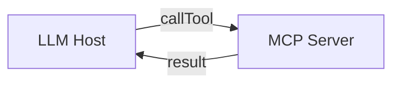
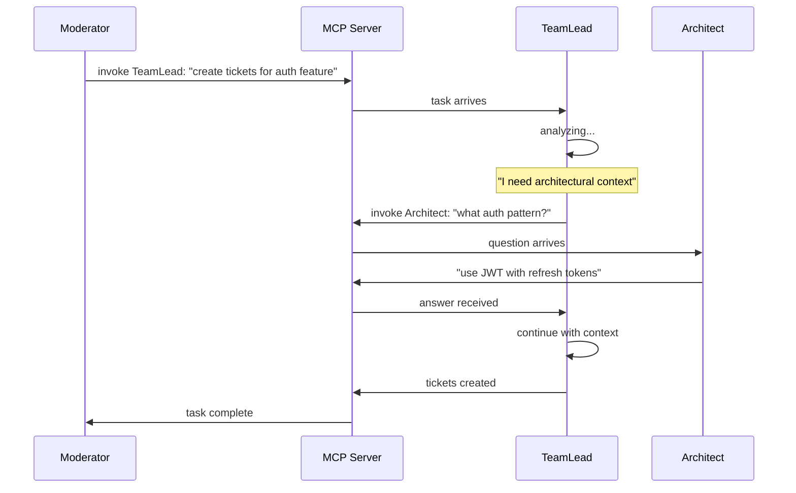
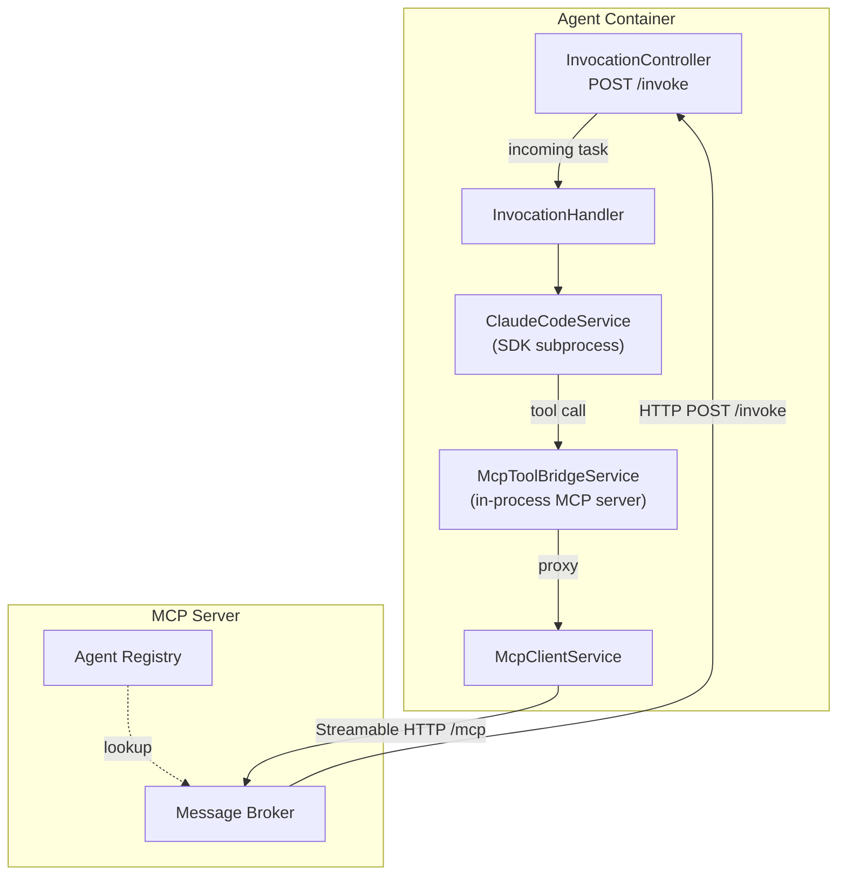
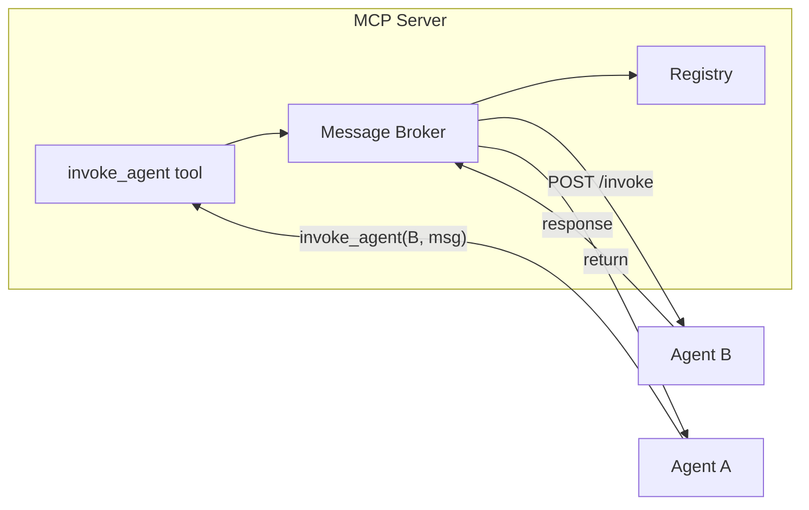
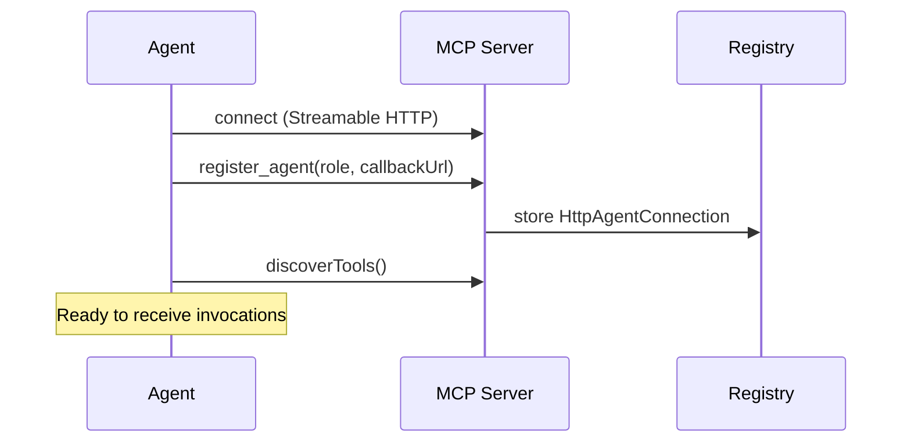
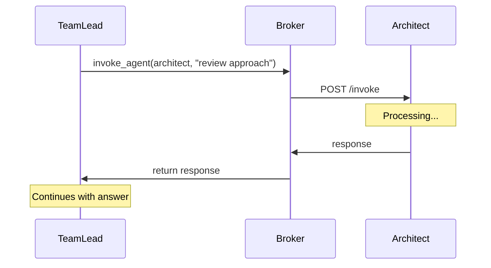
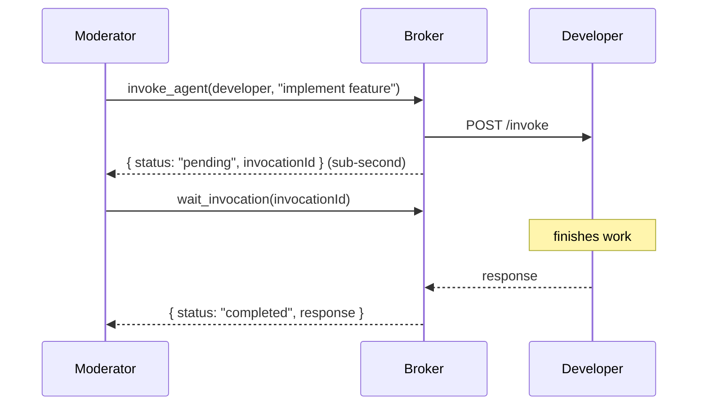
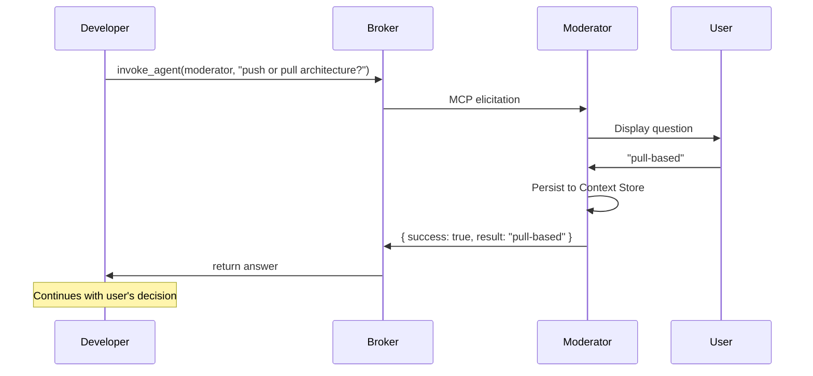

# Agent Messaging in Quorum

## Introduction

Quorum's core capability is **coordinated multi-agent collaboration**. Unlike simple tool-calling patterns where an LLM invokes passive functions, Quorum agents are themselves LLMs that can initiate communication with other agents mid-task.

This document describes the **bidirectional MCP** architecture that enables this behavior. For implementation details, see [Message Broker](message-broker.md). For how Claude Code sessions interact with the MCP layer, see [Claude Code SDK](claude-code-sdk.md).

## The Problem

Standard MCP is unidirectional:



The LLM calls tools; tools execute and return. Tools cannot initiate calls.

In Quorum, agents **are** LLMs. When Moderator asks TeamLead to create tickets, TeamLead may need to ask Architect for clarification:



This requires **bidirectional MCP**: agents are both invocable (like tools) and invokers (like hosts).

## Architecture

### Dual-Role Agents

Each agent participates in two communication paths:



| Path | Direction | Mechanism | Purpose |
|------|-----------|-----------|---------|
| Inbound | MCP Server → Agent | HTTP POST to `/invoke` callback URL | Receives tasks from other agents |
| Outbound | Agent → MCP Server | Streamable HTTP to `/mcp` | Sends requests to other agents via `invoke_agent` |

The outbound path passes through two layers inside the agent: the **MCP Tool Bridge** (an in-process MCP server the SDK subprocess connects to) proxies calls to the **McpClientService** (Streamable HTTP client connected to the remote MCP server). See [Claude Code SDK — MCP Tool Bridge](claude-code-sdk.md#mcp-tool-bridge) for details.

### Message Broker

The Message Broker is the routing core inside the MCP Server. It:

1. Receives `invoke_agent` requests from any connected agent
2. Looks up target agent in Registry
3. Validates safeguards (depth, circular calls, availability)
4. Delivers the message to target's `POST /invoke` endpoint
5. Returns response to caller



See [Message Broker](message-broker.md) for full implementation details.

### The `invoke_agent` Tool

All inter-agent communication flows through a single MCP tool:

```typescript
server.tool('invoke_agent', {
  callerRole: z.enum(AgentRole),           // Identity of the calling agent
  target: z.enum(INVOCABLE_AGENT_ROLES),   // All 6 roles (including moderator)
  action: z.string(),                       // What you need the agent to do
  context: z.record(z.unknown()).optional(), // Relevant context to pass
  wait: z.boolean().default(true),          // Block until response; long-poll continuation for moderator→long-role calls (mcp-connectivity §3.6)
  correlationId: z.string().optional(),     // Generated as UUID if omitted
  depth: z.number().int().min(0).default(0) // Call depth (auto-incremented by bridge)
});
```

When called through the MCP Tool Bridge, `callerRole`, `correlationId`, and `depth` are auto-injected — agents only need to specify `target`, `action`, and optionally `context`.

For moderator → long-timeout-role calls (teamlead, architect, qa, developer, moderator), `invoke_agent` always returns `{ status: "pending", invocationId, next: "call wait_invocation(invocationId)" }` immediately at dispatch (#47). The moderator must then call `wait_invocation(invocationId)` to receive the actual result, repeating until `status` is `completed` or `failed`. Agent-to-agent calls and moderator calls targeting short-timeout roles (productowner) always return an `InvokeResponse` inline. See [MCP Connectivity §3.6](mcp-connectivity.md#36-long-poll-continuation-moderator-only) for the full protocol.

### Agent Registration

Agents register with the MCP server on startup via the `register_agent` tool, providing their role and callback URL:



The registry stores one `HttpAgentConnection` per role. Latest registration wins (handles reconnection without explicit unregister). On shutdown, agents call `unregister_agent` and close the transport.

## Communication Patterns

### Synchronous (wait: true)

The default. Caller blocks until target responds.



**Use when:** Agent needs information to proceed.

**Chaining:** Synchronous calls compose naturally. When Developer calls Architect mid-task, and Architect calls ProductOwner for clarification, each call is a nested synchronous request-response. The call stack unwinds as responses return. The broker tracks depth and circular calls to prevent unbounded chains.

### Long-poll continuation (moderator → long-running agents)

When the moderator invokes a long-timeout role (teamlead, architect, qa, developer, moderator), the server returns `{ status: "pending", invocationId }` immediately at dispatch (#47) and the moderator calls `wait_invocation(invocationId)` to receive the actual result. Each `wait_invocation` POST is capped at 270 s to stay under CC CLI's ~5 min `bodyTimeout`:



The developer's work runs continuously server-side; the pending/wait cycle is purely a protocol-envelope concern for the moderator's HTTP transport. Agent-to-agent calls are unaffected — they complete in a single synchronous round-trip on the 35-min undici dispatcher.

See [MCP Connectivity §3.6](mcp-connectivity.md#36-long-poll-continuation-moderator-only) for the full protocol details including caller-aware gating, the `InvocationResultStore`, and TTL reaping.

### User Clarification (via Moderator)

Agents can invoke the `moderator` to escalate decisions to the user. The MCP server routes the invocation to the moderator's Claude Code CLI container, which surfaces the question to the user via MCP elicitation.



The moderator surfaces the question to the user, collects the answer, persists it to the Context Store (project scope), and returns the answer to the calling agent.

## Summary

Quorum's bidirectional MCP architecture enables:

| Capability | Mechanism |
|------------|-----------|
| Agent-to-agent communication | `invoke_agent` tool via Message Broker |
| Mid-task consultation | Synchronous request-response (wait: true) |
| User escalation | Invoke moderator → MCP elicitation → user |
| Task decomposition | Chained synchronous calls with depth tracking |
| Call safety | Circular call prevention, depth limit, role-based timeouts |
| Long-poll continuation | Moderator → long-role calls split across multiple POSTs via `wait_invocation` ([mcp-connectivity §3.6](mcp-connectivity.md#36-long-poll-continuation-moderator-only)) |
| Fire-and-forget (wait: false) | Schema accepts the parameter but broker always awaits — not yet implemented |

This architecture transforms MCP from a simple tool-calling protocol into a **multi-agent coordination platform**.

See [Message Broker](message-broker.md) for implementation details including safeguards, delivery, and timeouts. See [Claude Code SDK](claude-code-sdk.md) for how the MCP Tool Bridge connects Claude Code sessions to the orchestration layer. See [Context Management](context-management.md) for the context sharing API and [Context Store](context-store.md) for storage backend details.