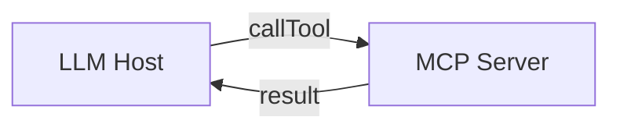
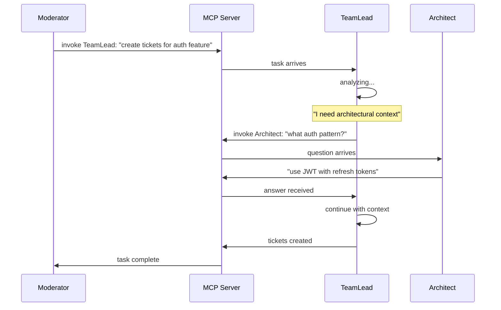
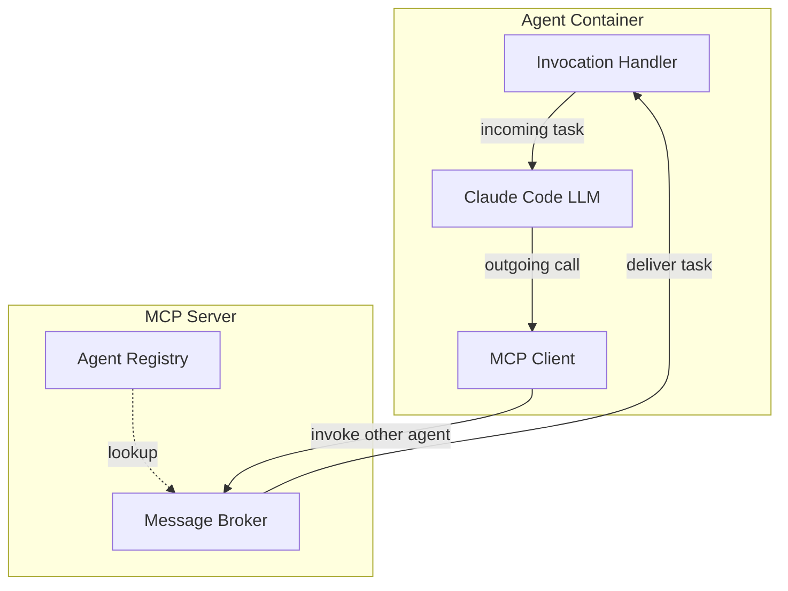
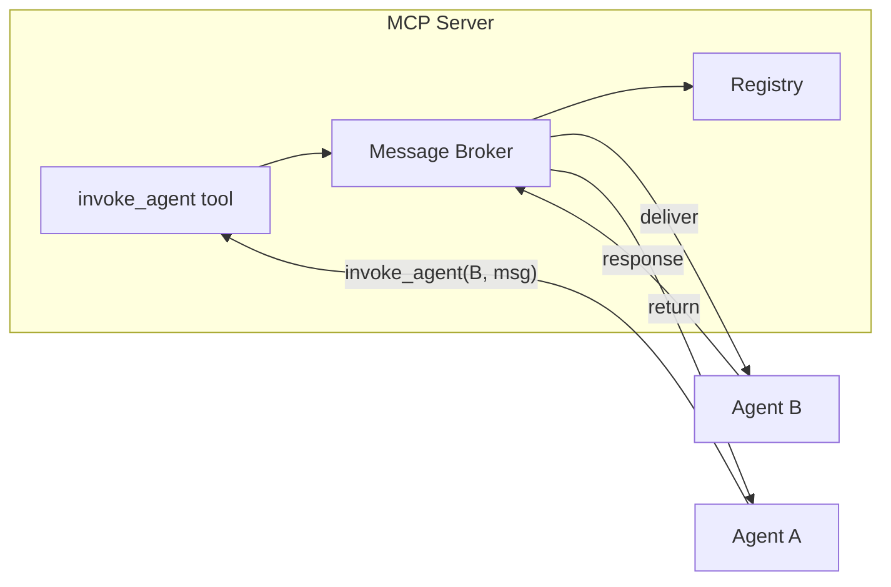
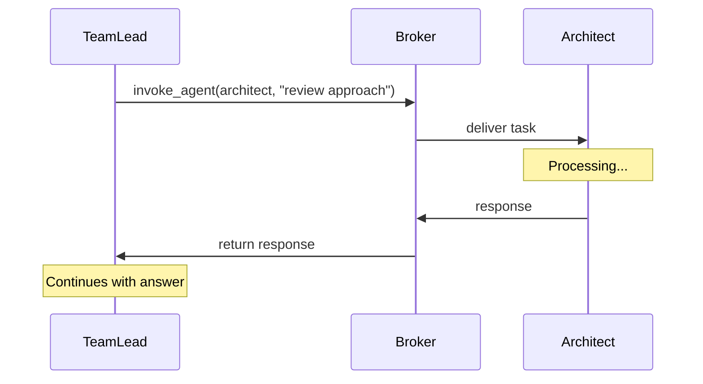
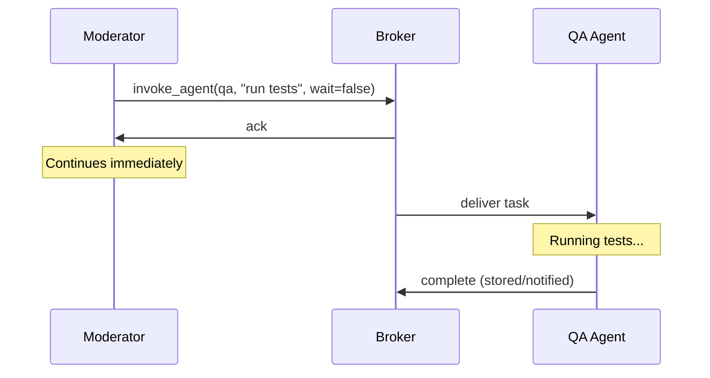

# Agent Messaging in Quorum

## Introduction

Quorum's core capability is **coordinated multi-agent collaboration**. Unlike simple tool-calling patterns where an LLM invokes passive functions, Quorum agents are themselves LLMs that can initiate communication with other agents mid-task.

This document describes the **bidirectional MCP** architecture that enables this behavior. For implementation details, see [Message Broker](message-broker.md).

## The Problem

Standard MCP is unidirectional:



The LLM calls tools; tools execute and return. Tools cannot initiate calls.

In Quorum, agents **are** LLMs. When Moderator asks TeamLead to create tickets, TeamLead may need to ask Architect for clarification:



This requires **bidirectional MCP**: agents are both invocable (like tools) and invokers (like hosts).

## Architecture

### Dual-Role Agents

Each agent maintains two MCP connections:



| Connection | Direction | Purpose |
|------------|-----------|---------|
| Invocation Handler | Inbound | Receives tasks from other agents |
| MCP Client | Outbound | Sends requests to other agents |

### Message Broker

The Message Broker is the routing core inside the MCP Server. It:

1. Receives `invoke_agent` requests from any connected agent
2. Looks up target agent in Registry
3. Delivers the message to target's handler
4. Returns response to caller



### The `invoke_agent` Tool

All inter-agent communication flows through a single MCP tool:

```typescript
server.tool('invoke_agent', {
  target: z.enum(['architect', 'teamlead', 'developer', 'qa', 'productowner']),
  action: z.string().describe('What you need the agent to do'),
  context: z.record(z.any()).optional().describe('Relevant context to pass'),
  wait: z.boolean().default(true).describe('Wait for response or fire-and-forget')
});
```

## Communication Patterns

### Synchronous (wait: true)

The default. Caller blocks until target responds.



**Use when:** Agent needs information to proceed.

**Chaining:** Synchronous calls compose naturally. When Developer calls Architect mid-task, and Architect calls ProductOwner for clarification, each call is a nested synchronous request-response. The call stack unwinds as responses return.

### Asynchronous (wait: false)

Caller continues immediately, target processes in background.



**Use when:** Long-running tasks, parallel work, no immediate dependency on result.

## Summary

Quorum's bidirectional MCP architecture enables:

| Capability | Mechanism |
|------------|-----------|
| Agent-to-agent communication | `invoke_agent` tool via Message Broker |
| Mid-task consultation | Synchronous request-response |
| Parallel work delegation | Asynchronous fire-and-forget |
| Task decomposition | Chained synchronous calls |

This architecture transforms MCP from a simple tool-calling protocol into a **multi-agent coordination platform**.

See [Message Broker](message-broker.md) for implementation details including safeguards, transport, and availability handling.