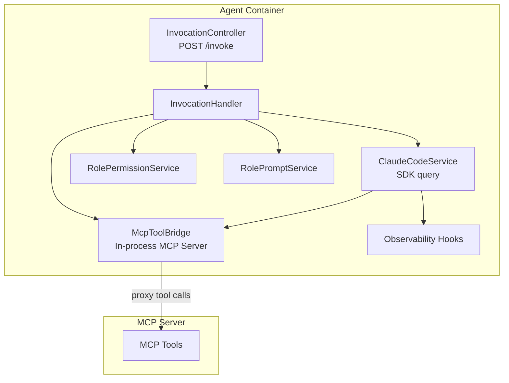
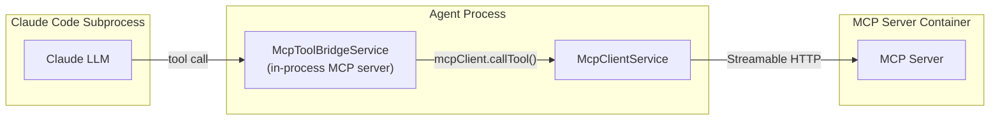
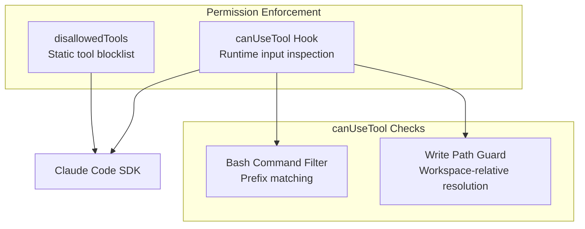

# Claude Code SDK Integration

This document covers how Quorum agents use the [Claude Agent SDK](https://github.com/anthropics/claude-agent-sdk) (`@anthropic-ai/claude-agent-sdk`) to process tasks. For overall system architecture, see [System Design](system-design.md).

## Overview

Each agent container runs a NestJS application that receives invocations via HTTP and processes them through the Claude Agent SDK. The SDK spawns a Claude Code subprocess with full filesystem access, bash execution, and MCP tool integration — making agents capable of real software development work.

## Invocation Flow

When a task arrives at `POST /invoke`, the `InvocationHandler` assembles all parameters and delegates to `ClaudeCodeService`:

1. **Prompt**: Built from `request.action` + serialized `request.context`
2. **System prompt**: Role-specific template from `RolePromptService`
3. **MCP servers**: In-process bridge from `McpToolBridgeService` (scoped to this request)
4. **Permissions**: `disallowedTools` list + `canUseTool` runtime callback from `RolePermissionService`
5. **Working directory (`cwd`)**: Per-invocation `git worktree` path at `/var/agent-worktrees/<correlationId>` — created by the handler from the requested `branch` before the SDK call and removed in `finally` (QRM8 #11). When `cwd` is omitted (e.g. tests), the SDK falls back to `agent.workspaceDir` (`/var/agent-repo`).

The `ClaudeCodeService` calls the SDK's `query()` generator and iterates over the message stream until a `result` message arrives (success or error). Results are mapped to an `InvokeResponse` and returned to the caller.

### ExecuteResult

The SDK response is normalized into a discriminated union:

| Field | Success | Failure |
|-------|---------|---------|
| `success` | `true` | `false` |
| `result` | LLM output text | — |
| `error` | — | Error description |
| `sessionId` | SDK session ID | — |
| `durationMs` | Elapsed time | Elapsed time |
| `totalCostUsd` | API cost | API cost |
| `numTurns` | Tool-use rounds | — |
| `commitMessage` | Optional — agent-authored commit message extracted from the SDK result (consumed by `InvocationHandler.commitAndPush`, QRM8 D2). Falls back to a handler-generated message when absent. | — |

## MCP Tool Bridge

The tool bridge is the mechanism connecting Claude Code sessions to Quorum's MCP orchestration. Since the SDK runs as a subprocess, it cannot directly call remote MCP tools. The bridge solves this by creating an **in-process MCP server** that proxies tool calls to the remote MCP server.

### Bridged Tools

The bridge exposes 5 orchestration tools to the Claude Code session:

| Tool | Purpose | Auto-injected Parameters |
|------|---------|-------------------------|
| `invoke_agent` | Call another agent | `callerRole`, `correlationId`, `depth+1` (always override) |
| `context_store` | Write to Context Store | `correlationId` (default, agent can override) |
| `context_query` | Read from Context Store | `correlationId` (default, agent can override) |
| `context_summarize` | Compress context | `correlationId` (default) |
| `context_stats` | Usage statistics | Pure passthrough |

The bridge is **request-scoped** — a new in-process server is created per invocation, capturing `correlationId`, `callerRole`, and `depth` in closures. This ensures each Claude Code session has correctly scoped orchestration context.

### Parameter Augmentation

For `invoke_agent`, the bridge always overrides `callerRole`, `correlationId`, and `depth+1` — the agent cannot spoof its identity or break the call chain. For context tools, `correlationId` is injected as a default that the agent can override (useful when querying a different conversation's context).

## Role Permission Profiles

Each agent role has a static permission profile that enforces principle of least privilege. Permissions are enforced mechanically — not just via prompts.

### Enforcement Layers

1. **`disallowedTools`**: Static list of tool names the SDK will never offer to the LLM
2. **`canUseTool` hook**: Runtime callback that inspects tool name + input before execution
   - **Bash command filter**: Prefix-matches against denied commands (case-insensitive, strips `sudo`, normalizes whitespace)
   - **Write path guard**: Resolves paths relative to workspace, enforces `allowedWritePaths` with trailing-slash comparison to prevent prefix-substring attacks

### Per-Role Profiles

All roles share a common set of disallowed tools: `AskUserQuestion` (would hang — no interactive user), `Config`, `ExitPlanMode`. Since QRM8 D2 (handler-controlled commits), every role also denies `git commit`, `git push`, `git checkout -b`, and `git branch` — the SDK subprocess can only edit files; `InvocationHandler` is the sole committer.

| Role | Additional Disallowed Tools | Denied Bash Commands | Write Path Restrictions | Allowed Skills |
|------|---------------------------|---------------------|------------------------|----------------|
| **developer** | `TodoWrite` | `git commit`, `git push`, `git checkout -b`, `git branch`, `rm -rf /` | Unrestricted | `simplify` |
| **architect** | `NotebookEdit` | `git push`, `git commit`, `git checkout -b`, `git branch`, `rm -rf`, `npm publish` | `docs/`, `tickets/` only | `code-review`, `simplify` |
| **teamlead** | — | `git commit`, `git push`, `git checkout -b`, `git branch`, `rm -rf /`, `npm publish` | Unrestricted | `code-review`, `simplify` |
| **qa** | — | `git push`, `git commit`, `git checkout -b`, `git branch`, `rm -rf`, `npm publish` | Unrestricted | — |
| **productowner** | `NotebookEdit`, `Bash`, `EnterWorktree`, `Agent` | N/A (Bash disabled) | `tickets/` only | — |

Source of truth: `apps/agent/src/config/role-tool-profiles.ts`. The `code-review` plugin (`docker/plugins/code-review/`) is seeded into `~/.claude/plugins/...` by the agent entrypoint on every boot and is loaded only for roles that list it in their `plugins` array.

> **Security boundary**: Bash filtering is bypassable via shell operators (pipes, subshells). This is an acknowledged design trade-off — the container itself (read-only filesystem, dropped capabilities, no-new-privileges) is the security boundary, not the tool filter. The filter prevents accidental misuse, not adversarial bypass.

## Container Hardening

Agent containers run with defense-in-depth security constraints. The Dockerfile uses a multi-target build: `default` for mcp-server, `agent` for agents, and `moderator` for the Claude Code CLI moderator (all Debian bookworm-slim).

### Agent Target (`node:24-bookworm-slim`)

Bookworm-slim (Debian) is used instead of Alpine because Claude Code tools require glibc (musl libc causes edge cases with ripgrep and git).

**Installed toolchain**: git, `gh` (≥ 2.92.0 from the upstream apt repo — Debian's 2.23.0 is too old), bash, ripgrep, curl, jq, openssh-client, ca-certificates.

**User setup**: Non-root `quorum` user with configurable UID/GID via `HOST_UID`/`HOST_GID` build args (default 1000). This aligns container file ownership with the host UID — needed for the `./logs` bind mount (so log files are owned by the host user) and for the named volumes (`{role}-agent-repo`, `{role}-sessions`, `moderator-workspace`, `moderator-claude-data`) so the `quorum` user can write to them.

**Entrypoint**: `docker/agent/entrypoint.sh` runs at every container start. It exchanges `GH_TOKEN` for a persisted `gh` credential helper (then `unset GH_TOKEN`), clones `$REPO_URL` into `/var/agent-repo` on first boot (idempotent on subsequent boots), detaches HEAD so any branch is checkout-able into a worktree, seeds the code-review plugin into `~/.claude/plugins/...`, runs `git worktree prune` to clean orphans from prior SIGKILL, and finally execs `node dist/main.js`.

### Docker Compose Security Policy

Agent services inherit a shared `x-agent-security` YAML anchor:

| Constraint | Value | Purpose |
|------------|-------|---------|
| `security_opt` | `no-new-privileges:true` | Prevent privilege escalation via setuid/setgid |
| `cap_drop` | `ALL` | Drop all Linux capabilities |
| `read_only` | `true` | Read-only root filesystem |
| `tmpfs /tmp` | 512 MB | Writable scratch space |
| `tmpfs ~/.claude` | 256 MB | SDK state directory |
| `tmpfs ~/.config` | 64 MB | XDG config directory |
| `tmpfs ~/.local` | 64 MB | XDG local directory |
| `tmpfs ~/.cache` | 128 MB | XDG cache directory |
| `tmpfs /var/agent-worktrees` | 1 GB | Per-invocation `git worktree` mount point — QRM8 #11 |

The agent profile attaches a small set of explicitly writable paths against the read-only rootfs:

| Path | Backing | Purpose |
|------|---------|---------|
| `/app/logs` | host bind mount `./logs:/app/logs` | NestJS + SDK log files (the only host bind mount on agents) |
| `/var/agent-repo` | named volume `{role}-agent-repo` | Base git clone, populated from `$REPO_URL` on first boot |
| `/var/agent-sessions` | named volume `{role}-sessions` | `FileSessionStore` JSONL transcripts — survives container restart (QRM8 D3) |
| `/var/agent-worktrees` | tmpfs from `x-agent-security` | Per-invocation worktrees, ephemeral by design |

### SDK Filesystem Workarounds

The read-only rootfs required several workarounds for Claude Code SDK compatibility:

- **`~/.claude.json`**: Symlinked to `/tmp/.claude.json` at build time (SDK writes config on startup; tmpfs makes the write succeed)
- **`~/.claude/debug/`**: Created in the Dockerfile and re-asserted by `docker/agent/entrypoint.sh` on every container start (the `~/.claude` tmpfs is wiped on restart)
- **tmpfs UID/GID**: Aligned with `HOST_UID`/`HOST_GID` build args so the `quorum` user can write
- **`/var/agent-repo` and `/var/agent-worktrees`**: Pre-created in the Dockerfile and chowned to `quorum`. The base-repo path is backed by a named volume; the worktree path is tmpfs declared in `x-agent-security` — required for QRM8 worktree-per-invocation isolation
- **wrong-libc SDK binaries removed**: The npm libc filter doesn't reliably skip the musl variants of `@anthropic-ai/claude-agent-sdk-linux-*`, and the SDK's binary picker tries `-musl` first with no detection. The Dockerfile deletes `node_modules/@anthropic-ai/claude-agent-sdk-linux-*-musl` so the glibc binary is selected on this Debian runtime (QRM6-BUG-012 follow-up)

### SDK Subprocess Environment

The agent's NestJS process inherits the container's full environment, including `GH_TOKEN` (needed by `InvocationHandler` for `git push`). The SDK subprocess does **not**: `ClaudeCodeService` builds the child env from a static allowlist (`SDK_ENV_ALLOWLIST` in `apps/agent/src/llm/claude-code.service.ts`):

| Category | Variables |
|----------|-----------|
| System essentials | `HOME`, `PATH`, `USER`, `SHELL`, `HOSTNAME` |
| Locale & terminal | `TERM`, `LANG`, `LC_ALL` |
| Runtime | `NODE_ENV`, `TMPDIR`, `TZ` |
| Git identity | `GIT_AUTHOR_NAME`, `GIT_AUTHOR_EMAIL`, `GIT_COMMITTER_NAME`, `GIT_COMMITTER_EMAIL` |

Everything else — `ANTHROPIC_API_KEY` (the SDK is configured separately, not via env), `GH_TOKEN`, `REPO_URL`, `MCP_*`, broker tuning, OpenSearch credentials — is excluded. The model cannot read those values via `printenv`, `echo $X`, or any tool call. This is QRM8 D5's primary defense against secret exfiltration; the `gh` credential helper that backs `git push`/`git fetch` is configured by the entrypoint before NestJS starts and is independent of the subprocess env.

## Observability Hooks

The `createObservabilityHooks()` factory produces SDK lifecycle hooks that log tool execution at DEBUG level:

| Hook | Event | Logged Data | Level |
|------|-------|-------------|-------|
| `PreToolUse` | Tool execution starts | Tool name, truncated input (200 chars) | DEBUG |
| `PostToolUse` | Tool execution succeeds | Tool name, `tool_use_id` | DEBUG |
| `PostToolUseFailure` | Tool execution fails | Tool name, truncated error (300 chars) | WARN |

All hooks return `{ continue: true }` — they observe but don't modify SDK behavior.

Additionally, `ClaudeCodeService` extracts tool call information from assistant messages (`tool_use` content blocks) and logs them at DEBUG level for end-to-end tracing.

### Log Levels

- **LOG**: Invocation start/complete, result summary (turns, cost, duration)
- **DEBUG**: SDK session start, tool events (via hooks), assistant reasoning
- **WARN**: Tool failures, invocation errors
- **ERROR**: SDK crashes, abort signals

## Configuration

| Environment Variable | Default | Purpose |
|---------------------|---------|---------|
| `AGENT_ROLE` | `developer` | Determines role prompt and permission profile |
| `AGENT_WORKSPACE_DIR` | `/var/agent-repo` | Base git clone path. The actual SDK `cwd` per invocation is the worktree at `/var/agent-worktrees/<correlationId>` (QRM8 #11); this fallback is used only outside the worktree lifecycle (e.g. unit tests). |
| `ANTHROPIC_MODEL` | `claude-sonnet-4-5-20250929` | Model for SDK queries |
| `ANTHROPIC_MAX_TOKENS` | `4096` | Max tokens per response |
| `REPO_URL` | — (required) | HTTPS clone URL consumed by `docker/agent/entrypoint.sh` on first boot; not forwarded to the SDK subprocess |
| `GH_TOKEN` | — (required) | Fine-grained PAT consumed by the entrypoint to configure the `gh` credential helper; `unset` before NestJS starts and **excluded from the SDK subprocess env** (QRM8 D5) |

## References

- [System Design](system-design.md) — Overall architecture
- [Agent Messaging](agent-messaging.md) — Bidirectional MCP, invoke_agent patterns
- [Message Broker](message-broker.md) — Routing, safeguards, timeouts
- [Context Management](context-management.md) — MCP context API design
- [Context Store](context-store.md) — Storage backend details