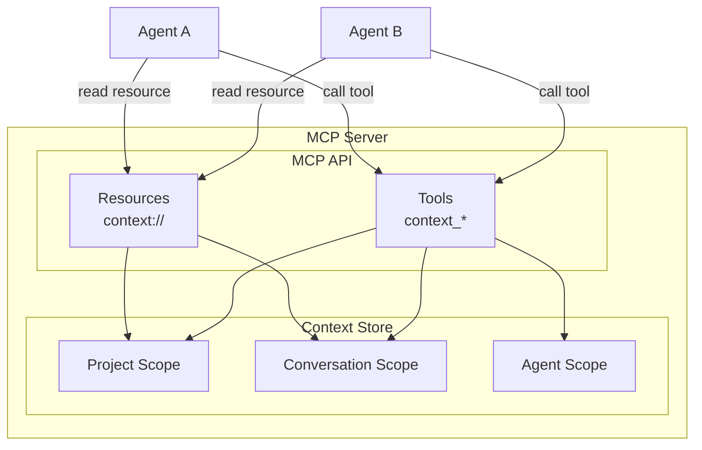
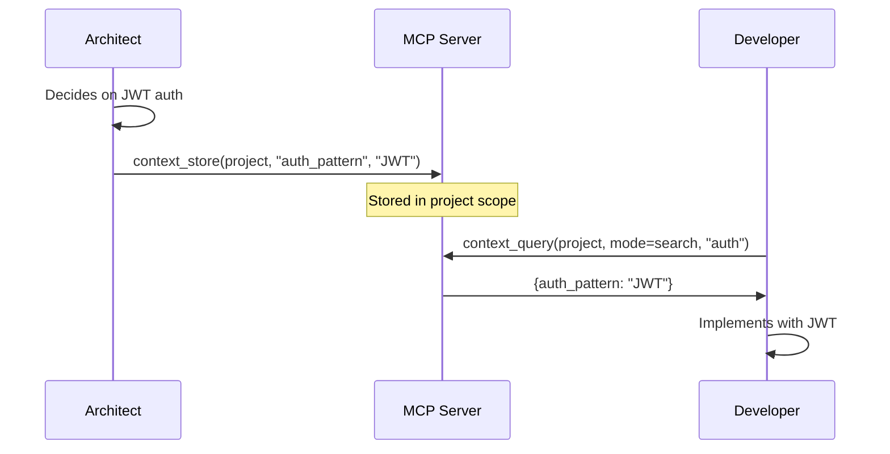
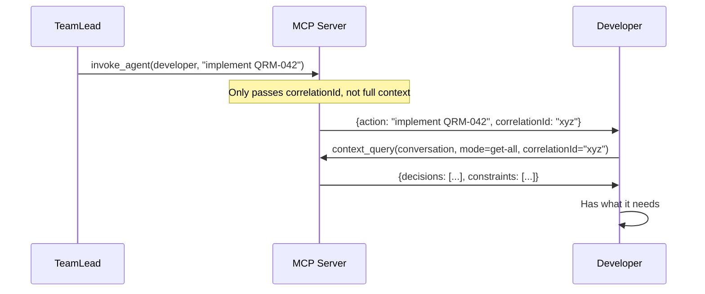
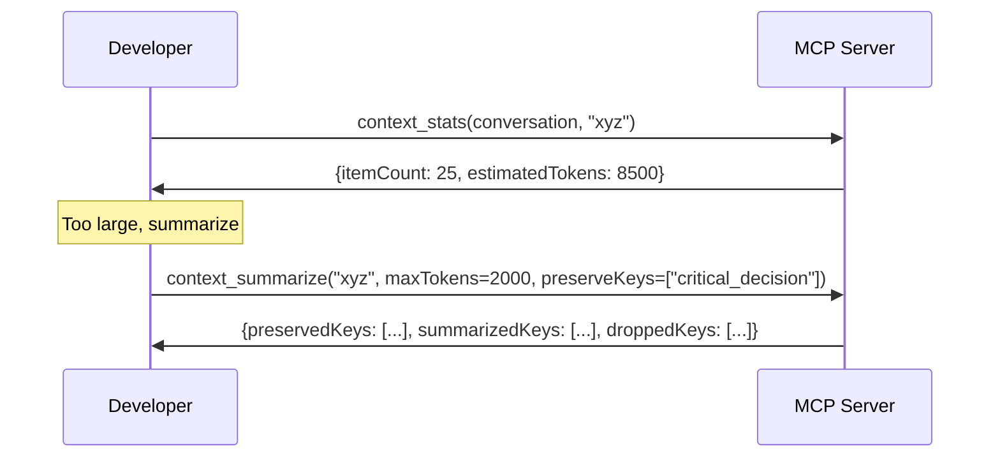
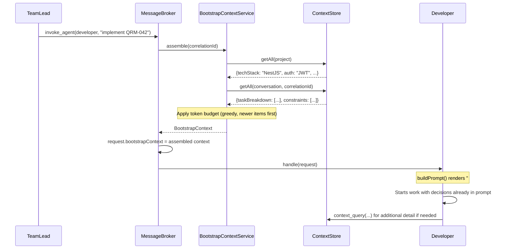

# Context Management in Quorum

## Introduction

When multiple AI agents collaborate, context management becomes critical. Each agent is a Claude Code instance with its own context window. Without coordination, agents either:

- **Over-share**: Pass full conversation histories, exhausting context windows
- **Under-share**: Lose important decisions made by other agents

Quorum solves this with a **pull-based context model**: agents receive a task description, correlation ID, and automatic bootstrap context (project-scope and conversation-scope decisions assembled by the broker), then query the Context Store for additional detail as needed and store their decisions for others.

This document describes the MCP API that exposes context management to agents. For storage backend implementation, see [Context Store](context-store.md). For overall architecture, see [System Design](system-design.md#context-management).

## Architecture

The MCP server exposes context through **resources** (read-only) and **tools** (read/write):



Context scopes, their lifetimes, and usage patterns are described in [System Design — Context Scopes](system-design.md#context-management). The key principle: agents don't receive full context on invocation — they query for what they need and store decisions for others.

## MCP Resources

Resources provide read-only access to context. Agents fetch what they need rather than receiving everything.

### Project Context (`context://project`)

Static resource returning all project-scoped items:

```typescript
server.registerResource(
  'project-context',
  'context://project',
  { description: 'All project-scoped context items' },
  async () => ({
    contents: [{
      uri: 'context://project',
      mimeType: 'application/json',
      text: JSON.stringify(await contextStore.getAll(ContextScope.project))
    }]
  })
);
```

**Example content:**
```json
{
  "techStack": { "runtime": "Node.js 22", "framework": "NestJS" },
  "auth_pattern": "JWT with refresh tokens"
}
```

### Conversation Context (`context://conversation/{correlationId}`)

Parameterized resource template for task-specific context:

```typescript
const template = new ResourceTemplate(
  'context://conversation/{correlationId}',
  { list: undefined },
);

server.registerResource(
  'conversation-context',
  template,
  { description: 'All context items for a conversation' },
  async (uri, variables) => {
    const correlationId = variables.correlationId as string;
    const all = await contextStore.getAll(ContextScope.conversation, correlationId);
    return {
      contents: [{
        uri: uri.href,
        mimeType: 'application/json',
        text: JSON.stringify(all)
      }]
    };
  }
);
```

### Agent Scope (No Resource)

Agent scope is intentionally excluded from MCP resources. Agent-scoped items are private working memory for a single agent instance — exposing them as a browsable resource would break that isolation. Agents access their own agent-scoped items through the `context_store` and `context_query` tools instead.

### Resource Subscriptions (Not Yet Implemented)

The MCP SDK supports `notifications/resources/updated` for real-time change notifications. The codebase has a TODO to wire `'context.change'` events (emitted by the Context Store via `EventEmitter2`) to these MCP notifications. Currently, agents must poll or re-read resources to detect changes.

## MCP Tools

Tools provide read/write access with validation and budget control. For how the tool bridge augments parameters in agent containers, see [Claude Code SDK — Bridged Tools](claude-code-sdk.md#bridged-tools).

### context_store

Store a context item for other agents to access:

```typescript
server.registerTool('context_store', {
  inputSchema: {
    scope: z.enum(['project', 'conversation', 'agent']),
    key: z.string().min(1),
    value: z.unknown(),
    correlationId: z.string().optional()
      .describe('Required for conversation scope'),
    agentRole: z.enum([...AgentRole]).optional()
      .describe('Agent role creating this item'),
    ttl: z.number().int().min(1).optional()
      .describe('Time-to-live in milliseconds'),
  }
}, handler);
```

**Handler logic:**
- Conversation scope **requires** `correlationId` (returns error if missing)
- Project scope **ignores** `correlationId` — items are always global (`id = undefined`)
- Conversation/agent scope uses `correlationId` as the `id` partition

**Usage by agent:**
```
I'll record this architectural decision for the team.
[calls context_store with scope="project", key="auth_pattern", value="JWT with refresh tokens"]
```

### context_query

Query context with explicit mode selection:

```typescript
server.registerTool('context_query', {
  inputSchema: {
    scope: z.enum(['project', 'conversation', 'agent']),
    mode: z.enum(['keys', 'search', 'get-all']),
    keys: z.array(z.string()).optional()
      .describe('Keys to look up (mode=keys)'),
    query: z.string().optional()
      .describe('Search query (mode=search)'),
    correlationId: z.string().optional()
      .describe('Scope identifier (correlationId or agentId)'),
    maxTokens: z.number().int().min(1).optional()
      .describe('Token budget for search results'),
  }
}, handler);
```

**Mode behavior:**

| Mode | Behavior | Returns |
|------|----------|---------|
| `keys` | Calls `get()` for each key individually | `Record<string, unknown>` (key → value, `undefined` for missing) |
| `search` | Hybrid BM25 + k-NN vector search with token budget (OpenSearch backend); substring match fallback (InMemory backend) | `ContextItem[]` ranked by relevance (within `maxTokens` budget, defaults to `CONTEXT_DEFAULT_MAX_TOKENS`) |
| `get-all` | Returns all items in the scope | `Record<string, unknown>` |

**Search behavior (OpenSearch backend):**

With the OpenSearch backend active, `search` mode uses **hybrid semantic search** rather than simple substring matching:

1. The query is embedded via `EmbeddingService.embedQuery()` using the `mxbai-embed-large` model (with an asymmetric instruction prefix for retrieval quality)
2. A hybrid query executes both a **BM25 full-text leg** (matching against pre-rendered `embeddingText`) and a **k-NN vector leg** (cosine similarity on embedding vectors)
3. Results are fused via the `hybrid-search` pipeline using min-max normalization and weighted combination (30% BM25, 70% k-NN)
4. Results are **ranked by relevance** — not just filtered by keyword presence — and accumulated within the `maxTokens` budget

**Graceful degradation:** If Ollama is unavailable, search falls back to BM25-only (still superior to substring matching since it uses tokenized full-text search with TF-IDF ranking). A record written moments ago that hasn't been embedded yet is still found via BM25; it participates in hybrid search once its vector is computed (~300ms async).

**Usage by agent:**
```
Before implementing auth, let me check what decisions have been made.
[calls context_query with scope="project", mode="search", query="authentication"]
```

### context_summarize

Compress conversation context via truncation (POC — LLM-based summarization planned):

```typescript
server.registerTool('context_summarize', {
  inputSchema: {
    correlationId: z.string(),
    maxTokens: z.number().int().min(1).optional()
      .describe('Token budget for summary'),
    preserveKeys: z.array(z.string()).optional()
      .describe('Keys to always keep in full'),
  }
}, handler);
```

**Handler logic:**
1. Fetches all items for the conversation via `getAll()`
2. Splits items into `preserved` (matching `preserveKeys`) and `rest`
3. Calculates budget: `totalCharBudget = maxTokens × tokenCharRatio` (defaults: 2000 × 4 = 8000 chars)
4. Subtracts preserved items' size from budget
5. Accumulates non-preserved items until remaining budget exhausted
6. Stores result as `_summary` key in the conversation scope
7. Returns stats: `{ preservedKeys, summarizedKeys, droppedKeys, totalCharsBudget, preservedChars, remainingBudget, charsUsed }`

### context_stats

Visibility into context usage:

```typescript
server.registerTool('context_stats', {
  inputSchema: {
    scope: z.enum(['project', 'conversation', 'agent']).optional()
      .describe('Limit stats to a specific scope'),
    correlationId: z.string().optional()
      .describe('Further filter by correlationId or agentId'),
  }
}, handler);
```

**Returns** a flat `ContextStats` object:
```json
{
  "itemCount": 12,
  "estimatedTokens": 3400
}
```

Omitting `scope` returns aggregate stats across all scopes and IDs.

## Usage Patterns

### Pattern 1: Decision Recording

When an agent makes a decision, record it for others:



### Pattern 2: Task Handoff

Minimal context passed during invocation, agent queries for details:



### Pattern 3: Context Compaction

Long-running tasks summarize periodically:



### Pattern 4: Bootstrap Context Injection

Automatic context injection on every `invoke_agent` call — agents start with relevant decisions instead of querying from scratch.

**Trigger:** Automatic — the Message Broker injects bootstrap context before delivering every invocation (when enabled).

**Flow:**



**How it works:**

The broker calls `BootstrapContextService.assemble(correlationId)` after safeguard checks pass. The service queries `ContextStore.getAll()` for project-scope items (always) and conversation-scope items (when a `correlationId` is present). A token budget (`BOOTSTRAP_MAX_TOKENS`, default 1000) is split between project and conversation scopes using `BOOTSTRAP_PROJECT_RATIO` (default 0.6). Items are selected via greedy bin-packing in reverse insertion order (newer items preferred). Unused project budget reclaims to the conversation allocation.

The assembled `BootstrapContext` is attached to `request.bootstrapContext`. On the agent side, `InvocationHandler.buildPrompt()` renders it as a `## Prior Decisions` section (with `### Project Context` and `### Conversation Context` subsections) prepended before the task description. The `meta` field (item count, estimated tokens, scopes queried) is not rendered — it is internal bookkeeping.

**Configuration:**

| Environment Variable | Default | Purpose |
|---------------------|---------|---------|
| `BOOTSTRAP_ENABLED` | `true` | Master toggle — `false` disables assembly entirely |
| `BOOTSTRAP_MAX_TOKENS` | `1000` | Total token budget for the bootstrap payload |
| `BOOTSTRAP_PROJECT_RATIO` | `0.6` | Fraction of budget for project-scope items |

These are configured in `docker-compose.yml` on the `mcp-server` service. The config factory is in `apps/mcp-server/src/config/bootstrap.config.ts`.

**Error handling:** Assembly is non-fatal. If it fails, the broker logs a warning and delivers the invocation without bootstrap context.

**Relationship to other patterns:**

- **Pattern 1 (Decision Recording)** feeds bootstrap injection — decisions stored via `context_store` are what bootstrap assembles and injects
- **Pattern 2 (Task Handoff)** is less necessary for common decisions — agents no longer start blind. However, agents still use explicit `context_query` for targeted lookups, detailed searches, or agent-scope data that bootstrap does not cover
- **Pattern 3 (Context Compaction)** remains relevant when stored context exceeds the bootstrap token budget

> **Details:** See [Message Broker — Context Integration](message-broker.md#context-integration) for the broker-side implementation and sequence diagram.

## Agent Identity

Since the MCP SDK doesn't expose client identity in tool handlers, agents must self-identify. The `context_store` tool accepts an optional `agentRole` parameter (from the `AgentRole` enum) to record who created each item. The `invoke_agent` tool uses `callerRole` for the same purpose.

When agents are invoked through the tool bridge in agent containers, the bridge auto-injects `correlationId` as a default (overridable by the agent for cross-conversation queries). See [Claude Code SDK — Parameter Augmentation](claude-code-sdk.md#parameter-augmentation) for details.

## References

- [Context Store](context-store.md) — Storage backend implementation, file persistence, CompositeKeyBuilder
- [System Design](system-design.md#context-management) — Context scopes, pull-based model, storage overview
- [Claude Code SDK](claude-code-sdk.md#mcp-tool-bridge) — Tool bridge, parameter augmentation for context tools
- [Agent Messaging](agent-messaging.md) — Bidirectional MCP architecture