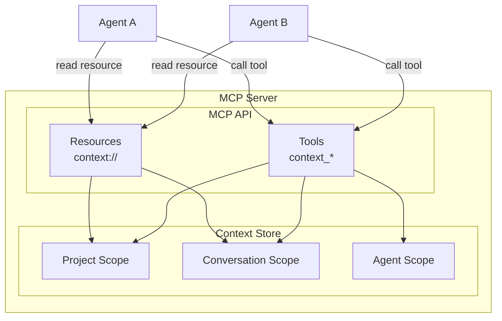
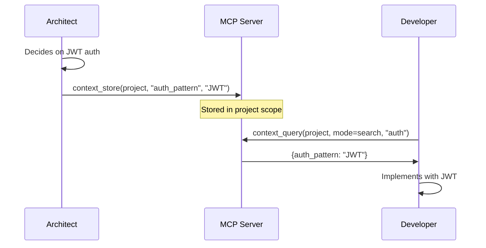
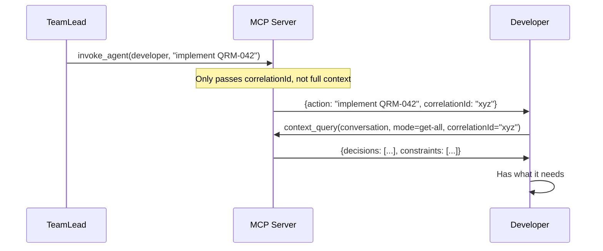
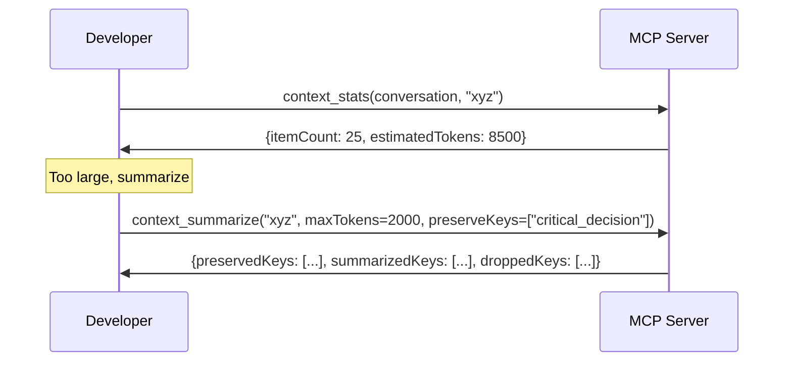

# Context Management in Quorum

## Introduction

When multiple AI agents collaborate, context management becomes critical. Each agent is a Claude Code instance with its own context window. Without coordination, agents either:

- **Over-share**: Pass full conversation histories, exhausting context windows
- **Under-share**: Lose important decisions made by other agents

Quorum solves this with a **pull-based context model**: agents receive minimal bootstrap context on invocation (task description + correlation ID), then query the Context Store for what they need and store their decisions for others.

This document describes the MCP API that exposes context management to agents. For storage backend implementation, see [Context Store](context-store.md). For overall architecture, see [System Design](system-design.md#context-management).

## Architecture

The MCP server exposes context through **resources** (read-only) and **tools** (read/write):



Context scopes, their lifetimes, and usage patterns are described in [System Design — Context Scopes](system-design.md#context-management). The key principle: agents don't receive full context on invocation — they query for what they need and store decisions for others.

## MCP Resources

Resources provide read-only access to context. Agents fetch what they need rather than receiving everything.

### Project Context (`context://project`)

Static resource returning all project-scoped items:

```typescript
server.registerResource(
  'project-context',
  'context://project',
  { description: 'All project-scoped context items' },
  async () => ({
    contents: [{
      uri: 'context://project',
      mimeType: 'application/json',
      text: JSON.stringify(await contextStore.getAll(ContextScope.project))
    }]
  })
);
```

**Example content:**
```json
{
  "techStack": { "runtime": "Node.js 22", "framework": "NestJS" },
  "auth_pattern": "JWT with refresh tokens"
}
```

### Conversation Context (`context://conversation/{correlationId}`)

Parameterized resource template for task-specific context:

```typescript
const template = new ResourceTemplate(
  'context://conversation/{correlationId}',
  { list: undefined },
);

server.registerResource(
  'conversation-context',
  template,
  { description: 'All context items for a conversation' },
  async (uri, variables) => {
    const correlationId = variables.correlationId as string;
    const all = await contextStore.getAll(ContextScope.conversation, correlationId);
    return {
      contents: [{
        uri: uri.href,
        mimeType: 'application/json',
        text: JSON.stringify(all)
      }]
    };
  }
);
```

### Resource Subscriptions (Not Yet Implemented)

The MCP SDK supports `notifications/resources/updated` for real-time change notifications. The codebase has a TODO to wire `'context.change'` events (emitted by the Context Store via `EventEmitter2`) to these MCP notifications. Currently, agents must poll or re-read resources to detect changes.

## MCP Tools

Tools provide read/write access with validation and budget control. For how the tool bridge augments parameters in agent containers, see [Claude Code SDK — Bridged Tools](claude-code-sdk.md#bridged-tools).

### context_store

Store a context item for other agents to access:

```typescript
server.registerTool('context_store', {
  inputSchema: {
    scope: z.enum(['project', 'conversation', 'agent']),
    key: z.string().min(1),
    value: z.unknown(),
    correlationId: z.string().optional()
      .describe('Required for conversation scope'),
    agentRole: z.enum([...AgentRole]).optional()
      .describe('Agent role creating this item'),
    ttl: z.number().int().min(1).optional()
      .describe('Time-to-live in milliseconds'),
  }
}, handler);
```

**Handler logic:**
- Conversation scope **requires** `correlationId` (returns error if missing)
- Project scope **ignores** `correlationId` — items are always global (`id = undefined`)
- Conversation/agent scope uses `correlationId` as the `id` partition

**Usage by agent:**
```
I'll record this architectural decision for the team.
[calls context_store with scope="project", key="auth_pattern", value="JWT with refresh tokens"]
```

### context_query

Query context with explicit mode selection:

```typescript
server.registerTool('context_query', {
  inputSchema: {
    scope: z.enum(['project', 'conversation', 'agent']),
    mode: z.enum(['keys', 'search', 'get-all']),
    keys: z.array(z.string()).optional()
      .describe('Keys to look up (mode=keys)'),
    query: z.string().optional()
      .describe('Search query (mode=search)'),
    correlationId: z.string().optional()
      .describe('Scope identifier (correlationId or agentId)'),
    maxTokens: z.number().int().min(1).optional()
      .describe('Token budget for search results'),
  }
}, handler);
```

**Mode behavior:**

| Mode | Behavior | Returns |
|------|----------|---------|
| `keys` | Calls `get()` for each key individually | `Record<string, unknown>` (key → value, `undefined` for missing) |
| `search` | Case-insensitive substring match with token budget | `ContextItem[]` (within `maxTokens` budget, defaults to `CONTEXT_DEFAULT_MAX_TOKENS`) |
| `get-all` | Returns all items in the scope | `Record<string, unknown>` |

**Usage by agent:**
```
Before implementing auth, let me check what decisions have been made.
[calls context_query with scope="project", mode="search", query="authentication"]
```

### context_summarize

Compress conversation context via truncation (POC — LLM-based summarization planned):

```typescript
server.registerTool('context_summarize', {
  inputSchema: {
    correlationId: z.string(),
    maxTokens: z.number().int().min(1).optional()
      .describe('Token budget for summary'),
    preserveKeys: z.array(z.string()).optional()
      .describe('Keys to always keep in full'),
  }
}, handler);
```

**Handler logic:**
1. Fetches all items for the conversation via `getAll()`
2. Splits items into `preserved` (matching `preserveKeys`) and `rest`
3. Calculates budget: `totalCharBudget = maxTokens × tokenCharRatio` (defaults: 2000 × 4 = 8000 chars)
4. Subtracts preserved items' size from budget
5. Accumulates non-preserved items until remaining budget exhausted
6. Stores result as `_summary` key in the conversation scope
7. Returns stats: `{ preservedKeys, summarizedKeys, droppedKeys, totalCharsBudget, preservedChars, remainingBudget, charsUsed }`

### context_stats

Visibility into context usage:

```typescript
server.registerTool('context_stats', {
  inputSchema: {
    scope: z.enum(['project', 'conversation', 'agent']).optional()
      .describe('Limit stats to a specific scope'),
    correlationId: z.string().optional()
      .describe('Further filter by correlationId or agentId'),
  }
}, handler);
```

**Returns** a flat `ContextStats` object:
```json
{
  "itemCount": 12,
  "estimatedTokens": 3400
}
```

Omitting `scope` returns aggregate stats across all scopes and IDs.

## Usage Patterns

### Pattern 1: Decision Recording

When an agent makes a decision, record it for others:



### Pattern 2: Task Handoff

Minimal context passed during invocation, agent queries for details:



### Pattern 3: Context Compaction

Long-running tasks summarize periodically:



## Agent Identity

Since the MCP SDK doesn't expose client identity in tool handlers, agents must self-identify. The `context_store` tool accepts an optional `agentRole` parameter (from the `AgentRole` enum) to record who created each item. The `invoke_agent` tool uses `callerRole` for the same purpose.

When agents are invoked through the tool bridge in agent containers, the bridge auto-injects `correlationId` as a default (overridable by the agent for cross-conversation queries). See [Claude Code SDK — Parameter Augmentation](claude-code-sdk.md#parameter-augmentation) for details.

## References

- [Context Store](context-store.md) — Storage backend implementation, file persistence, CompositeKeyBuilder
- [System Design](system-design.md#context-management) — Context scopes, pull-based model, storage overview
- [Claude Code SDK](claude-code-sdk.md#mcp-tool-bridge) — Tool bridge, parameter augmentation for context tools
- [Agent Messaging](agent-messaging.md) — Bidirectional MCP architecture