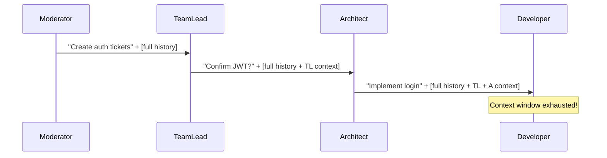
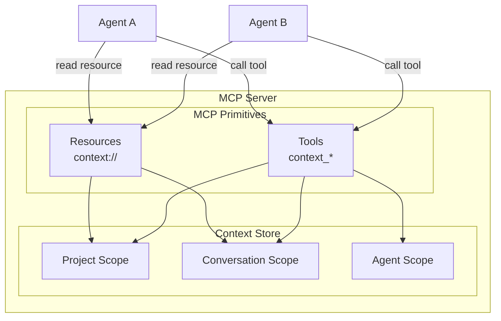
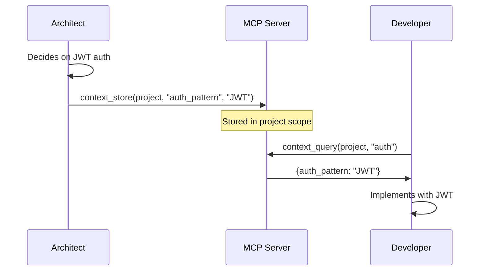
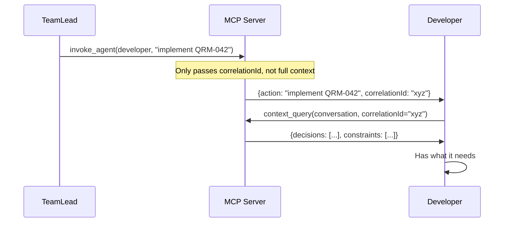
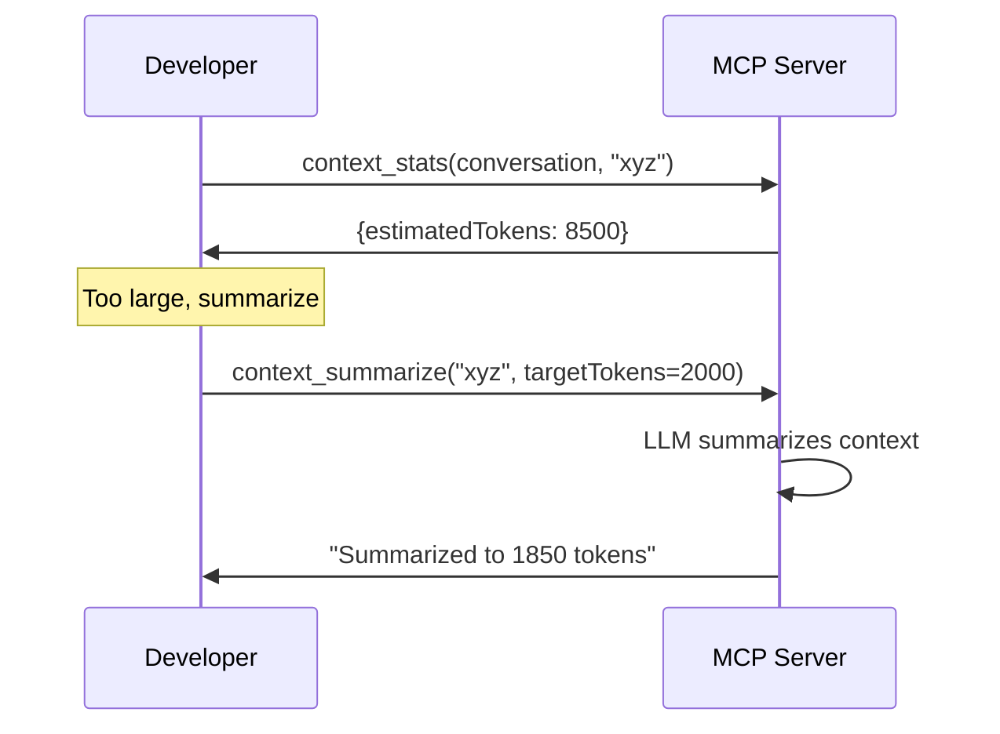

# Context Management in Quorum

## Introduction

When multiple AI agents collaborate, context management becomes critical. Each agent is a Claude Code instance with its own context window. Without coordination, agents either:

- **Over-share**: Pass full conversation histories, exhausting context windows
- **Under-share**: Lose important decisions made by other agents

This document describes Quorum's context management architecture built on MCP primitives provided by `@modelcontextprotocol/sdk`. For implementation details, see [Context Store](context-store.md).

## The Problem



| Problem | Impact |
|---------|--------|
| Context duplication | Same data repeated at each call depth |
| No selective retrieval | Agents get everything or nothing |
| No visibility | Can't debug why an agent is slow or confused |
| No eviction | Old context crowds out new information |

## Architecture

Quorum's MCP server exposes context management through **resources** (read) and **tools** (read/write):



### Context Scopes

| Scope | Lifetime | Use Case |
|-------|----------|----------|
| **Project** | Entire session | Tech stack decisions, constraints, team agreements |
| **Conversation** | Single task chain (correlationId) | Task-specific decisions, intermediate results |
| **Agent** | Per-agent | Agent's working memory, scratchpad |

## MCP Resources

Resources provide read-only access to context. Agents fetch what they need rather than receiving everything.

### Project Context

Static resource for project-wide information:

```typescript
server.registerResource(
  "context://project",
  {
    uri: "context://project",
    mimeType: "application/json",
    name: "project-context",
    description: "Project-wide decisions and constraints"
  },
  async () => ({
    content: [{
      type: "text",
      text: JSON.stringify(contextStore.getProjectContext())
    }]
  })
);
```

**Example content:**
```json
{
  "techStack": {
    "runtime": "Node.js 22",
    "framework": "NestJS",
    "database": "PostgreSQL"
  },
  "decisions": [
    { "topic": "auth", "decision": "JWT with refresh tokens", "by": "architect" },
    { "topic": "api", "decision": "REST, not GraphQL", "by": "architect" }
  ],
  "constraints": [
    "No external dependencies without approval",
    "All endpoints must have OpenAPI docs"
  ]
}
```

### Conversation Context

Parameterized resource for task-specific context:

```typescript
server.registerResourceTemplate(
  {
    uriTemplate: "context://conversation/{correlationId}",
    mimeType: "application/json",
    name: "conversation-context",
    description: "Context for a specific task chain"
  },
  async (uri, { correlationId }) => {
    const context = contextStore.getConversationContext(correlationId);
    return {
      content: [{
        type: "text",
        text: JSON.stringify(context)
      }]
    };
  }
);
```

**Example content:**
```json
{
  "correlationId": "task-auth-impl-001",
  "originatingAgent": "moderator",
  "task": "Implement user authentication",
  "callChain": ["moderator", "teamlead", "architect"],
  "decisions": [
    { "key": "session_storage", "value": "Redis", "by": "architect" }
  ],
  "artifacts": [
    { "type": "ticket", "id": "QRM-042", "status": "in_progress" }
  ]
}
```

### Resource Subscriptions

Agents can subscribe to context changes:

```typescript
// Client-side: subscribe to conversation context
await mcpClient.subscribeResource(`context://conversation/${correlationId}`);

// Server-side: notify on changes
contextStore.on('change', async (scope, key) => {
  if (scope === 'conversation') {
    await server.notification({
      method: "notifications/resources/updated",
      params: { uri: `context://conversation/${key}` }
    });
  }
});
```

## MCP Tools

Tools provide read/write access with validation and budget control.

### context_store

Store a fact or decision:

```typescript
server.registerTool(
  "context_store",
  {
    description: "Store context for other agents to access",
    inputSchema: {
      scope: z.enum(["project", "conversation", "agent"])
        .describe("Context scope"),
      key: z.string()
        .describe("Unique key for this context item"),
      value: z.any()
        .describe("The context data to store"),
      correlationId: z.string().optional()
        .describe("Required for conversation scope"),
      ttl: z.number().optional()
        .describe("Auto-expire in seconds (conversation/agent scope only)")
    }
  },
  async ({ scope, key, value, correlationId, ttl }) => {
    await contextStore.set({ scope, key, value, correlationId, ttl });

    return {
      content: [{
        type: "text",
        text: `Stored ${key} in ${scope} scope`
      }]
    };
  }
);
```

**Usage by agent:**
```
I'll record this architectural decision for the team.

[calls context_store with scope="project", key="auth_pattern", value="JWT with refresh tokens"]
```

### context_query

Retrieve context with token budget:

```typescript
server.registerTool(
  "context_query",
  {
    description: "Query context with token budget control",
    inputSchema: {
      scope: z.enum(["project", "conversation", "agent"])
        .describe("Context scope to query"),
      query: z.string().optional()
        .describe("Natural language query to filter relevant context"),
      keys: z.array(z.string()).optional()
        .describe("Specific keys to retrieve"),
      correlationId: z.string().optional()
        .describe("Required for conversation scope"),
      maxTokens: z.number().default(2000)
        .describe("Maximum tokens to return")
    }
  },
  async ({ scope, query, keys, correlationId, maxTokens }) => {
    let context;

    if (keys) {
      // Direct key lookup
      context = await contextStore.getByKeys(scope, keys, correlationId);
    } else if (query) {
      // Semantic search (requires embedding or keyword matching)
      context = await contextStore.search(scope, query, correlationId);
    } else {
      // Get all in scope
      context = await contextStore.getAll(scope, correlationId);
    }

    // Truncate to token budget
    const truncated = truncateToTokens(context, maxTokens);

    return {
      content: [{
        type: "text",
        text: JSON.stringify(truncated)
      }]
    };
  }
);
```

**Usage by agent:**
```
Before implementing auth, let me check what decisions have been made.

[calls context_query with scope="project", query="authentication decisions", maxTokens=1000]
```

### context_summarize

Compress verbose context:

```typescript
server.registerTool(
  "context_summarize",
  {
    description: "Summarize conversation context to reduce token usage",
    inputSchema: {
      correlationId: z.string()
        .describe("Conversation to summarize"),
      targetTokens: z.number().default(500)
        .describe("Target size after summarization"),
      preserveKeys: z.array(z.string()).optional()
        .describe("Keys to keep verbatim (not summarized)")
    }
  },
  async ({ correlationId, targetTokens, preserveKeys }) => {
    const context = await contextStore.getConversationContext(correlationId);

    // Use LLM to summarize (or simpler heuristics for POC)
    const summary = await summarizeContext(context, targetTokens, preserveKeys);

    // Store summary back
    await contextStore.set({
      scope: "conversation",
      correlationId,
      key: "_summary",
      value: summary
    });

    return {
      content: [{
        type: "text",
        text: `Summarized to ${countTokens(summary)} tokens`
      }]
    };
  }
);
```

### context_stats

Visibility into context usage:

```typescript
server.registerTool(
  "context_stats",
  {
    description: "Get context usage statistics",
    inputSchema: {
      scope: z.enum(["project", "conversation", "agent", "all"]).optional()
        .describe("Scope to get stats for"),
      correlationId: z.string().optional()
        .describe("Specific conversation ID")
    }
  },
  async ({ scope, correlationId }) => {
    const stats = await contextStore.getStats(scope, correlationId);

    return {
      content: [{
        type: "text",
        text: JSON.stringify(stats, null, 2)
      }]
    };
  }
);
```

**Example output:**
```json
{
  "project": {
    "itemCount": 12,
    "estimatedTokens": 3400
  },
  "conversations": {
    "task-auth-impl-001": {
      "itemCount": 8,
      "estimatedTokens": 2100,
      "depth": 3,
      "agents": ["moderator", "teamlead", "architect"]
    }
  },
  "agents": {
    "developer-1": {
      "itemCount": 5,
      "estimatedTokens": 800
    }
  }
}
```

## Usage Patterns

### Pattern 1: Decision Recording

When an agent makes a decision, record it for others:



### Pattern 2: Task Handoff

Minimal context passed during invocation, agent queries for details:



### Pattern 3: Context Compaction

Long-running tasks summarize periodically:



## SDK Limitations and Workarounds

| Limitation | Workaround |
|------------|------------|
| No agent identity in tool handlers | Pass `agentRole` as explicit parameter |
| No server-push notifications | Agents poll or use resource subscriptions |
| No built-in token counting | Implement estimation (chars/4) or use tokenizer |
| No semantic search | Use keyword matching for POC, add embeddings later |

### Agent Identity

Since MCP SDK doesn't expose client identity in tool handlers, agents must self-identify:

```typescript
// Tool requires agentRole parameter
server.registerTool("context_store", {
  inputSchema: {
    agentRole: z.enum(["architect", "teamlead", "developer", "qa", "productowner"])
      .describe("Your agent role"),
    // ... other params
  }
}, async ({ agentRole, ...params }) => {
  await contextStore.set({ ...params, createdBy: agentRole });
});
```

## Summary

| Component | Purpose |
|-----------|---------|
| `context://project` resource | Read-only project-wide context |
| `context://conversation/{id}` resource | Read-only task-specific context |
| `context_store` tool | Write context for other agents |
| `context_query` tool | Read context with token budget |
| `context_summarize` tool | Compress verbose context |
| `context_stats` tool | Visibility into usage |

This architecture transforms context from a "pass everything" model to a **pull-based** model where agents request only what they need, with built-in token budgeting.

## References

- [Context Store](context-store.md) - Implementation details, storage backends
- [Agent Messaging](agent-messaging.md) - Bidirectional MCP architecture
- [Message Broker](message-broker.md) - Inter-agent communication
- [@modelcontextprotocol/sdk](https://github.com/modelcontextprotocol/typescript-sdk) - MCP TypeScript SDK