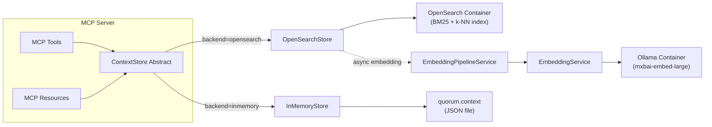

# Context Store Implementation

This document covers the implementation details of Quorum's Context Store. For conceptual overview and MCP API design, see [Context Management](context-management.md). For how context fits into the overall system, see [System Design](system-design.md#context-management).

## Responsibilities

The Context Store is a component inside the MCP Server that:

1. Persists context items across three scopes (project, conversation, agent)
2. Provides key-value access and hybrid semantic search (BM25 + k-NN vector)
3. Manages TTL-based expiration (lazy, on read)
4. Emits change events for decoupled subscribers (embedding pipeline, future notifications)
5. Supports two backends: **OpenSearchStore** (production) and **InMemoryStore** (tests/dev)



## Core Interface

All storage backends implement this abstract class, which doubles as the NestJS DI injection token (TypeScript interfaces are erased at compile time):

```typescript
abstract class ContextStore {
  abstract set(params: SetParams): Promise<void>;
  abstract get(scope: ContextScope, key: string, id?: string): Promise<unknown>;
  abstract getAll(scope: ContextScope, id?: string): Promise<Record<string, unknown>>;
  abstract search(scope: ContextScope, query: string, id?: string, maxTokens?: number): Promise<ContextItem[]>;
  abstract getStats(scope?: ContextScope, id?: string): Promise<ContextStats>;
}
```

Key design decisions:
- **Scoped keys**: Items are keyed by `{scope}:{id}:{key}` via `CompositeKeyBuilder` to partition data
- **TTL support**: Items can auto-expire via `expiresAt` timestamp. `ttl` is in **milliseconds**, converted to `expiresAt = Date.now() + ttl`
- **Token budgeting**: `search()` accepts `maxTokens` to limit response size (estimate: `Math.ceil(JSON.stringify(value).length / 4)`)
- **All-async**: Methods return `Promise` even for synchronous backends, so the contract stays stable across backends
- **Change events are not part of the abstract class**: Concrete stores inject `EventEmitter2` and emit `'context.change'` events independently; listeners subscribe with `@OnEvent('context.change')` in any NestJS module

### Types

```typescript
enum ContextScope {
  project = 'project',       // Entire session lifetime
  conversation = 'conversation', // Single task chain (correlationId)
  agent = 'agent',           // Per-agent working memory
}

interface ContextItem {
  key: string;               // Item key within scope
  value: unknown;            // JSON-serializable payload
  scope: ContextScope;
  id?: string;               // correlationId (conversation) or agentId (agent)
  createdBy?: string;        // Agent role that created this item
  createdAt: number;         // Epoch milliseconds
  expiresAt?: number;        // Epoch milliseconds (undefined = no expiry)
}

interface SetParams {
  scope: ContextScope;
  key: string;
  value: unknown;
  id?: string;               // correlationId or agentId
  createdBy?: string;
  ttl?: number;              // Milliseconds, converted to expiresAt
}

interface ContextStats {
  itemCount: number;         // Live (non-expired) items
  estimatedTokens: number;   // Math.ceil(JSON.stringify(value).length / 4)
}

interface ChangeEvent {
  scope: ContextScope;
  key: string;
  id?: string;
  action: 'set' | 'delete' | 'expire';
}
```

## CompositeKeyBuilder

Centralized scope-aware key construction in `libs/common`. Ensures consistent keying across all backends and prevents the scope/id mismatch bug that occurred when tool handlers blindly passed `correlationId` for project-scope items (see QRM2-BUG-006).

**Format**: `${scope}:${id ?? '_'}:${key}`

**Rules**:
- **project** scope: `id` is always stripped -> `project:_:key` (even if provided)
- **conversation** scope: `id` required -> `conversation:{correlationId}:key`
- **agent** scope: `id` required -> `agent:{agentId}:key`
- **Throws** if conversation/agent scope is missing `id`

```typescript
class CompositeKeyBuilder {
  static build(scope: ContextScope, key: string, id?: string): string;
  static parse(compositeKey: string): { scope: ContextScope; id: string | undefined; key: string };
}
```

`parse()` decomposes a composite key back to its parts — useful for debugging and logging. It handles keys containing colons correctly (only the first two colons are delimiters).

## OpenSearchStore

Production backend using OpenSearch for unified BM25 full-text and k-NN vector search. Activated by setting `CONTEXT_STORE_BACKEND=opensearch`. This is the active backend in the Docker Compose deployment.

### Architecture

OpenSearchStore combines two search strategies in a single index (`quorum-context`):

- **BM25 full-text search** via the `embeddingText` field (standard analyzer) — available immediately on write
- **k-NN vector search** via the `embedding` field (1024-dimensional, HNSW/Faiss/cosine) — available after async embedding (~300ms)

A hybrid search pipeline (`hybrid-search`) fuses both result sets using min-max normalization and arithmetic mean combination with weights **0.3 BM25 + 0.7 k-NN**, favoring semantic similarity while retaining keyword recall.

### Index Schema

Created by `OpenSearchSetupService.onModuleInit()` (idempotent — skips if index exists):

| Field | Type | Purpose |
|-------|------|---------|
| `key` | `keyword` | Item key within scope |
| `scope` | `keyword` | Context scope (project/conversation/agent) |
| `id` | `keyword` | Scope identifier (`_` for project scope — convention C1) |
| `value` | `object` (disabled) | Raw JSON payload, stored but not analyzed |
| `createdBy` | `keyword` | Agent role that created the item |
| `createdAt` | `long` | Epoch milliseconds |
| `expiresAt` | `long` | TTL expiry timestamp |
| `embeddingText` | `text` (standard analyzer) | Pre-rendered text for BM25 search |
| `embedding` | `knn_vector` (1024d, HNSW/Faiss/cosine) | Embedding vector for k-NN search |

The `value` field has indexing disabled (`enabled: false`) — it is stored for retrieval but not analyzed, since search operates on the purpose-built `embeddingText` field.

### Behavior

| Method | Behavior |
|--------|----------|
| `set()` | Builds composite key, pre-renders `embeddingText` via `toEmbeddingText()`, indexes with `refresh: true` (BM25-immediate), emits `'context.change'` event (triggers async embedding) |
| `get()` | Fetches by composite key document ID. Lazy-expires: if `expiresAt <= now`, deletes and emits `'expire'` event |
| `getAll()` | Filtered query by scope + id prefix, excludes expired items, excludes `embedding`/`embeddingText` from response |
| `search()` | Hybrid query (BM25 + k-NN) through `hybrid-search` pipeline; falls back to BM25-only when Ollama unavailable. Applies token budget |
| `getStats()` | Counts live items and estimates tokens. Aggregates across all scopes if `scope` omitted |

### Write Path

1. Construct `ContextItem` with metadata (scope, key, id, timestamps, optional TTL)
2. Pre-render `embeddingText` via `toEmbeddingText(item)` — a deterministic text renderer that converts the key + value into natural-language prose optimized for embedding (see [Embedding Text Renderer](#embedding-text-renderer))
3. Index document to OpenSearch with composite key as `_id` and `refresh: true`
4. Document is **immediately BM25-searchable** via `embeddingText`
5. Emit `'context.change'` event with action `'set'`
6. `EmbeddingPipelineService` catches the event asynchronously, computes the embedding vector via Ollama, and partial-updates the document — making it **hybrid-searchable within ~300ms**

### Search Path

1. Request query embedding via `EmbeddingService.embedQuery(query)` (prepends asymmetric instruction prefix)
2. **If embedding succeeds** — Hybrid query:
   - BM25 leg: `match` on `embeddingText` with scope/id/TTL filters
   - k-NN leg: `knn` on `embedding` field with `k=100`
   - Combined via `hybrid-search` pipeline (min-max normalization, 0.3 BM25 + 0.7 k-NN weights)
3. **If embedding fails** (Ollama unavailable) — BM25-only fallback:
   - `match` query on `embeddingText` with same scope/id/TTL filters
4. Apply token budget: accumulate results until `maxTokens` exhausted (`Math.ceil(JSON.stringify(value).length / 4)`)
5. Return results ranked by relevance score

### TTL Handling

- **`get()`**: Lazy expiration — checks `expiresAt`, deletes document and emits `'expire'` event if expired
- **`getAll()` / `search()`**: Query-time filter via `bool` clause: `should: [{ must_not: exists(expiresAt) }, { range: expiresAt > now }]`
- No background cleanup job — expired items are filtered on read and eventually deleted on direct access

### Graceful Degradation

| Scenario | Behavior |
|----------|----------|
| OpenSearch up, Ollama up | Full hybrid search (BM25 + k-NN vector) |
| OpenSearch up, Ollama down | BM25-only search — `EmbeddingService.embedQuery()` returns null, search omits k-NN leg |
| Record just written (no vector yet) | BM25 match only for that record; hybrid for records with vectors |
| OpenSearch error on any operation | `OpenSearchStore` catches error, logs, returns empty/undefined — no throws to callers |

### Embedding Text Renderer

`toEmbeddingText(item: ContextItem)` is a pure utility in `libs/common` that converts a context item into natural-language text optimized for both BM25 tokenization and embedding models.

**Algorithm:**
1. Item key as header (front-loaded for embedding model importance)
2. Blank line separator
3. Recursive value rendering: strings as-is, numbers/booleans as strings, arrays as bulleted lists, objects as `label: value` lines with key name transformation (camelCase/snake_case to lowercase spaces), nulls omitted
4. Truncate at 1500 characters (~500 embedding tokens) with `[truncated]` marker

Called synchronously during `OpenSearchStore.set()` and `MigrationService` import. The rendered text serves dual purpose: immediate BM25 searchability and input for async embedding computation.

## Embedding Pipeline

The `EmbeddingPipelineService` is an event-driven background worker that computes and stores embedding vectors asynchronously after documents are written to OpenSearch.

### Flow

1. **Event-driven**: Subscribes to `'context.change'` events (emitted by `OpenSearchStore.set()`)
2. **Enqueue**: On `'set'` events, adds the document's composite key to an in-memory queue
3. **Drain loop**: Processes queue items sequentially (sufficient for low-throughput context stores — ~50 records per session)
4. **Per-item processing**:
   - Fetch `embeddingText` from OpenSearch by composite key
   - Compute embedding via `EmbeddingService.embedDocument(embeddingText)` (document-side, no instruction prefix)
   - Partial-update the document with the `embedding` vector
5. **Retry**: Exponential backoff (1s → 2s → 4s → 8s max), abandon after 3 retries with warning log

### Startup Backfill

On `onModuleInit()`, the pipeline queries for documents that have `embeddingText` but no `embedding` field and enqueues them. This handles:
- Records imported by `MigrationService` (which indexes without vectors)
- Records where embedding failed on a previous run
- Records written while Ollama was temporarily unavailable

### Embedding Service

`EmbeddingService` wraps `OllamaClient` with graceful error handling (returns `null` on failure):

| Method | Behavior |
|--------|----------|
| `embedDocument(text)` | Embeds text as-is (document-side) |
| `embedQuery(text)` | Prepends `"Represent this sentence for searching relevant passages: "` before embedding (asymmetric retrieval — improves search quality) |
| `isAvailable()` | Delegates to `OllamaClient.isHealthy()` — used by health endpoint |

The asymmetric prefix follows the `mxbai-embed-large` model's recommended usage pattern for retrieval tasks.

### Ollama Client

`OllamaClient` communicates with the Ollama REST API:

| Endpoint | Timeout | Purpose |
|----------|---------|---------|
| `POST /api/embed` | 30s | Compute embedding vector. Validates returned dimension matches `EMBEDDING_DIMENSIONS` config |
| `GET /api/tags` | 5s | Health check (used by `isAvailable()`) |

## InMemoryStore

`Map<string, ContextItem>` backed store with file persistence. Used for development without Docker infrastructure and as the test backend.

### Behavior

| Method | Behavior |
|--------|----------|
| `set()` | Builds composite key, stores item, emits `'context.change'` with action `'set'` |
| `get()` | Returns `item.value` or `undefined`. Lazy-expires and emits `'expire'` if item has passed `expiresAt` |
| `getAll()` | Filters by prefix `${scope}:${id ?? '_'}:`, skips expired, returns `{ [key]: value }` |
| `search()` | Case-insensitive substring match on `JSON.stringify(value)`. Accumulates results until `maxTokens` budget exhausted |
| `getStats()` | Counts items and estimates tokens. If `scope` is omitted, aggregates across all scopes |

All read methods perform **lazy TTL expiration** — there is no background cleanup job. Expired items are deleted and emit an `'expire'` event when encountered during reads.

### File Persistence

Context is persisted to a `quorum.context` JSON file in the workspace directory. This survives container restarts without requiring an external database.

**Serialization format**: JSON array of `[compositeKey, ContextItem]` tuples (round-trips with `new Map()`).

```json
[
  ["project:_:tech_stack", { "key": "tech_stack", "value": {"runtime": "Node.js"}, "scope": "project", "createdAt": 1710400000000 }],
  ["conversation:task-001:decision", { "key": "decision", "value": "JWT", "scope": "conversation", "id": "task-001", "createdAt": 1710400001000 }]
]
```

**Lifecycle hooks**:

| Hook | Trigger | Behavior |
|------|---------|----------|
| `onModuleInit()` | NestJS app startup | Reads JSON file, skips expired items, populates `Map`. Handles missing file (ENOENT) gracefully |
| `onModuleDestroy()` | NestJS graceful shutdown | Filters out expired items, writes to `.tmp` file, atomically renames to final path |

The **atomic write pattern** (tmp + rename) prevents partial/corrupt writes if the process is killed mid-save. Write failures are logged but do not throw (other shutdown hooks continue).

## Data Migration

`MigrationService` handles one-time import of existing `quorum.context` file records into OpenSearch on first startup.

**Flow:**
1. Check idempotency: if OpenSearch index already has records, skip
2. Read `quorum.context` JSON file (same format as InMemoryStore persistence)
3. Filter out expired records
4. For each valid record: compute `embeddingText` via `toEmbeddingText()`, index to OpenSearch (no `embedding` vector — left for pipeline backfill)
5. Preserve the `quorum.context` file as backup (not deleted)

**Error handling**: Outer try/catch logs but does not throw — system starts even if migration fails. Per-record errors are logged and skipped.

**Module init ordering** ensures migration runs before embedding backfill: `OpenSearchSetupService` (index creation) → `MigrationService` (data import) → `EmbeddingPipelineService` (vector backfill).

## Module Wiring

`ContextStoreModule.forRoot()` is a dynamic module that selects the backend at composition time based on the `CONTEXT_STORE_BACKEND` environment variable:

```typescript
static forRoot(): DynamicModule {
  const backend = process.env.CONTEXT_STORE_BACKEND ?? 'inmemory';

  if (backend === 'opensearch') {
    return {
      module: ContextStoreModule,
      imports: [
        EventEmitterModule.forRoot(),
        OpenSearchModule,        // Provides OpenSearchSetupService (client + index)
        EmbeddingModule,         // Provides EmbeddingService (Ollama)
        ConfigModule.forFeature(contextStoreConfig),
      ],
      providers: [
        { provide: ContextStore, useClass: OpenSearchStore },
        MigrationService,
        EmbeddingPipelineService,
      ],
      exports: [ContextStore],
    };
  }

  // Default: inmemory
  return {
    module: ContextStoreModule,
    imports: [EventEmitterModule.forRoot()],
    providers: [{ provide: ContextStore, useClass: InMemoryStore }],
    exports: [ContextStore],
  };
}
```

**Why `process.env` instead of config factory?** Module composition happens before NestJS dependency injection resolves — the config service isn't available yet. The env var is read directly at module-level composition time (architect constraint C2). The same variable is also available at runtime through `contextStoreConfig` for code that runs after DI.

When `backend=inmemory`, `OpenSearchModule` and `EmbeddingModule` are **not imported** — no unnecessary connections to OpenSearch or Ollama containers.

## Configuration

### Backend Selection

| Environment Variable | Default | Purpose |
|---------------------|---------|---------|
| `CONTEXT_STORE_BACKEND` | `inmemory` | Backend selection: `inmemory` or `opensearch` |

### Context Store (shared)

| Environment Variable | Default | Purpose |
|---------------------|---------|---------|
| `CONTEXT_STORE_PATH` | `${MCP_WORKSPACE_DIR}/quorum.context` | File persistence path (InMemoryStore; also read by MigrationService for import) |
| `MCP_WORKSPACE_DIR` | `.` (current directory) | Workspace root |

### Context Query Defaults

| Environment Variable | Default | Purpose |
|---------------------|---------|---------|
| `CONTEXT_DEFAULT_MAX_TOKENS` | `2000` | Default token budget for `context_query` search mode |
| `CONTEXT_TOKEN_CHAR_RATIO` | `4` | Characters per token estimate (used by `context_summarize`) |

### OpenSearch

| Environment Variable | Default | Purpose |
|---------------------|---------|---------|
| `OPENSEARCH_NODE` | `http://opensearch:9200` | OpenSearch cluster endpoint |
| `OPENSEARCH_INDEX` | `quorum-context` | Index name for context documents |
| `OPENSEARCH_USERNAME` | `admin` | Basic auth username |
| `OPENSEARCH_PASSWORD` | `admin` | Basic auth password |

### Embedding (Ollama)

| Environment Variable | Default | Purpose |
|---------------------|---------|---------|
| `OLLAMA_BASE_URL` | `http://ollama:11434` | Ollama server endpoint |
| `EMBEDDING_MODEL` | `mxbai-embed-large` | Embedding model (670MB, 1024 dimensions) |
| `EMBEDDING_DIMENSIONS` | `1024` | Vector dimension size (must match model output and index mapping) |

All config factories use Zod validation and are registered as NestJS config namespaces: `contextStoreConfig`, `opensearchConfig`, `embeddingConfig`.

## Startup Sequence (OpenSearch Backend)

Docker dependency chain ensures correct ordering:

1. **`opensearch`** starts, health check passes (`GET /_cluster/health`)
2. **`ollama-init`** pulls `mxbai-embed-large` model into shared volume, completes
3. **`ollama`** starts (depends on `ollama-init`), health check passes (`ollama list`)
4. **`mcp-server`** starts (depends on both with `condition: service_healthy`)
5. **`OpenSearchSetupService.onModuleInit()`** — creates index + `hybrid-search` pipeline (idempotent)
6. **`MigrationService.onModuleInit()`** — imports `quorum.context` records if index is empty
7. **`EmbeddingPipelineService.onModuleInit()`** — backfills vectors for documents missing embeddings

## Future Enhancements

| Enhancement | Description |
|-------------|-------------|
| **LLM-based summarization** | Replace POC truncation in `context_summarize` with semantic summarization |
| **Bootstrap context injection** | Message Broker queries Context Store for recent decisions and attaches to invocation requests (TODO in broker) |
| **Resource update notifications** | Wire `'context.change'` events to MCP `notifications/resources/updated` for real-time subscriptions (TODO in MCP service) |
| **Role-based access control** | Agents only see context for their scope |
| **Hybrid weight tuning** | Adjust BM25/k-NN weights (currently 0.3/0.7) based on observed retrieval quality |
| **Sub-document chunking** | For large context values, split into chunks for finer-grained vector matching (currently one embedding per record) |

## References

- [Context Management](context-management.md) — Concepts and MCP API
- [System Design](system-design.md#context-management) — How context fits into the architecture
- [Claude Code SDK](claude-code-sdk.md#mcp-tool-bridge) — Tool bridge parameter augmentation for context tools
