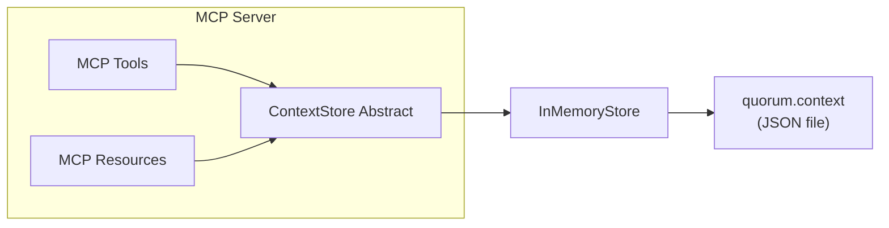

# Context Store Implementation

This document covers the implementation details of Quorum's Context Store. For conceptual overview and MCP API design, see [Context Management](context-management.md). For how context fits into the overall system, see [System Design](system-design.md#context-management).

## Responsibilities

The Context Store is a component inside the MCP Server that:

1. Persists context items across three scopes (project, conversation, agent)
2. Provides key-value and keyword search access
3. Manages TTL-based expiration (lazy, on read)
4. Emits change events for decoupled subscribers
5. Persists state to a JSON file in the workspace (survives container restarts)



## Core Interface

All storage backends implement this abstract class, which doubles as the NestJS DI injection token (TypeScript interfaces are erased at compile time):

```typescript
abstract class ContextStore {
  abstract set(params: SetParams): Promise<void>;
  abstract get(scope: ContextScope, key: string, id?: string): Promise<unknown>;
  abstract getAll(scope: ContextScope, id?: string): Promise<Record<string, unknown>>;
  abstract search(scope: ContextScope, query: string, id?: string, maxTokens?: number): Promise<ContextItem[]>;
  abstract getStats(scope?: ContextScope, id?: string): Promise<ContextStats>;
}
```

Key design decisions:
- **Scoped keys**: Items are keyed by `{scope}:{id}:{key}` via `CompositeKeyBuilder` to partition data
- **TTL support**: Items can auto-expire via `expiresAt` timestamp. `ttl` is in **milliseconds**, converted to `expiresAt = Date.now() + ttl`
- **Token budgeting**: `search()` accepts `maxTokens` to limit response size (estimate: `Math.ceil(JSON.stringify(value).length / 4)`)
- **All-async**: Methods return `Promise` even for synchronous backends, so the contract stays stable when the backend becomes truly async
- **Change events are not part of the abstract class**: Concrete stores inject `EventEmitter2` and emit `'context.change'` events independently; listeners subscribe with `@OnEvent('context.change')` in any NestJS module

### Types

```typescript
enum ContextScope {
  project = 'project',       // Entire session lifetime
  conversation = 'conversation', // Single task chain (correlationId)
  agent = 'agent',           // Per-agent working memory
}

interface ContextItem {
  key: string;               // Item key within scope
  value: unknown;            // JSON-serializable payload
  scope: ContextScope;
  id?: string;               // correlationId (conversation) or agentId (agent)
  createdBy?: string;        // Agent role that created this item
  createdAt: number;         // Epoch milliseconds
  expiresAt?: number;        // Epoch milliseconds (undefined = no expiry)
}

interface SetParams {
  scope: ContextScope;
  key: string;
  value: unknown;
  id?: string;               // correlationId or agentId
  createdBy?: string;
  ttl?: number;              // Milliseconds, converted to expiresAt
}

interface ContextStats {
  itemCount: number;         // Live (non-expired) items
  estimatedTokens: number;   // Math.ceil(JSON.stringify(value).length / 4)
}

interface ChangeEvent {
  scope: ContextScope;
  key: string;
  id?: string;
  action: 'set' | 'delete' | 'expire';
}
```

## CompositeKeyBuilder

Centralized scope-aware key construction in `libs/common`. Ensures consistent keying across all backends and prevents the scope/id mismatch bug that occurred when tool handlers blindly passed `correlationId` for project-scope items (see QRM2-BUG-006).

**Format**: `${scope}:${id ?? '_'}:${key}`

**Rules**:
- **project** scope: `id` is always stripped → `project:_:key` (even if provided)
- **conversation** scope: `id` required → `conversation:{correlationId}:key`
- **agent** scope: `id` required → `agent:{agentId}:key`
- **Throws** if conversation/agent scope is missing `id`

```typescript
class CompositeKeyBuilder {
  static build(scope: ContextScope, key: string, id?: string): string;
  static parse(compositeKey: string): { scope: ContextScope; id: string | undefined; key: string };
}
```

`parse()` decomposes a composite key back to its parts — useful for debugging and logging. It handles keys containing colons correctly (only the first two colons are delimiters).

## InMemoryStore

`Map<string, ContextItem>` backed store with file persistence. This is the current (POC phase) backend.

### Behavior

| Method | Behavior |
|--------|----------|
| `set()` | Builds composite key, stores item, emits `'context.change'` with action `'set'` |
| `get()` | Returns `item.value` or `undefined`. Lazy-expires and emits `'expire'` if item has passed `expiresAt` |
| `getAll()` | Filters by prefix `${scope}:${id ?? '_'}:`, skips expired, returns `{ [key]: value }` |
| `search()` | Case-insensitive substring match on `JSON.stringify(value)`. Accumulates results until `maxTokens` budget exhausted |
| `getStats()` | Counts items and estimates tokens. If `scope` is omitted, aggregates across all scopes |

All read methods perform **lazy TTL expiration** — there is no background cleanup job. Expired items are deleted and emit an `'expire'` event when encountered during reads.

### File Persistence

Context is persisted to a `quorum.context` JSON file in the workspace directory. This survives container restarts without requiring an external database.

**Serialization format**: JSON array of `[compositeKey, ContextItem]` tuples (round-trips with `new Map()`).

```json
[
  ["project:_:tech_stack", { "key": "tech_stack", "value": {"runtime": "Node.js"}, "scope": "project", "createdAt": 1710400000000 }],
  ["conversation:task-001:decision", { "key": "decision", "value": "JWT", "scope": "conversation", "id": "task-001", "createdAt": 1710400001000 }]
]
```

**Lifecycle hooks**:

| Hook | Trigger | Behavior |
|------|---------|----------|
| `onModuleInit()` | NestJS app startup | Reads JSON file, skips expired items, populates `Map`. Handles missing file (ENOENT) gracefully |
| `onModuleDestroy()` | NestJS graceful shutdown | Filters out expired items, writes to `.tmp` file, atomically renames to final path |

The **atomic write pattern** (tmp + rename) prevents partial/corrupt writes if the process is killed mid-save. Write failures are logged but do not throw (other shutdown hooks continue).

### Module Wiring

```typescript
@Module({
  imports: [EventEmitterModule.forRoot()],
  providers: [{ provide: ContextStore, useClass: InMemoryStore }],
  exports: [ContextStore],
})
export class ContextStoreModule {}
```

Swapping to a different backend requires only a `useClass` change.

## Configuration

Two config factories in `apps/mcp-server/src/config/`:

**contextStoreConfig** — file persistence path:

| Environment Variable | Default | Purpose |
|---------------------|---------|---------|
| `CONTEXT_STORE_PATH` | `${MCP_WORKSPACE_DIR}/quorum.context` | Override the persistence file path |
| `MCP_WORKSPACE_DIR` | `.` (current directory) | Workspace root (also used by other modules) |

**contextConfig** — query defaults:

| Environment Variable | Default | Purpose |
|---------------------|---------|---------|
| `CONTEXT_DEFAULT_MAX_TOKENS` | `2000` | Default token budget for `context_query` search mode |
| `CONTEXT_TOKEN_CHAR_RATIO` | `4` | Characters per token estimate (used by `context_summarize` budget calculation) |

Both are loaded via `McpServerConfigService` and injected into `McpService` tool handlers.

## Future Enhancements

| Enhancement | Description |
|-------------|-------------|
| **OpenSearch backend** | Unified BM25 full-text + k-NN vector search (hybrid scoring) for semantic context retrieval. Would replace keyword substring matching with meaning-based search |
| **Embedding on write** | Embed context items at storage time (Voyage AI, OpenAI, or local Ollama) to enable vector similarity queries |
| **LLM-based summarization** | Replace POC truncation in `context_summarize` with semantic summarization |
| **Bootstrap context injection** | Message Broker queries Context Store for recent decisions and attaches to invocation requests (TODO in broker) |
| **Resource update notifications** | Wire `'context.change'` events to MCP `notifications/resources/updated` for real-time subscriptions (TODO in MCP service) |
| **Role-based access control** | Agents only see context for their scope |

## References

- [Context Management](context-management.md) — Concepts and MCP API
- [System Design](system-design.md#context-management) — How context fits into the architecture
- [Claude Code SDK](claude-code-sdk.md#mcp-tool-bridge) — Tool bridge parameter augmentation for context tools