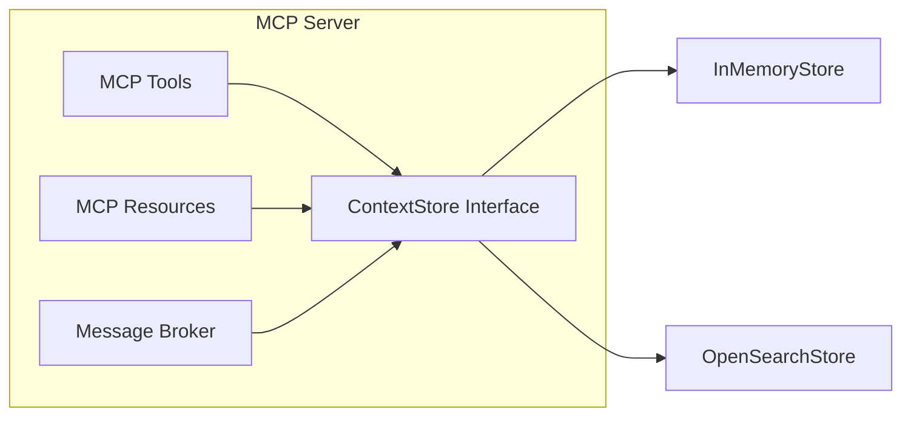

# Context Store Implementation

This document covers the implementation details of Quorum's Context Store. For conceptual overview and MCP API design, see [Context Management](context-management.md).

## Responsibilities

The Context Store is a component inside the MCP Server that:

1. Persists context items across three scopes (project, conversation, agent)
2. Provides key-value and semantic search access
3. Manages TTL-based expiration
4. Emits change events for resource subscriptions



## Core Interface

All storage backends implement this interface:

```typescript
interface ContextStore {
  set(params: SetParams): Promise<void>;
  get(scope: string, key: string, id?: string): Promise<unknown | undefined>;
  getAll(scope: string, id?: string): Promise<Record<string, unknown>>;
  search(scope: string, query: string, id?: string, maxTokens?: number): Promise<ContextItem[]>;
  getStats(scope?: string, id?: string): Promise<ContextStats>;
  on(event: "change", listener: ChangeListener): void;
}
```

Key design decisions:
- **Scoped keys**: Items are keyed by `{scope}:{id}:{key}` to partition data
- **TTL support**: Items can auto-expire via `expiresAt` timestamp
- **Token budgeting**: `search()` accepts `maxTokens` to limit response size
- **Event emission**: `change` events trigger MCP resource notifications

## Storage Backend Evolution

```
Phase 1 (POC)          Phase 2 (MVP)              Phase 3 (Production)
────────────────────────────────────────────────────────────────────────
InMemoryStore     →    PostgreSQL + pgvector  →   OpenSearchStore
(no persistence)       (hybrid storage)           (unified search)
```

### Backend Comparison

| Backend | Full-Text | Vector Search | Persistence | Best For |
|---------|-----------|---------------|-------------|----------|
| In-Memory Map | ❌ | ❌ | ❌ | POC |
| PostgreSQL + pgvector | ✅ | ✅ | ✅ | MVP |
| OpenSearch | ✅ BM25 | ✅ k-NN | ✅ | Production |

### Why OpenSearch for Production

OpenSearch provides **unified full-text + vector search** in a single query:

```typescript
// Hybrid query: BM25 text relevance + k-NN vector similarity
{
  query: {
    bool: {
      should: [
        { match: { content: query } },           // Full-text
        { knn: { embedding: { vector, k: 10 } }} // Semantic
      ],
      filter: [
        { term: { scope: "conversation" } },
        { term: { correlationId } }
      ]
    }
  }
}
```

This enables agents to query context by meaning, not just keywords.

## In-Memory Store (POC)

Simple `Map<string, ContextItem>` with:
- Key format: `${scope}:${id}:${key}`
- Lazy TTL expiration on read
- Keyword-based search (substring matching)
- Token estimation: `Math.ceil(JSON.stringify(value).length / 4)`

Suitable for development only. No persistence, no semantic search.

## OpenSearch Store (Production)

### Index Schema

```json
{
  "properties": {
    "key": { "type": "keyword" },
    "value": { "type": "object", "enabled": false },
    "content": { "type": "text" },
    "embedding": { "type": "knn_vector", "dimension": 1536 },
    "scope": { "type": "keyword" },
    "correlationId": { "type": "keyword" },
    "expiresAt": { "type": "date" }
  }
}
```

### Embedding Strategy

Context items are embedded on write for semantic search:

```typescript
async set(params: SetParams): Promise<void> {
  const content = JSON.stringify(params.value);
  const embedding = await this.embedder.embed(content);  // 1536-dim vector

  await this.client.index({
    index: "quorum-context",
    body: { ...params, content, embedding }
  });
}
```

Embedding options:
- **Voyage AI** (Anthropic's recommended)
- **OpenAI** `text-embedding-3-small`
- **Local** models via Ollama (for air-gapped environments)

### TTL Enforcement

Two approaches:
1. **Query-time filtering**: Exclude expired items in search queries
2. **Scheduled cleanup**: Periodic `deleteByQuery` for expired items

## Integration with Message Broker

The Message Broker uses Context Store for minimal bootstrap context:

```typescript
async invoke(request: InvokeRequest): Promise<InvokeResponse> {
  // Only fetch essential context - agent queries for more
  const recentDecisions = await this.contextStore.search(
    "conversation",
    "decisions",
    request.correlationId,
    500  // Token budget
  );

  return agent.handle({
    ...request,
    bootstrapContext: { recentDecisions }
  });
}
```

Agents then use `context_query` tool to fetch additional context as needed.

## Docker Compose

```yaml
services:
  opensearch:
    image: opensearchproject/opensearch:2.11.0
    environment:
      - discovery.type=single-node
      - plugins.security.disabled=true  # Dev only
    ports:
      - "9200:9200"
    volumes:
      - opensearch-data:/usr/share/opensearch/data
```

## Future Enhancements

| Enhancement | Description |
|-------------|-------------|
| **Hybrid scoring tuning** | Adjust BM25 vs k-NN weights per query type |
| **Caching layer** | Redis for frequently accessed project context |
| **Role-based access** | Agents only see context for their scope |
| **Context versioning** | Track history of changes |

## References

- [Context Management](context-management.md) - Concepts and MCP API
- [Message Broker](message-broker.md) - Inter-agent communication
- [OpenSearch k-NN](https://opensearch.org/docs/latest/search-plugins/knn/index/)