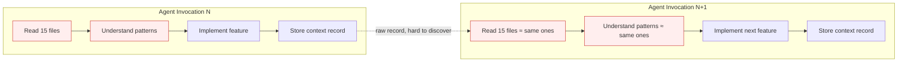
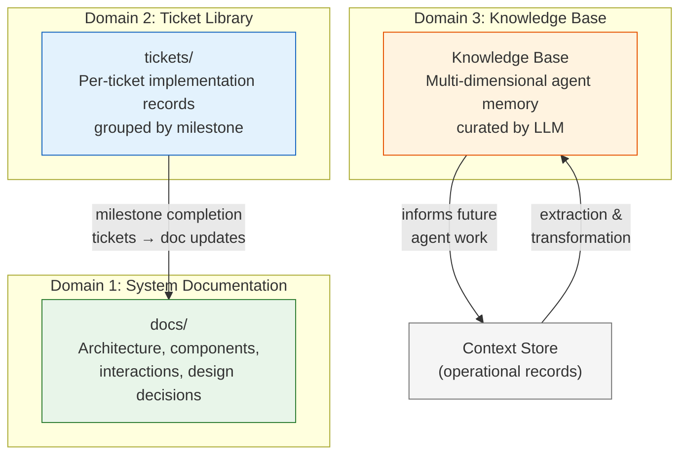
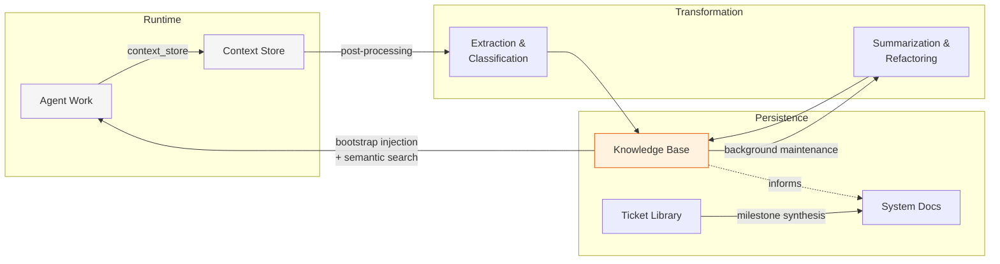
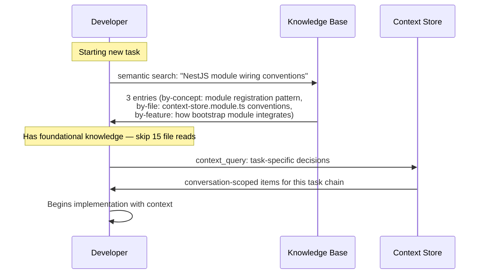

# Knowledge Management in Quorum

## Introduction

Quorum agents are stateless. Every invocation starts with a blank context window — the agent has no memory of prior sessions, no accumulated understanding of the codebase, no recall of decisions made in previous runs. The [Context Store](context-store.md) and [bootstrap context injection](context-management.md#pattern-4-bootstrap-context-injection) partially address this by sharing operational state within a session, but they don't capture the *learning* that agents accumulate through repeated interaction with the codebase.

When a developer agent reads 21 files to understand a codebase pattern, implements a feature using that pattern, and returns — all of that understanding evaporates. The next invocation on a different task rediscovers the same patterns from scratch. The system remembers *what happened* (context store records, tickets, commits) but not *what it means* (which patterns matter, how components connect, what constraints exist).

This document describes Quorum's knowledge management architecture: three knowledge domains with distinct ownership, lifecycle, and purpose, connected by transformation pipelines that convert operational experience into reusable knowledge.

## The Problem

Multi-agent systems face a fundamental tension between agent statelessness and organizational learning:

Each invocation repeats a **discovery phase** — reading files, understanding conventions, tracing integration points — that prior invocations already completed. The cost is not just in tool calls and tokens; it's in the turns consumed before the agent reaches the point where it can do novel work.

The Context Store captures fragments of this understanding as operational records, but these records are:

- **Task-specific** — written to serve the current task, not future tasks
- **Unstructured** — free-form JSON values with no consistent schema or vocabulary
- **Flat** — one key, one value, one access path. An agent looking for "what do I need to know about token budgeting?" won't find a record keyed as `qrm4-002-implementation-result`
- **Unmaintained** — no process to update, summarize, or retire stale records

The gap between *capturing operational state* (what the Context Store does) and *building organizational knowledge* (what agents need) is the problem knowledge management solves.

## Three Knowledge Domains

Quorum organizes knowledge into three domains, each with distinct ownership, trust level, and lifecycle:

### Domain 1: System Documentation (`docs/`)

**Source of truth about what the system IS.**

System documentation describes the current architecture: what components exist, how they connect, how they interact, what design decisions underpin them. It is the human architect's primary artifact — representing the idea of the project as the human envisions it.

| Property | Value |
|----------|-------|
| **Owner** | Human architect |
| **Trust level** | Highest — authoritative reference |
| **Update frequency** | Low — revised at milestone boundaries |
| **Audience** | All agents and humans |
| **Examples** | `system-design.md`, `agent-messaging.md`, `context-store.md` |

System docs answer: *"How does this system work?"*

### Domain 2: Ticket Library (`tickets/`)

**Record of how the system EVOLVED.**

The ticket library is a sequential record of every unit of work — each ticket is a time snapshot capturing the circumstances, reasoning, and approach for a specific piece of codework. Tickets are grouped by milestones. They explain *why* something was implemented a certain way, while the codebase remains the primary source of truth for *how*.

| Property | Value |
|----------|-------|
| **Owner** | Human-supervised, agent-produced |
| **Trust level** | High — reviewed and accepted |
| **Update frequency** | Per-ticket (during milestone) |
| **Audience** | Agents implementing related work, future maintainers |
| **Examples** | `QRM4-002-bootstrap-context-assembly-service.md` |

Tickets answer: *"Why was this built this way, and what was considered?"*

**Lifecycle bridge:** At the end of a milestone, completed tickets represent accumulated knowledge about the system that has not yet been reflected in system documentation. The transformation of ticket quantity into documentation quality is an explicit pipeline — not an afterthought. Milestone goals are defined by the human architect, implemented by agents through tickets, and then synthesized back into authoritative docs with agent assistance under human review.

### Domain 3: Knowledge Base (new)

**What agents LEARNED through repeated interaction with the codebase.**

While implementing tickets and assisting with documentation, agents read hundreds of files, make logical conclusions, opt into design decisions, and discover constraints. This understanding is currently ephemeral — it exists only within a single invocation's context window and vanishes when the session ends. The Knowledge Base captures, structures, and maintains this understanding so future invocations can build on it rather than rediscovering it.

| Property | Value |
|----------|-------|
| **Owner** | Agent-produced, LLM-maintained |
| **Trust level** | Medium — derived, requires provenance |
| **Update frequency** | Continuous (background processing) |
| **Audience** | Agents at task start and during research |
| **Examples** | File-level knowledge, feature-level patterns, cross-cutting conventions |

The Knowledge Base answers: *"What should I already know before working on this?"*

## Knowledge Lifecycle

Knowledge flows between domains through explicit transformation pipelines:

### Stage 1: Capture

Agents write to the Context Store during their work — implementation decisions, research findings, review verdicts, progress checkpoints. These records are task-focused and operational.

### Stage 2: Extract and Classify

Raw context store records are post-processed into structured Knowledge Base entries. A single context store record may produce multiple KB entries, each classified along a different **dimension**:

| Dimension | Question It Answers | Example |
|-----------|-------------------|---------|
| **By source file** | "What do I need to know about this file?" | `bootstrap-context.service.ts` — implements greedy bin-packing with reverse insertion order, handles budget reclamation between scopes |
| **By feature** | "What do I need to know about this feature?" | Bootstrap context injection — non-fatal assembly, 1000-token default budget, project/conversation split |
| **By concept** | "What do I need to know about this pattern/convention?" | Token budgeting in Quorum — used in bootstrap assembly, search results, context summarization; formula is `ceil(JSON.stringify(value).length / 4)` |

The same underlying knowledge — "how token budgeting works in bootstrap assembly" — is accessible through three different retrieval paths. An agent searching by file, by feature, or by concept can all find it.

### Stage 3: Summarize and Refactor

The Knowledge Base is continuously maintained through background LLM processing:

- **Summarization** — when multiple KB entries about the same topic accumulate, they are merged into a concise summary that preserves the essential knowledge while reducing token cost
- **Deduplication** — entries derived from different context store records that describe the same knowledge are consolidated
- **Staleness detection** — entries whose underlying code has changed significantly are flagged for re-evaluation or retired
- **Taxonomy alignment** — emergent sub-topics are normalized to prevent drift (e.g., "config factory" and "configuration service" refer to the same pattern)

### Stage 4: Milestone Synthesis

At the end of a milestone, completed tickets represent a body of implementation decisions that should be reflected in system documentation. This transformation pipeline — supported by agents, reviewed by the human architect — converts the sequential record of *how the system changed* into an updated description of *how the system works*.

## Knowledge Retrieval

Agents access knowledge through two complementary mechanisms:

### Passive: Bootstrap Injection

The existing [bootstrap context injection](context-management.md#pattern-4-bootstrap-context-injection) mechanism extends to include Knowledge Base entries. When the broker assembles context for an invocation, it draws from both the operational Context Store and the curated Knowledge Base — prioritizing high-relevance KB entries that match the task being assigned.

### Active: Semantic Search

Agents query the Knowledge Base using semantic search — matching intent rather than exact keywords. An agent searching for "how do agents receive context on startup" should find entries about bootstrap context injection, even if none of them contain that exact phrase.

Semantic search operates across all dimensions simultaneously. A query about "token budget" returns file-level entries (which files implement it), feature-level entries (which features use it), and concept-level entries (the general pattern and its rationale).

## Relationship to Existing Context Management

The Knowledge Base does not replace the Context Store — it is built on top of it.

| Aspect | Context Store | Knowledge Base |
|--------|-------------|----------------|
| **Content** | Operational records (decisions, checkpoints, results) | Curated knowledge (patterns, conventions, relationships) |
| **Lifecycle** | Session-scoped with TTL | Persistent, background-maintained |
| **Structure** | Free-form key-value | Classified by dimension (file, feature, concept) |
| **Search** | Keyword-based | Semantic (intent-based) |
| **Trust model** | Raw — what an agent wrote mid-task | Derived — post-processed with provenance |
| **Primary use** | Mid-task coordination between agents | Pre-task context loading for new invocations |

The Context Store remains the operational backbone — agents still use `context_store` and `context_query` for real-time coordination within a session. The Knowledge Base is a **derived view**: raw context store records are its primary input, but it applies extraction, classification, and curation to produce higher-quality, more discoverable knowledge.

**Key design principle:** The Knowledge Base is always regenerable from its sources (context store records + current code state). A corrupted or stale KB entry can be deleted without data loss — the extraction pipeline can recreate it from source material.

## Provenance and Trust

Every Knowledge Base entry carries metadata about its origin:

- **Source records** — which context store records it was derived from
- **Source agent** — which agent role produced the original observations
- **Extraction timestamp** — when the KB entry was created or last updated
- **Code references** — which files or features the entry describes
- **Confidence signal** — whether the entry has been validated by subsequent use or human review

Agents should treat KB entries as informed guidance, not absolute truth. When a KB entry conflicts with what the agent observes in the current code, the code wins — and the agent should flag the discrepancy so the KB can be updated.

## Dimensional Taxonomy

Knowledge Base entries are classified along three primary dimensions using a **hybrid taxonomy**: a fixed top-level structure derived from the project's module architecture, with emergent sub-topics assigned during extraction.

### By Source File

Entries keyed by the source file they describe. Useful when an agent is about to modify a specific file and wants to know its conventions, constraints, and integration points.

### By Feature

Entries keyed by the feature or subsystem they belong to. The top-level feature list is derived from the project's architectural components (e.g., Context Store, Message Broker, Bootstrap Context, Agent Permissions). Useful when an agent is working on a feature-level task and needs cross-file understanding.

### By Concept

Entries keyed by cross-cutting patterns, conventions, or constraints that span multiple files and features (e.g., token budgeting, composite key scheme, error handling conventions, NestJS module wiring). Useful when an agent encounters a pattern and needs to understand how it's applied across the codebase.

A single piece of knowledge can — and often should — exist in all three dimensions. The extraction pipeline determines which dimensions are relevant for each source record.

## Summary

| Capability | Mechanism |
|------------|-----------|
| Persistent agent learning | Knowledge Base — curated, multi-dimensional, background-maintained |
| Knowledge discovery | Semantic search across file, feature, and concept dimensions |
| Knowledge quality | LLM-based extraction, summarization, deduplication, staleness detection |
| Knowledge trust | Provenance metadata, confidence signals, code-wins-over-memory principle |
| Knowledge lifecycle | Context Store → extraction → KB → summarization → (informs) → System Docs |
| Milestone synthesis | Completed tickets → system documentation updates (human-reviewed) |

Quorum's knowledge management architecture transforms agents from stateless executors into participants in an organizational learning system — where each invocation contributes to and benefits from a growing body of curated knowledge.

## References

- [Context Management](context-management.md) — MCP API for context sharing (operational layer beneath the KB)
- [Context Store](context-store.md) — Storage backend that feeds the KB extraction pipeline
- [System Design](system-design.md#context-management) — Context scopes and pull-based model
- [Agent Messaging](agent-messaging.md) — Bidirectional MCP architecture for agent coordination