# MCP Connectivity

This document is the single source of truth for how Quorum establishes, maintains, and recycles MCP sessions between the MCP server and its two classes of client: **agents** (NestJS apps) and the **moderator** (Claude Code CLI).

For the protocol-agnostic message-routing layer, see [Message Broker](message-broker.md). For the messaging conceptual model, see [Agent Messaging](agent-messaging.md).

---

## 1. Overview

The MCP server exposes a single Streamable HTTP endpoint at `POST/GET/DELETE /mcp` (port 3000 inside the Compose network). Two client topologies share that endpoint:

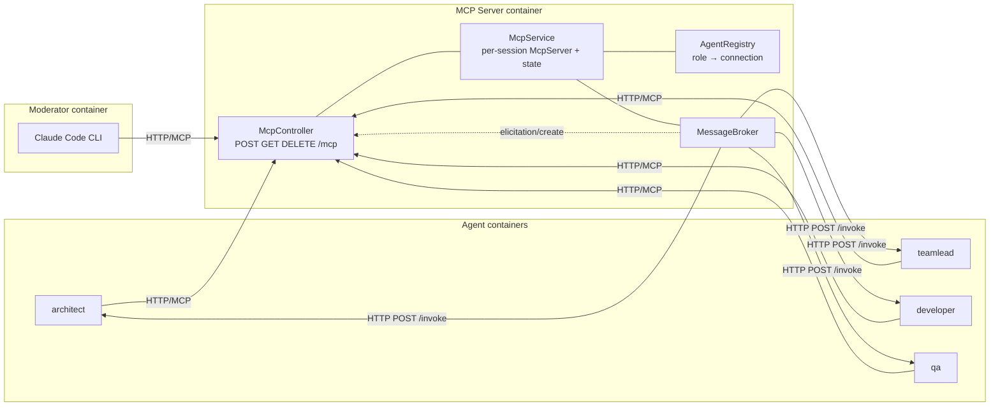

Key distinction:

| Aspect | Agents | Moderator |
|---|---|---|
| Client | NestJS app (`apps/agent`) | Claude Code CLI |
| Outbound to MCP server | `StreamableHTTPClientTransport` | CC CLI's built-in MCP client |
| `register_agent` includes `callbackUrl` | yes (`http://<role>:<port>`) | no |
| Inbound delivery channel | HTTP `POST /invoke` on the agent app | MCP `elicitation/create` over the moderator's open MCP session |
| Liveness from server's POV | always `true` (HTTP push is best-effort) | `lastSeenAt`-driven |
| Lifetime | container lifetime | one CC CLI process; subject to transport recycling |

---

## 2. Server-side session model

### 2.1 Session creation

A session is born when a client sends `POST /mcp` without an `mcp-session-id` header. The controller:

1. Constructs a fresh `StreamableHTTPServerTransport` with a UUID `sessionIdGenerator`.
2. Calls `McpService.connect(transport)`, which constructs a per-session `McpServer`, registers tools/resources on it, attaches it to the transport, and seeds session state.
3. Lets the transport's `handleRequest` process the `initialize` JSON-RPC message; the SDK assigns the session id mid-call.
4. Stores `sessionId → transport` and `sessionId → McpServer` in two parallel maps.
5. Sets `transport.onclose` to delete both map entries and call `McpService.disconnect`.

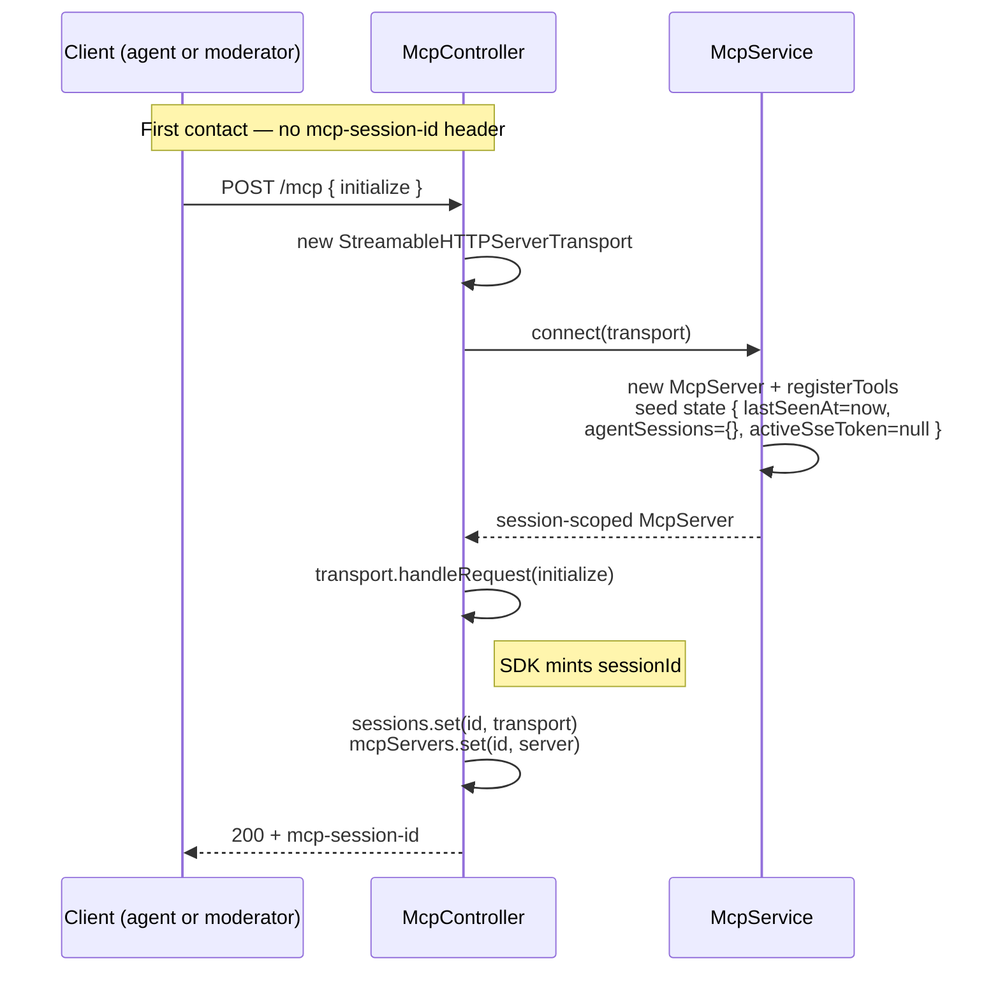

### 2.2 Per-session state

`McpService` owns a `Map<McpServer, McpSessionState>`:

```ts
interface McpSessionState {
  role?: AgentRole;                      // set by register_agent
  correlationId?: string;                // set by new_conversation
  agentSessions: Map<AgentRole, string>; // SDK sub-session cache
  lastSeenAt: number;                    // refreshed on POST/GET/keepalive write
  activeSseToken: object | null;         // opaque identity token; non-null while a GET SSE response is live
}
```

State is populated progressively:

| Event | Field updated |
|---|---|
| Session created | `lastSeenAt`, `agentSessions`, `activeSseToken=null` |
| Any POST/GET on the session | `lastSeenAt = Date.now()` (via `touchSession`) |
| `GET /mcp` opens an SSE stream | `activeSseToken = {}` (fresh opaque token) |
| `GET /mcp` response close fires | `activeSseToken = null` (only if token still matches; identity-guarded) |
| 15 s SSE keepalive tick on long POST | `lastSeenAt = Date.now()` on every `: ping` write |
| `register_agent` | `role` set; prior session bound to the same role is evicted |
| `new_conversation` | `correlationId` set |

### 2.3 SSE keepalive

`startSseKeepalive(res, server?)` runs on every response that is or becomes `text/event-stream`. It does three things:

1. Sets the TCP socket to `keepAlive(true, 15_000)` for kernel-level dead-peer detection.
2. Writes an immediate `: ready\n\n` SSE comment (and touches `lastSeenAt`).
3. Schedules a 15 s `setInterval` that writes `: ping\n\n` and touches `lastSeenAt`. The tick checks `res.writableEnded` first and self-clears if the response has ended.

This produces two distinct runtime profiles depending on the path:

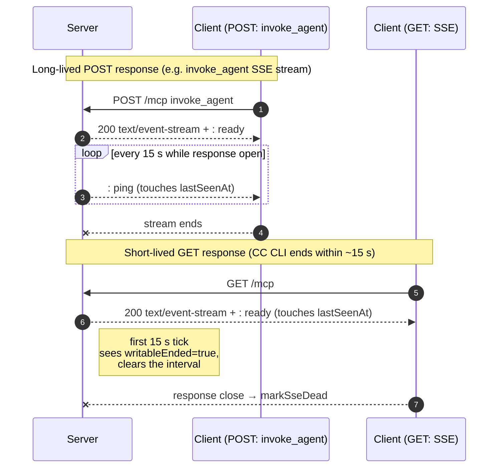

The same code branches on `res.writableEnded` so callers don't need to know which path they're on.

### 2.4 Liveness — `isSessionAlive`

The reaper consults this predicate every 30 s:

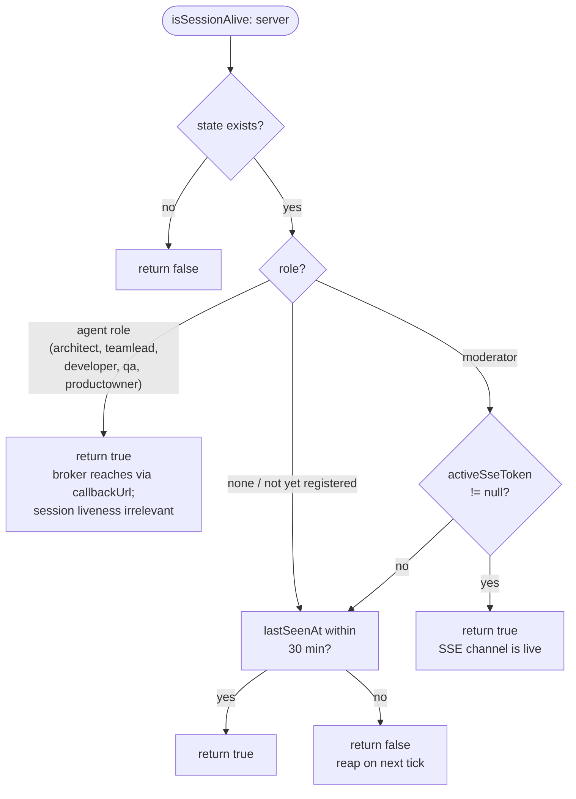

Three exemptions, in priority order:

1. **Agent-role sessions** are always alive from the reaper's POV. The broker delivers to agents via HTTP `POST /invoke` on `callbackUrl`; the agent's MCP session has no bearing on inbound reachability. Memory bound for this class is the same-role eviction (§4.4).
2. **Moderator with live SSE response** (`activeSseToken !== null`) is alive regardless of `lastSeenAt`. The token is set on `GET /mcp` open and cleared on the response's `close` event under an identity guard (only the token from a still-current GET can clear the field).
3. **Anonymous sessions** (no `role` yet, or `role=none` after deregistration) and **moderator between SSE GETs** fall through to `Date.now() - lastSeenAt < 30 min`.

### 2.5 The reaper

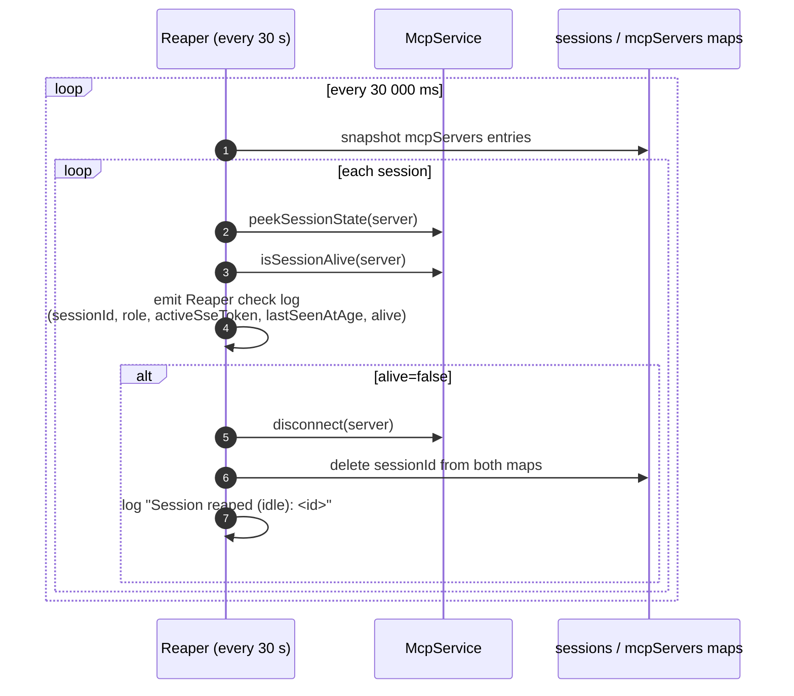

Constants:
- `REAPER_INTERVAL_MS = 30_000`
- `SESSION_LIVENESS_TIMEOUT_MS = 1_800_000` (30 min)
- `TCP_KEEPALIVE_INITIAL_DELAY_MS = 15_000`
- `SSE_KEEPALIVE_INTERVAL_MS = 15_000`

The reaper is idempotent with `transport.onclose` — both routes call `McpService.disconnect`, which is a no-op on already-removed state.

### 2.6 Three exit paths for a session

A session leaves the maps via exactly one of:

1. **Reaper eviction** — `isSessionAlive` returned false; logged as `Session reaped (idle): <id>`.
2. **Same-role eviction at `register_agent`** — a new client claims a role already bound to a prior session; the prior `McpServer` is `close()`d, which cascades `transport.onclose` → maps cleared. Logged as `Evicted prior <role> session (idle <N>s) on re-register` followed by `Session closed: <id>`.
3. **Client `DELETE /mcp`** — usually issued by the SDK on graceful shutdown. Logged as `Session deleted: <id>`.

---

## 3. Agents (HTTP delivery)

Agents are NestJS apps under `apps/agent` that run one container per role. Each container uses `apps/agent/src/connection/mcp-client.service.ts` to connect to the MCP server and a local `POST /invoke` controller to receive invocations.

### 3.1 Bootstrap sequence

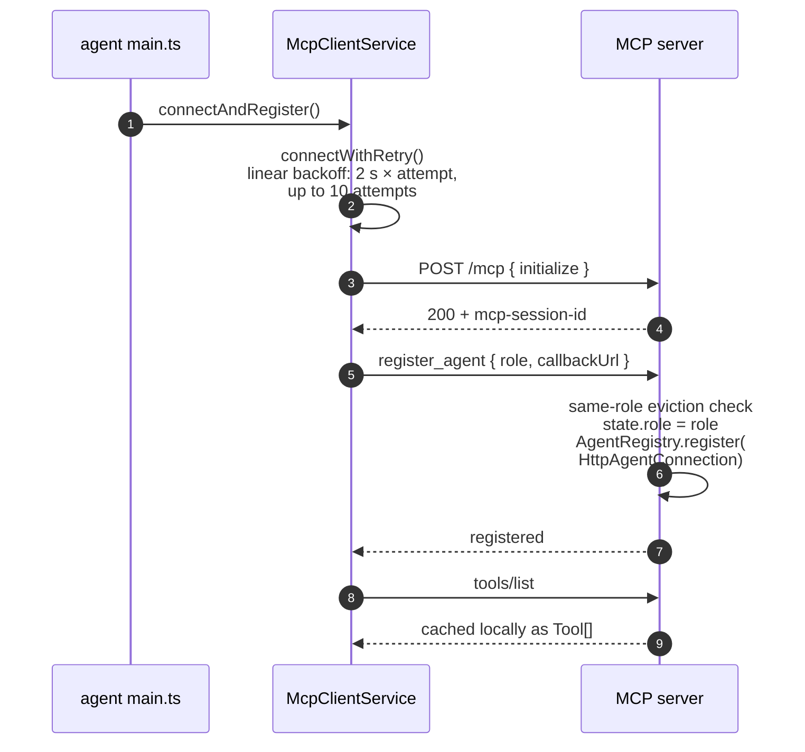

Configuration (env-driven, `apps/agent/src/config/agent.config.ts`):

| Env var | Purpose |
|---|---|
| `AGENT_ROLE` | one of architect, teamlead, developer, qa, productowner |
| `AGENT_CALLBACK_URL` | `http://<role>:<port>`, used by the broker for outbound `POST /invoke` |
| `MCP_SERVER_URL` | `http://mcp-server:3000/mcp` |
| `MCP_REQUEST_TIMEOUT_MS` | per-call SDK timeout for outbound MCP calls |

### 3.2 Outbound transport (agent → server)

The agent constructs a `StreamableHTTPClientTransport` with a custom `fetch` that uses an undici `Agent` dispatcher with both `headersTimeout` and `bodyTimeout` set to **35 minutes**, plus a TCP keepalive initial delay of 30 s. This is the timeout authority for nested invocations: the SDK request timeout caps tool calls; the dispatcher keeps the underlying HTTP/SSE connection from being closed mid-response by undici's defaults.

### 3.3 Inbound delivery (server → agent)

The MCP server's `HttpAgentConnection` represents an agent in the registry. `handle(request, timeout)` issues a single `POST {callbackUrl}/invoke` with the same 35-min undici dispatcher and an `AbortController` driven by the role-specific timeout (§5). Errors are mapped to `InvokeResponse { success: false, error: ... }` — `handle` never throws.

`isConnected()` is hard-coded `true` for `HttpAgentConnection`: HTTP delivery is best-effort, and unreachability is discovered when `handle` fails.

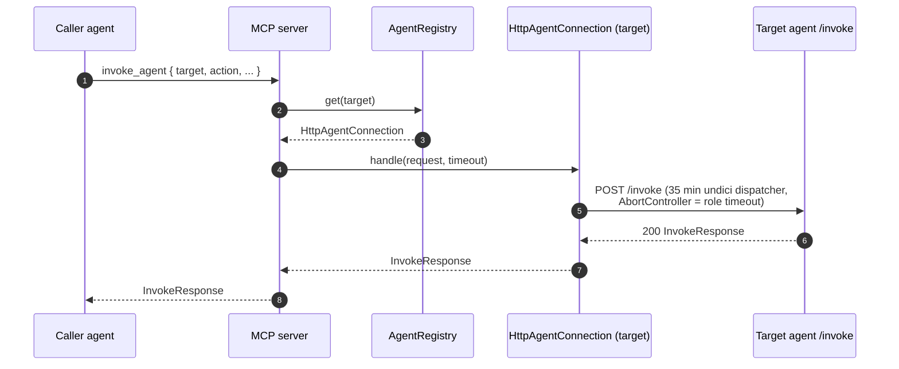

### 3.4 Reconnection

The agent's transport carries an `onclose` handler. If it fires while `shuttingDown=false`, the agent runs `handleReconnection()`:

1. `connectWithRetry()` re-establishes the transport.
2. `register_agent` is re-issued with the same role + callbackUrl.
3. Tools are re-discovered.

A single `reconnectPromise` field deduplicates concurrent reconnection attempts.

`callTool` also intercepts `Session not found` errors directly — if the server reaped or restarted, the agent closes its zombie transport, runs the same reconnection routine, and retries the call exactly once before surfacing the error.

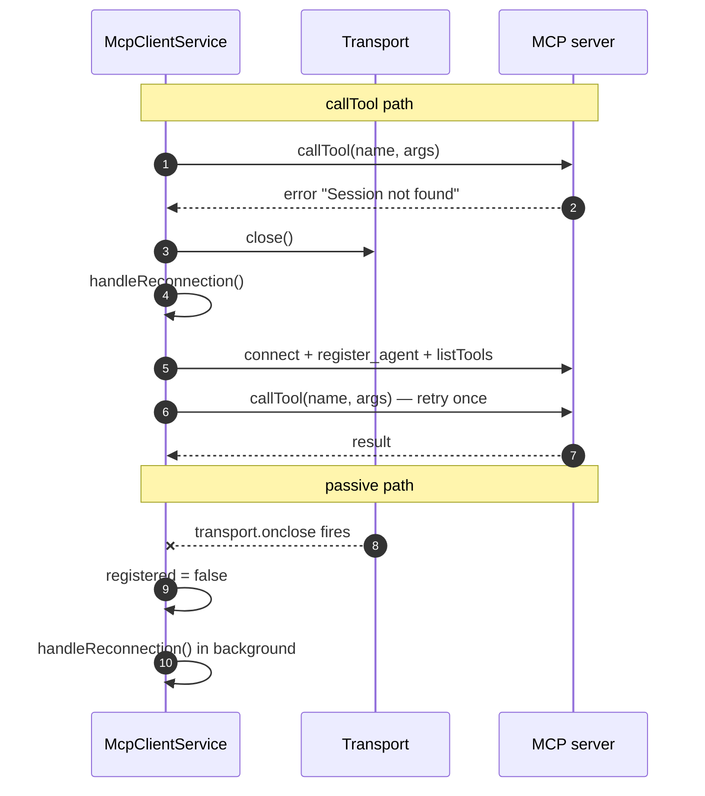

### 3.5 Shutdown

`onApplicationShutdown` (`SIGTERM`/`SIGINT`):

1. `unregister()` → `unregister_agent` tool call (best-effort).
2. `closeTransport()` → SDK translates to `DELETE /mcp`, which the controller's `handleDelete` processes by closing the transport, which fires `transport.onclose` → maps cleared, state disposed.

---

## 4. Moderator (elicitation delivery)

The moderator is **not** a Quorum NestJS app — it is a Claude Code CLI process running in the `moderator` container. It speaks MCP to the server using its own bundled MCP client. Quorum has no direct code on the moderator side; it only configures CC CLI through `MCP_SERVER_URL=http://mcp-server:3000/mcp`.

### 4.1 Bootstrap sequence

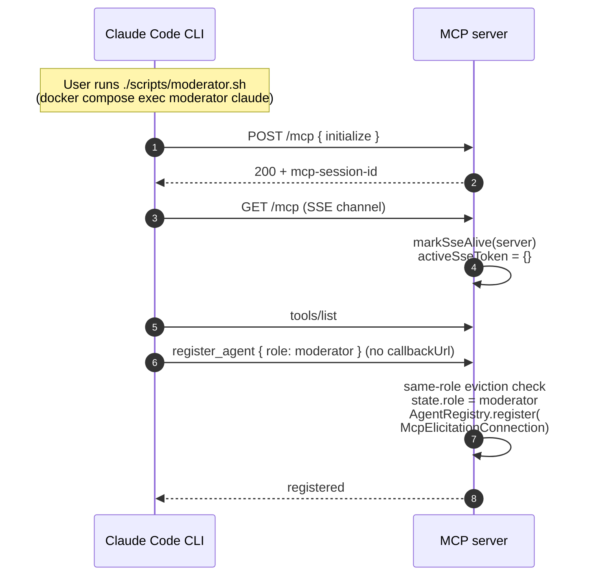

`register_agent` without a `callbackUrl` is only legal for `role=moderator`. The handler constructs an `McpElicitationConnection` bound to the moderator's per-session `McpServer` and a `livenessCheck` closure that calls `isSessionAlive(server)`.

### 4.2 SSE GET stream

CC CLI keeps a `GET /mcp` request open as its inbound channel for server-initiated requests (notifications and elicitations). The SDK reopens this GET periodically — typically driven by the upstream HTTP stack's body-idle behavior. While a GET response is in-flight, `state.activeSseToken` is non-null; once the response ends (whether by client close or server-side reset), the close handler fires and clears the token under the identity guard.

The identity guard is what makes overlapping reopens safe:

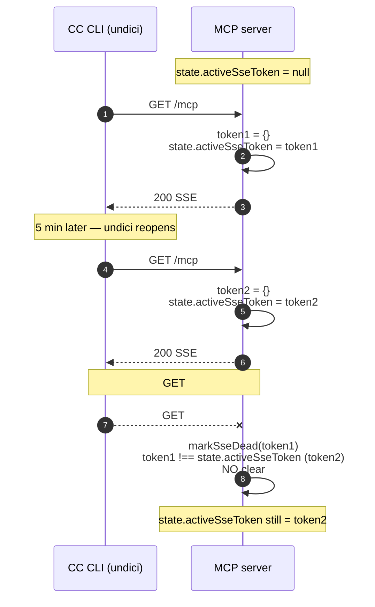

Result: the moderator's `activeSseToken` is non-null whenever any SSE GET is open, including across reopens. While that holds, `isSessionAlive` short-circuits to `true` regardless of `lastSeenAt`.

### 4.3 Outbound delivery (server → moderator)

When an agent invokes the moderator (e.g. for clarification), the broker resolves to an `McpElicitationConnection` and calls `handle(request, timeout)`. The connection issues `server.server.elicitInput(...)` on the moderator's per-session `McpServer`. The SDK pushes an `elicitation/create` JSON-RPC request down the open SSE stream; CC CLI surfaces the question in the user's terminal; the user's typed answer comes back as the elicitation result.

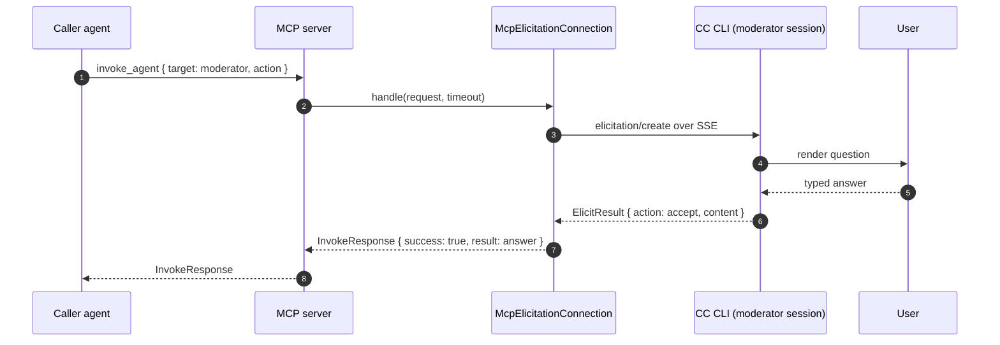

`McpElicitationConnection.isConnected()` returns `livenessCheck()`, which is `isSessionAlive(server)` for the moderator's specific per-session server. If the moderator's SSE channel is live or its `lastSeenAt` is fresh, the broker considers it reachable and forwards the elicitation; otherwise the broker rejects with `Agent moderator not connected`.

### 4.4 Transport recycling and same-role eviction

CC CLI is free to abandon a session id and create a new one (e.g. on internal transport recycle or a fresh user turn after a long idle). When that happens, the moderator simply re-runs the bootstrap sequence: `initialize` → `GET /mcp` → `register_agent`. The `register_agent` handler walks `sessionStates` and, finding a different `McpServer` already bound to `role=moderator`:

1. Removes that prior server from `sessionStates`.
2. Calls `prior.close()`, which cascades to `transport.close()` → `transport.onclose` → maps cleared and state disposed.
3. Sets `state.role = moderator` on the new session.
4. Replaces the connection in `AgentRegistry` (the registry's own `set` overwrites any prior entry for the role).

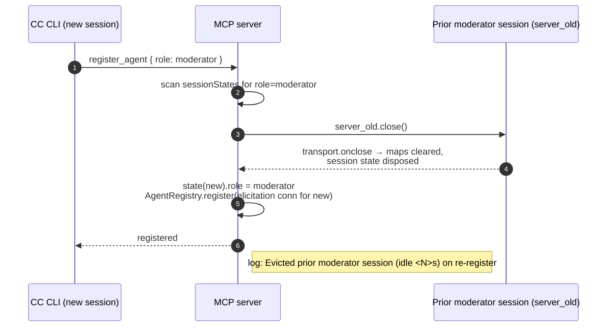

Same-role eviction is what bounds memory for moderator sessions: even if CC CLI walks through several session ids, only the most recent one stays bound to the role; previous ones are closed deterministically on the next `register_agent` call.

### 4.5 First-call-after-recycle behavior

If CC CLI sends a tool call on a freshly recycled transport without re-running `register_agent` first (e.g. a queued request races with the transport recycle), the call lands on a session whose `state.role` is unset. The server returns the appropriate error (e.g. `invoke_agent` rejects unregistered callers); CC CLI's MCP client retries by re-running `register_agent` and reissuing the call. From the user's perspective this is a transparent retry; on the server it appears as a normal `Evicted prior moderator session ... on re-register` followed by the successful tool call.

---

## 5. Role-based timeouts

The broker applies a per-role timeout when delivering an invocation. Defined in `apps/mcp-server/src/messaging/role-timeouts.ts`:

| Role | Timeout |
|---|---|
| moderator | 5 min (user clarification via elicitation) |
| productowner | 2 min |
| teamlead | 10 min |
| architect | 15 min |
| qa | 15 min |
| developer | 30 min |

Timeout is applied as a timeout-vs-delivery race in `deliverWithTimeout` (an explicit `new Promise(resolve => ...)` with a `setTimeout` racing against `delivery.then/catch`); on expiry the broker resolves with `{ success: false, error: 'Agent <role> timed out after <ms>ms' }` without throwing. This is independent of — and shorter than — the underlying undici `headersTimeout`/`bodyTimeout` on both sides (35 min), which exist solely to keep the HTTP connection from being killed before the role timeout has a chance to fire.

---

## 6. Cadence reference

| Cadence | Where | Effect |
|---|---|---|
| 30 s | reaper interval | scan sessions, evict any whose `isSessionAlive` is false |
| 30 min | `SESSION_LIVENESS_TIMEOUT_MS` | upper bound on idle time for moderator-without-SSE and anonymous sessions |
| 15 s | TCP keepalive initial delay | first kernel probe on idle TCP socket |
| 15 s | SSE keepalive interval | `: ping` on long-lived POST responses, refreshes `lastSeenAt` |
| 2 s × N | agent connect retry | linear backoff, 10 attempts max |
| 30 s | agent undici keepAliveInitialDelay | TCP keepalive on outbound transport |
| 35 min | undici `headersTimeout` / `bodyTimeout` | both directions; allows the per-role timeouts above to be the sole authority |

---

## 7. End-to-end reference flows

### 7.1 Agent → Agent invocation (e.g. teamlead → architect)

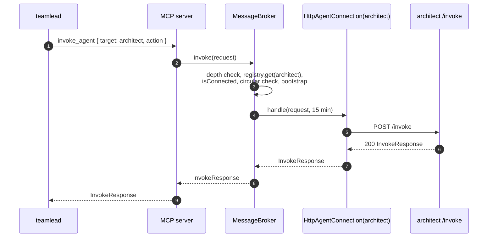

### 7.2 Agent → Moderator clarification

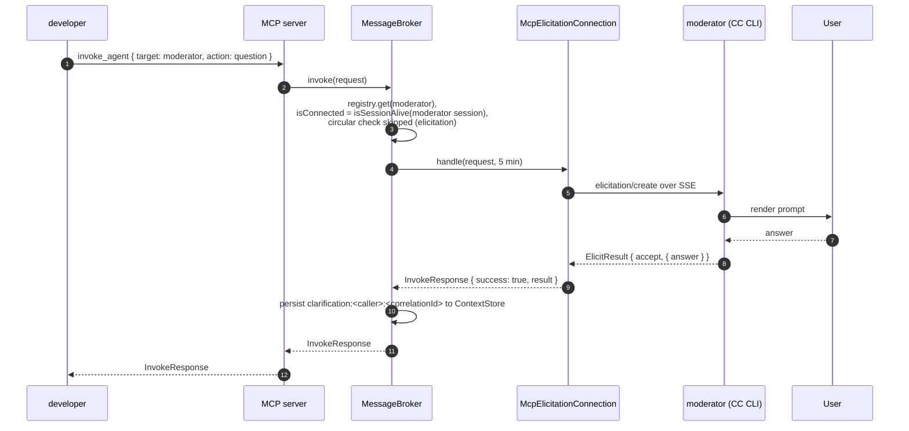

### 7.3 Long-running invoke_agent — keepalive in action

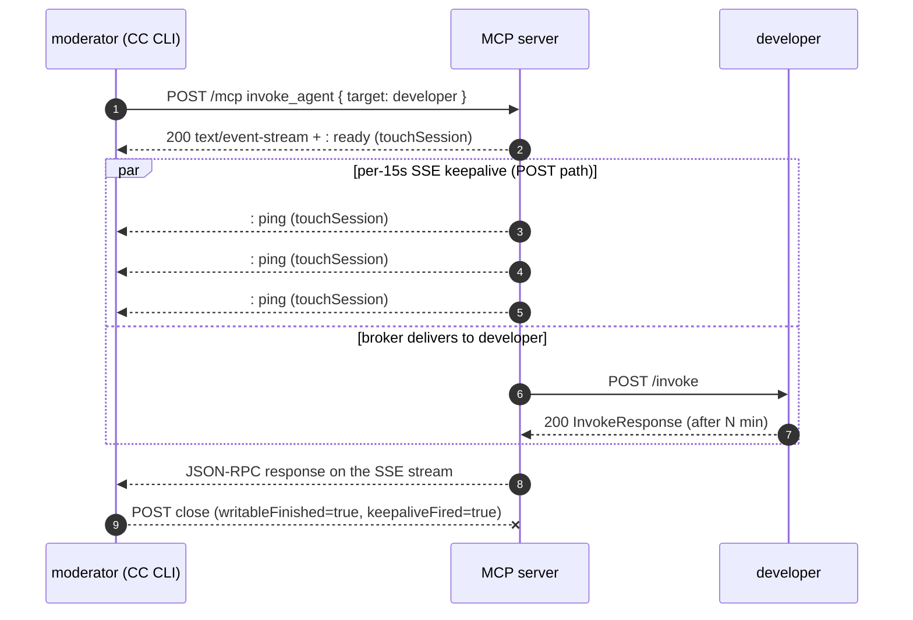

The 15 s pings keep `lastSeenAt` continuously fresh on the moderator's session for the full duration of the invocation, regardless of whether its `GET /mcp` SSE happens to be open at that moment.

---

## 8. Quick reference

**Where a session can be observed in logs:**

| Log line | Source | Meaning |
|---|---|---|
| `Session created: <id>` | `McpController.handlePost` | new transport bound to a fresh sessionId |
| `Session closed: <id>` | `transport.onclose` | transport ended (DELETE, server-side close, or eviction) |
| `Session deleted: <id>` | `McpController.handleDelete` | client issued DELETE /mcp |
| `Session reaped (idle): <id>` | `McpController.reapStaleSessions` | reaper found `isSessionAlive=false` |
| `Reaper check: sessionId=<id> ... activeSseToken=<bool> lastSeenAtAge=<ms> alive=<bool>` | reaper diagnostic | per-tick state snapshot |
| `Registered agent: <role>` | `AgentRegistry.register` | role bound in registry |
| `Evicted prior <role> session (idle <N>s) on re-register` | `register_agent` handler | same-role eviction during another session's `register_agent` |
| `Agent <role> registered at <url>` | `register_agent` handler | HTTP delivery (agents) |
| `Agent <role> registered via MCP elicitation (session-bound)` | `register_agent` handler | elicitation delivery (moderator) |
| `POST close: sessionId=<id> ... keepaliveFired=<bool>` | POST instrumentation | whether the long-running SSE keepalive engaged on this POST |

**Where to look in code:**

| Concern | File |
|---|---|
| HTTP routing, session maps, reaper, SSE keepalive | `apps/mcp-server/src/mcp/mcp.controller.ts` |
| Per-session McpServer, state, liveness predicate, tool handlers | `apps/mcp-server/src/mcp/mcp.service.ts` |
| Registry / one-connection-per-role | `apps/mcp-server/src/registry/agent-registry.service.ts` |
| HTTP connection abstraction (agents) | `apps/mcp-server/src/registry/http-agent-connection.ts` |
| Elicitation connection abstraction (moderator) | `apps/mcp-server/src/registry/mcp-elicitation-connection.ts` |
| Broker, depth/circular safeguards, role timeouts | `apps/mcp-server/src/messaging/message-broker.service.ts` |
| Per-role timeout values | `apps/mcp-server/src/messaging/role-timeouts.ts` |
| Agent client (connect, register, retry, shutdown) | `apps/agent/src/connection/mcp-client.service.ts` |
| Agent inbound `/invoke` endpoint | `apps/agent/src/connection/invocation.controller.ts` |