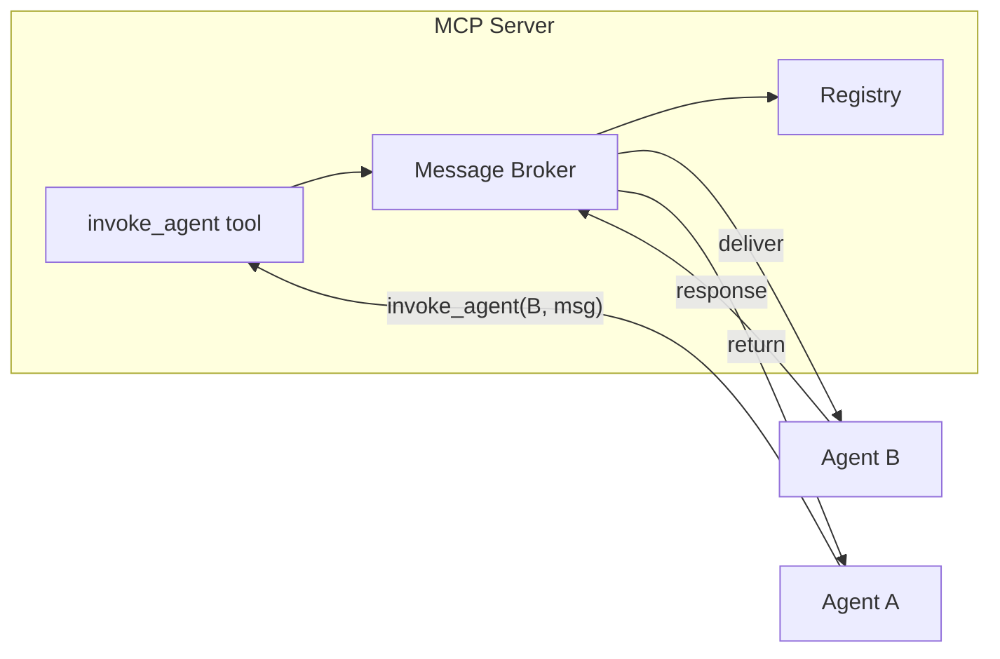

# Message Broker Implementation

This document covers the implementation details of Quorum's Message Broker. For conceptual overview, see [Agent Messaging](agent-messaging.md).

## Responsibilities

The Message Broker is a component inside the MCP Server that:

1. Receives `invoke_agent` requests from any connected agent
2. Looks up the target agent in the Registry
3. Delivers the message to the target's handler
4. Manages response flow back to the caller



## Core Interfaces

### InvokeRequest / InvokeResponse

```typescript
interface InvokeRequest {
  correlationId: string;       // Track through entire call chain
  parentRequestId?: string;    // Immediate caller's request ID
  caller: AgentRole;
  target: AgentRole;
  action: string;
  context?: Record<string, unknown>;
  wait: boolean;
  depth: number;               // Current call depth
}

interface InvokeResponse {
  success: boolean;
  result?: string;
  error?: string;
}
```

### MessageBroker

```typescript
class MessageBroker {
  constructor(
    private registry: AgentRegistry,
    private defaultTimeout: number = 300_000
  ) {}

  async invoke(request: InvokeRequest): Promise<InvokeResponse> {
    const agent = this.registry.get(request.target);

    if (!agent) {
      return { success: false, error: `Agent ${request.target} not available` };
    }

    return agent.handle(request, this.getTimeout(request.target));
  }

  private getTimeout(role: AgentRole): number {
    return ROLE_TIMEOUTS[role] ?? this.defaultTimeout;
  }
}
```

### AgentHandler

Each agent implements a handler that receives invocations:

```typescript
class AgentHandler {
  constructor(
    private llm: ClaudeCodeRunner,
    private mcpClient: Client
  ) {}

  async handle(request: InvokeRequest, timeout: number): Promise<InvokeResponse> {
    const result = await this.llm.run({
      task: request.action,
      context: request.context,
      tools: [this.createInvokeAgentTool(request)],
      timeout
    });

    return { success: true, result };
  }

  private createInvokeAgentTool(parentRequest: InvokeRequest) {
    return {
      name: 'ask_agent',
      description: 'Ask another agent for help or information',
      execute: (args) => this.mcpClient.callTool('invoke_agent', {
        ...args,
        correlationId: parentRequest.correlationId,
        parentRequestId: parentRequest.correlationId,
        depth: parentRequest.depth + 1
      })
    };
  }
}
```

## Safeguards

### Circular Call Prevention

Agents calling each other in a loop will deadlock. Track the call chain and reject cycles:

```typescript
class MessageBroker {
  private callChains = new Map<string, Set<AgentRole>>();

  async invoke(request: InvokeRequest): Promise<InvokeResponse> {
    const chain = this.callChains.get(request.correlationId) || new Set();

    if (chain.has(request.target)) {
      return {
        success: false,
        error: `Circular call: ${[...chain].join(' → ')} → ${request.target}`
      };
    }

    chain.add(request.caller);
    this.callChains.set(request.correlationId, chain);

    try {
      return await this.deliverToAgent(request);
    } finally {
      chain.delete(request.caller);
      if (chain.size === 0) {
        this.callChains.delete(request.correlationId);
      }
    }
  }
}
```

### Call Depth Limit

Prevent unbounded delegation chains:

```typescript
const MAX_CALL_DEPTH = 5;

async invoke(request: InvokeRequest): Promise<InvokeResponse> {
  if (request.depth >= MAX_CALL_DEPTH) {
    return {
      success: false,
      error: `Max call depth (${MAX_CALL_DEPTH}) exceeded`
    };
  }
  // proceed...
}
```

### Role-Based Timeouts

Different agents have different expected response times:

```typescript
const ROLE_TIMEOUTS: Record<AgentRole, number> = {
  architect: 5 * 60_000,      // 5 min - design review
  teamlead: 10 * 60_000,      // 10 min - ticket creation
  developer: 30 * 60_000,     // 30 min - implementation
  qa: 15 * 60_000,            // 15 min - test execution
  productowner: 2 * 60_000    // 2 min - clarification
};
```

### Context Size Management

Avoid passing full conversation history. Pass only relevant data:

```typescript
// Prefer specific context
invoke_agent(architect, "what auth pattern?", {
  ticketId: 'QRM-001',
  decisions: ['use JWT', 'NestJS guards'],
  constraint: 'must support refresh tokens'
})

// Avoid bloated context
invoke_agent(architect, task, { fullConversation: [...] })
```

## Transport

WebSocket provides native bidirectional messaging:

```typescript
// Agent connects to MCP Server
const transport = new WebSocketClientTransport('ws://mcp-server:3000');
const client = new Client({ name: `${role}-agent` });
await client.connect(transport);

// Server delivers incoming tasks over the same connection
agentSocket.on('message', (msg) => handler.handle(msg));
```

Connection lifecycle (reconnection, heartbeats) is handled by `@modelcontextprotocol/sdk`.

## Agent Availability

Handle agents being offline or disconnected:

```typescript
async invoke(request: InvokeRequest): Promise<InvokeResponse> {
  const agent = this.registry.get(request.target);

  if (!agent) {
    return { success: false, error: `${request.target} not registered` };
  }

  if (!agent.isConnected()) {
    if (request.wait) {
      // Synchronous call - fail immediately
      return { success: false, error: `${request.target} not connected` };
    } else {
      // Async call - queue for later delivery
      return this.queueForDelivery(request);
    }
  }

  return this.deliverToAgent(agent, request);
}
```

## Observability

Include correlation IDs in all logs for tracing call chains:

```typescript
logger.info('Invoking agent', {
  correlationId: request.correlationId,
  caller: request.caller,
  target: request.target,
  depth: request.depth
});
```