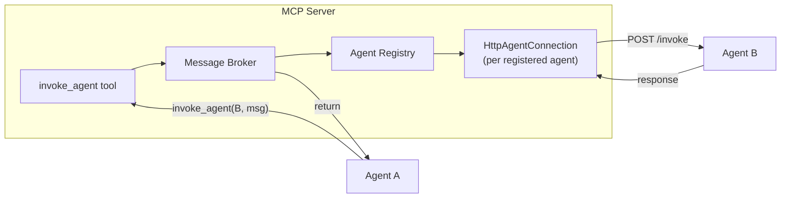
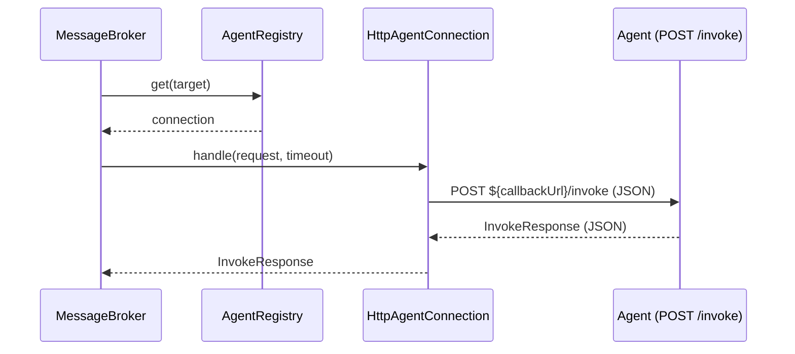
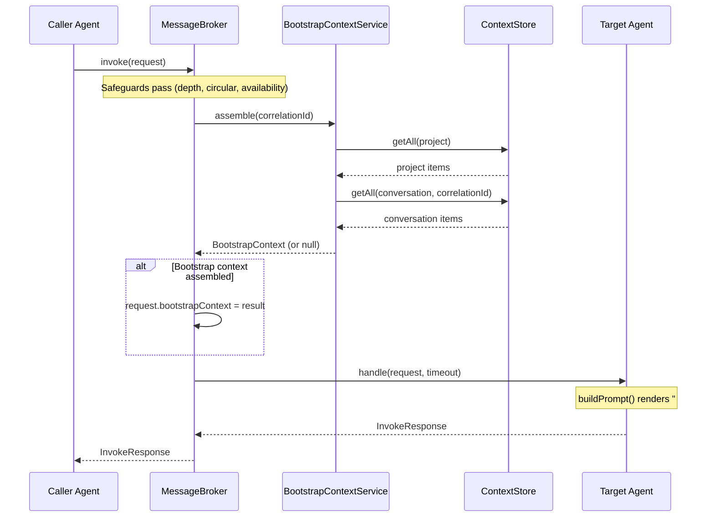

# Message Broker Implementation

This document covers the implementation details of Quorum's Message Broker. For conceptual overview, see [Agent Messaging](agent-messaging.md).

## Responsibilities

The Message Broker is a NestJS injectable service inside the MCP Server that:

1. Receives `invoke_agent` requests from any connected agent
2. Applies safeguards (depth, circular call, availability)
3. Looks up the target agent in the Registry
4. Delivers the request via HTTP POST to the agent's callback URL
5. Enforces role-based timeouts on the response
6. Returns the response to the caller



## Core Interfaces

### InvokeRequest / InvokeResponse

Defined in `libs/common/src/messaging/`:

```typescript
interface InvokeRequest {
  correlationId: string;       // UUID — traces entire call chain
  parentRequestId?: string;    // Immediate caller's request ID (nested-call debugging)
  caller: AgentRole;
  target: AgentRole;
  action: string;              // Natural-language task description
  context?: Record<string, unknown>;
  bootstrapContext?: BootstrapContext;  // Injected by broker — project + conversation context
  wait: boolean;
  depth: number;               // 0-based, incremented at each hop
}

interface InvokeResponse {
  success: boolean;
  result?: string;             // Present on success
  error?: string;              // Present on failure
}
```

> The `BootstrapContext` and `BootstrapContextMeta` types are defined in `libs/common/src/messaging/invoke.types.ts`.

### AgentRole Constants

```typescript
enum AgentRole {
  moderator, architect, teamlead, developer, qa, productowner
}

// The 5 roles deployed as agent containers (excludes moderator)
DEPLOYABLE_AGENT_ROLES = [architect, teamlead, developer, qa, productowner]

// All 6 roles valid as invoke_agent targets (includes moderator for user clarification)
INVOCABLE_AGENT_ROLES = [...DEPLOYABLE_AGENT_ROLES, moderator]
```

## Agent Registry

The `AgentRegistry` is a one-connection-per-role registry backed by `Map<AgentRole, AgentConnection>`. Agents register on startup via the `register_agent` MCP tool and unregister on shutdown.

```typescript
abstract class AgentConnection {
  abstract readonly role: AgentRole;
  abstract isConnected(): boolean;
  abstract handle(request: InvokeRequest, timeout: number): Promise<InvokeResponse>;
}
```

The concrete implementation is `HttpAgentConnection` — it delivers invocations via HTTP POST to the agent's registered callback URL (`${callbackUrl}/invoke`). Key behaviors:

- **Optimistic availability**: `isConnected()` always returns `true`; unreachability is discovered at delivery time
- **Never throws**: all transport errors, HTTP failures, and timeouts are caught and mapped to `{ success: false, error: '...' }`
- **AbortController timeout**: each delivery creates an `AbortController` with the broker-provided timeout; `DOMException` abort errors are mapped to timeout messages

Latest registration for a role silently overwrites the previous one (handles reconnection without explicit unregister).

## MessageBroker

```typescript
class MessageBroker {
  private readonly callChains = new Map<string, Set<AgentRole>>();

  constructor(
    private readonly registry: AgentRegistry,
    private readonly config: McpServerConfigService,
  ) {}

  async invoke(request: InvokeRequest): Promise<InvokeResponse>;
}
```

The `invoke()` method applies four safeguards in order, then delivers:

## Safeguards

### 1. Call Depth Limit

Prevent unbounded delegation chains. Configurable via environment:

```typescript
if (depth >= config.broker.maxCallDepth) {
  return { success: false, error: `Max call depth (${maxCallDepth}) exceeded` };
}
```

| Environment Variable | Default | Purpose |
|---------------------|---------|---------|
| `BROKER_MAX_CALL_DEPTH` | `5` | Maximum allowed call depth |

### 2. Circular Call Prevention

Track the call chain per `correlationId` and reject cycles:

```typescript
private readonly callChains = new Map<string, Set<AgentRole>>();

// In invoke():
const chain = this.callChains.get(correlationId) ?? new Set<AgentRole>();

if (chain.has(target)) {
  return { success: false, error: `Circular call: ${[...chain].join(' → ')} → ${target}` };
}

chain.add(caller);
this.callChains.set(correlationId, chain);

try {
  return await this.deliverWithTimeout(agent.handle(request, timeout), timeout, target);
} finally {
  chain.delete(caller);
  if (chain.size === 0) this.callChains.delete(correlationId);
}
```

The chain tracks callers (not targets), so A → B → C is allowed but A → B → A is rejected.

### 3. Agent Availability

Fail immediately if the target is not registered or not connected:

```typescript
const agent = this.registry.get(target);

if (!agent) return { success: false, error: `Agent ${target} not registered` };
if (!agent.isConnected()) return { success: false, error: `Agent ${target} not connected` };
```

There is no queuing or deferred delivery — if the target is unavailable, the caller gets an immediate error regardless of the `wait` flag.

### 4. Role-Based Timeouts

Different agents have different expected response times. The broker wraps delivery in a timeout promise:

```typescript
const ROLE_TIMEOUTS: Partial<Record<AgentRole, number>> = {
  architect:    5 * 60_000,   // 5 min — design review
  teamlead:    10 * 60_000,   // 10 min — ticket creation
  developer:   30 * 60_000,   // 30 min — implementation
  qa:          15 * 60_000,   // 15 min — test execution
  productowner: 2 * 60_000,   // 2 min — clarification
  // moderator: uses defaultTimeoutMs (user interaction time varies)
};
```

Roles not in the map (currently `moderator`) fall back to `defaultTimeoutMs`.

| Environment Variable | Default | Purpose |
|---------------------|---------|---------|
| `BROKER_DEFAULT_TIMEOUT_MS` | `300000` (5 min) | Fallback timeout for roles not in `ROLE_TIMEOUTS` |

The timeout is enforced by `deliverWithTimeout()` — a `Promise` wrapper that resolves to a timeout error if the timer fires before delivery completes. The timer uses `.unref()` so it doesn't block Node.js graceful shutdown.

## Delivery

After all safeguards pass, the broker delivers via the registered `HttpAgentConnection`:



The `HttpAgentConnection.handle()` method:
1. Creates an `AbortController` with the timeout
2. Sends HTTP POST with `InvokeRequest` as JSON body
3. Validates HTTP status and response shape
4. Maps `DOMException` abort to timeout error
5. Catches all errors — never throws, always resolves to `InvokeResponse`

## Transport

All MCP communication uses **Streamable HTTP** (not WebSocket):

| Channel | Protocol | Endpoints | Purpose |
|---------|----------|-----------|---------|
| MCP Protocol | Streamable HTTP | `POST/GET/DELETE /mcp` | Agent → MCP server tool calls, with per-client `mcp-session-id` sessions |
| Invocation Delivery | Plain HTTP | `POST /invoke` | MCP server → agent task delivery |

The MCP server creates a **per-session `McpServer` instance** (each client connection gets its own SDK server with independently registered tools). Session-to-transport mapping is maintained in `McpController`.

Agent-side connection management (`McpClientService`) handles reconnection with linear backoff (max 10 retries, 2s base interval). On disconnect, the client reconnects and re-registers automatically. A `shuttingDown` flag prevents reconnection attempts during graceful shutdown.

## Observability

All broker operations include `correlationId` for cross-service tracing:

```
Invoke: correlationId=abc-123 caller=moderator target=architect depth=0
Completed: correlationId=abc-123 target=architect success=true
```

Safeguard rejections are logged at WARN level:

```
Rejected: Max call depth (5) exceeded [correlationId=abc-123]
Rejected: Circular call: moderator → architect → moderator [correlationId=abc-123]
Rejected: Agent qa not registered [correlationId=abc-123]
```

> **Note:** Agent-side observability (SDK session tracking, tool events, cost/duration) is documented in [Claude Code SDK — Observability Hooks](claude-code-sdk.md#observability-hooks).

## Context Integration

The broker automatically injects relevant context from the Context Store into every invocation request before delivery. This implements the pull-based context model described in [Context Management](context-management.md), reducing the need for agents to query for common decisions at task start.

### Bootstrap Context Assembly

Before delivering an invocation, the broker calls `BootstrapContextService.assemble(correlationId)` to gather project-scope and conversation-scope decisions from the Context Store. The assembled `BootstrapContext` is attached to `request.bootstrapContext`.

**Assembly flow:**

1. **Check enabled** — if `BOOTSTRAP_ENABLED=false`, assembly returns `null` immediately (zero overhead)
2. **Calculate budgets** — split `BOOTSTRAP_MAX_TOKENS` between project and conversation scopes using `BOOTSTRAP_PROJECT_RATIO`
3. **Fetch project items** — always queries `ContextStore.getAll(project)` for architectural decisions, tech stack, constraints
4. **Fetch conversation items** — queries `ContextStore.getAll(conversation, correlationId)` when a `correlationId` is present; skipped otherwise
5. **Apply token budget** — greedy bin-packing over items in reverse insertion order (newer items preferred), using `Math.ceil(JSON.stringify(value).length / 4)` as the token estimate
6. **Reclaim unused budget** — unused project budget flows to the conversation allocation
7. **Empty check** — if both scopes are empty after budgeting, returns `null` (no `bootstrapContext` field set)

**Configuration:**

| Environment Variable | Default | Purpose |
|---------------------|---------|---------|
| `BOOTSTRAP_ENABLED` | `true` | Master toggle — when `false`, assembly returns `null` |
| `BOOTSTRAP_MAX_TOKENS` | `1000` | Total token budget for the assembled bootstrap payload |
| `BOOTSTRAP_PROJECT_RATIO` | `0.6` | Fraction of budget allocated to project-scope items (remainder goes to conversation) |

These are set in `docker-compose.yml` on the `mcp-server` service and read by the config factory in `apps/mcp-server/src/config/bootstrap.config.ts`.

### Error Handling

Bootstrap context assembly is **non-fatal**. If `assemble()` throws, the broker logs a warning and proceeds with delivery — the agent receives the invocation without bootstrap context. This ensures that a Context Store failure never blocks agent-to-agent communication.

### Agent-Side Rendering

On the agent side, `InvocationHandler.buildPrompt()` (in `apps/agent/src/connection/invocation-handler.service.ts`) renders the bootstrap context as a `## Prior Decisions` section prepended before the `Task:` line. The section contains `### Project Context` and `### Conversation Context` subsections with key-value entries formatted as `- key: JSON.stringify(value)`. Empty scopes are omitted. The `meta` field (item count, estimated tokens, scopes queried) is internal bookkeeping and is not rendered into the prompt.

When `bootstrapContext` is absent or both scopes are empty, the prompt is identical to the pre-bootstrap behavior — full backward compatibility.

### Sequence Diagram



> **Note:** See [Context Management](context-management.md) for the MCP API design (including Pattern 4: Bootstrap Context Injection), and [Context Store](context-store.md) for storage backend implementation details.