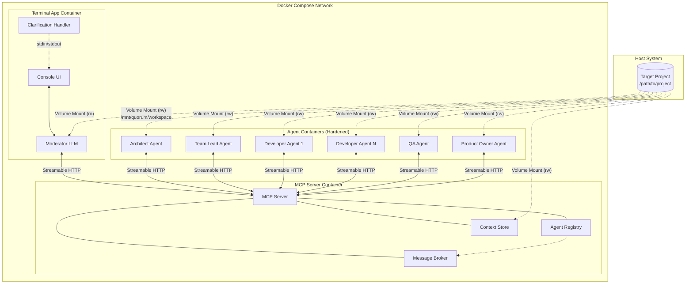
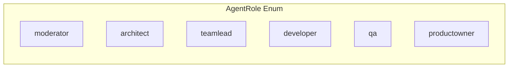
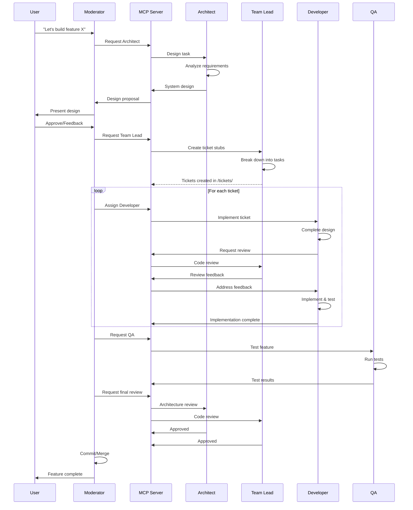
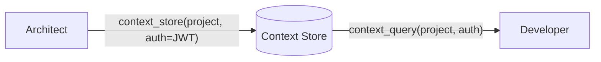
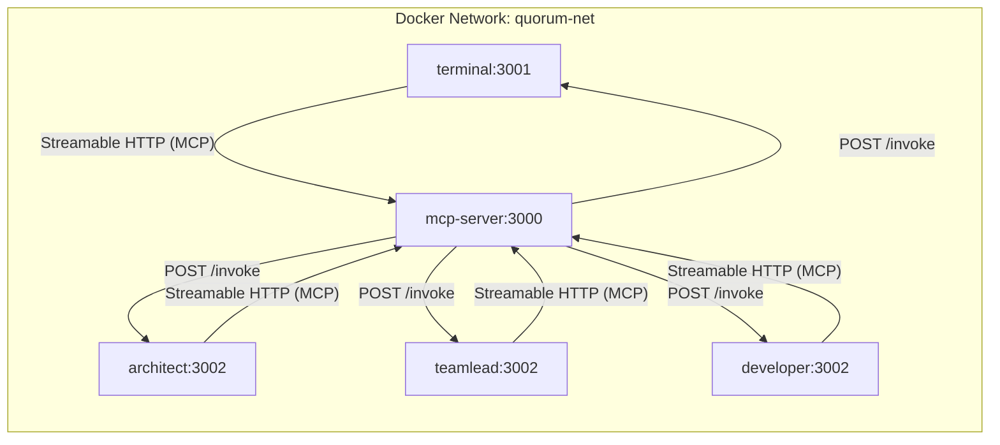

# Quorum System Design

## Overview

Quorum is a multi-agent AI orchestration system for semi-autonomous software development. It coordinates role-based AI agents (Claude Code instances) that collaborate on development tasks through an MCP server.

## System Architecture



## Container Components

### 1. Terminal App Container

The user-facing component providing a conversational interface.

| Aspect | Description |
|--------|-------------|
| **Purpose** | Console UI for chat-based interaction with the Moderator |
| **Technology** | NestJS application with Anthropic SDK (raw, not Claude Code SDK) |
| **LLM Integration** | Built-in Moderator LLM with 10-round agentic tool loop |
| **Connection** | MCP client (Streamable HTTP) connected to MCP Server |
| **Workspace** | Read-only mount at `/mnt/quorum/workspace` (reads `quorum.md` at startup) |

**Responsibilities:**
- Accept user input as natural language commands
- Display agent responses and progress
- Manage conversation context with Moderator
- Relay orchestration commands to MCP Server
- Surface agent clarification requests to the user via `ClarificationHandler`

#### Moderator LLM vs Clarification Handler

The Terminal App contains two distinct communication paths:

| | Moderator LLM | Clarification Handler |
|---|---|---|
| **Who initiates** | User sends a message | Agent escalates mid-task via `invoke_agent(moderator, ...)` |
| **Intelligence** | Full LLM reasoning — interprets intent, selects agents, sequences workflow | None — passthrough relay between agent and user |
| **Scope** | Entire workflow orchestration | Single decision point |
| **Context** | Full conversation history with the user | Just the question and the user's answer |

The **Moderator LLM** is the orchestration brain: it decomposes user requests into agent workflows ("build auth" → architect designs → team lead creates tickets → developer implements), synthesizes multi-agent results into coherent responses, and makes judgment calls about agent output.

The **Clarification Handler** is a direct agent-to-user channel that bypasses the Moderator LLM. When an agent needs a user decision mid-task (e.g., "push or pull architecture?"), the handler surfaces the question in the console, collects the answer, auto-persists it to the Context Store (project scope), and returns it to the calling agent. This avoids a synchronous call-chain deadlock that would occur if the agent tried to invoke the Moderator LLM while it's already blocked waiting for that agent. A `StdinLockService` (async mutex) prevents interleaved I/O between the chat loop and clarification prompts.

The terminal exposes `POST /invoke` (mirroring the agent pattern) so the MCP server can deliver clarification requests to it like any other agent.

### 2. MCP Server Container

The communication backbone connecting all agents.

| Aspect | Description |
|--------|-------------|
| **Purpose** | Bidirectional communication hub for all agents |
| **Technology** | NestJS MCP server implementation |
| **Protocol** | MCP (Model Context Protocol) over Streamable HTTP |
| **Transport** | `StreamableHTTPServerTransport` with per-client sessions (`mcp-session-id` header) |
| **Discovery** | Agent registry for role-based lookup |
| **Messaging** | Message broker for agent-to-agent invocation |
| **Workspace** | Read-write mount at `/mnt/quorum/workspace` (context file persistence) |

**MCP Tools (7):**

| Tool | Purpose |
|------|---------|
| `invoke_agent` | Route inter-agent messages via Message Broker |
| `register_agent` | Register an agent's role and callback URL |
| `unregister_agent` | Remove an agent from the registry |
| `context_store` | Write context items (scoped by project/conversation/agent) |
| `context_query` | Read context with mode selection (`keys`, `search`, `get-all`) |
| `context_summarize` | Compress conversation context (POC: truncation-based) |
| `context_stats` | Get context usage statistics (item count, estimated tokens) |

**MCP Resources (2):**

| Resource | URI | Purpose |
|----------|-----|---------|
| Project context | `context://project` | Read-only access to project-wide decisions |
| Conversation context | `context://conversation/{correlationId}` | Read-only access to task-specific context |

**Responsibilities:**
- Register and track active agents via `register_agent`/`unregister_agent`
- Route inter-agent messages via Message Broker
- Expose `invoke_agent` tool for agent-to-agent communication
- Manage shared Context Store (in-memory with file persistence)
- Health check endpoint (`GET /health`)

> **Note:** See [Agent Messaging](agent-messaging.md) for detailed documentation on bidirectional MCP and the Message Broker mechanism. See [Context Management](context-management.md) for the context sharing API and [Context Store](context-store.md) for storage backend details.

### 3. Agent Containers

Identical Docker images configured via environment variables. Containers are hardened with read-only filesystems, dropped capabilities, and no-new-privileges.

| Aspect | Description |
|--------|-------------|
| **Purpose** | Execute role-specific AI tasks via Claude Code SDK |
| **Technology** | NestJS application with Claude Agent SDK (`@anthropic-ai/claude-agent-sdk`) |
| **Base Image** | `node:24-bookworm-slim` (Debian, glibc required for SDK toolchain) |
| **Configuration** | `AGENT_ROLE` environment variable |
| **Workspace** | Shared volume at `/mnt/quorum/workspace` (read-write) |
| **MCP Role** | Dual: client (invoke others via tool bridge) + handler (be invoked via `POST /invoke`) |
| **Permissions** | Per-role tool restrictions enforced mechanically via `disallowedTools` + `canUseTool` hook |

**Agent Roles:**



The `moderator` role is handled by the Terminal App (not deployed as an agent container) but is part of the enum and is invocable via `invoke_agent` — enabling agents to route clarification requests to the user.

> **Details:** See [Claude Code SDK](claude-code-sdk.md) for SDK integration, tool bridge, permission profiles, container hardening, and observability hooks.

## Shared Workspace Structure

All agents access the target project through a mounted volume:

```
/mnt/quorum/workspace/           # Target project root
├── quorum.md                    # Feature definition & role configuration
├── quorum.context               # Context Store persistence (JSON, managed by MCP server)
├── docs/                        # Generated system documentation
│   └── *.md                     # Architecture docs, design decisions
├── tickets/                     # Implementation task tracking
│   └── *.md                     # Individual task definitions
└── [project files]              # Existing codebase
```

### quorum.md Configuration File

The `quorum.md` file serves as the primary configuration mechanism:

```markdown
# Feature: [Feature Name]

## Description
[What the feature should accomplish]

## Role Configurations

### Architect
[Custom instructions for architect behavior]

### Team Lead
[Custom instructions for team lead behavior]

### Developer
[Custom instructions for developer behavior]

### QA
[Custom instructions for QA behavior]

### Product Owner
[Custom instructions for product owner behavior]

## Constraints
[Technical constraints, deadlines, dependencies]
```

This file is:
- **Feature-specific**: Redefined for each new development task
- **Codebase-adaptable**: Adjusted per project's conventions
- **Universal**: Keeps Quorum apps reusable across projects

## Agent Collaboration Flow



## Context Management

Multi-agent collaboration creates a context management challenge: passing full conversation histories between agents exhausts context windows, while passing too little loses critical decisions. Quorum solves this with a **pull-based context model**.

### Core Principle

Agents don't receive full context on invocation. Instead, they:
1. Receive minimal bootstrap context (task description + correlation ID)
2. Query the Context Store for what they need via `context_query`
3. Store their decisions for others via `context_store`



### Context Scopes

| Scope | Lifetime | Contents | Example |
|-------|----------|----------|---------|
| **Project** | Entire session | Tech stack, constraints, architectural decisions | `"database": "PostgreSQL"` |
| **Conversation** | Single task chain | Task-specific decisions, intermediate results | `"api_style": "REST"` for ticket QRM-042 |
| **Agent** | Per-agent instance | Working memory, scratchpad | Developer's local notes |

### Agent Responsibility

Each agent role is prompted to record significant decisions:

- **Architect**: Stores tech choices, patterns, constraints in `project` scope
- **Team Lead**: Stores task breakdowns, priorities in `conversation` scope
- **Developer**: Queries decisions before implementing, stores implementation notes

This transforms context from "push everything" to "store decisions, query as needed" — keeping agent context windows lean while preserving team knowledge.

### Storage

The current backend is `InMemoryStore` — a `Map<string, ContextItem>` with composite keys (`{scope}:{id}:{key}`) managed by `CompositeKeyBuilder`. Project scope always uses `_` as ID; conversation/agent scopes require an explicit ID (correlationId or agentId).

Context is persisted to a `quorum.context` JSON file in the workspace directory. The store loads from this file on startup (pruning expired items) and saves on shutdown via atomic tmp+rename. This survives container restarts without requiring an external database.

> **Details:** [Context Management](context-management.md) for MCP API design, [Context Store](context-store.md) for storage implementation and backend evolution plan.

## NestJS Monorepo Structure

```
quorum/
├── package.json                 # Root workspace config
├── nest-cli.json                # NestJS monorepo config
├── Dockerfile                   # Multi-target build (default + agent targets)
├── docker-compose.yml           # Container orchestration
├── scripts/start.sh             # Docker launch script (exports HOST_UID/GID)
│
├── apps/
│   ├── terminal/                # Terminal App (Moderator)
│   │   ├── src/
│   │   │   ├── main.ts
│   │   │   ├── terminal.module.ts
│   │   │   ├── chat/            # ChatService — interactive loop, 10-round tool loop
│   │   │   ├── clarification/   # ClarificationService, StdinLockService
│   │   │   ├── config/          # Terminal-specific config (callbackUrl, workspaceDir)
│   │   │   ├── connection/      # MCP client (Streamable HTTP), registration
│   │   │   └── llm/             # AnthropicService (raw SDK, not Claude Code)
│   │   └── tsconfig.app.json
│   │
│   ├── mcp-server/              # MCP Server
│   │   ├── src/
│   │   │   ├── main.ts
│   │   │   ├── mcp-server.module.ts
│   │   │   ├── config/          # Server + broker + context-store config
│   │   │   ├── health/          # GET /health endpoint
│   │   │   ├── mcp/             # MCP protocol (7 tools, 2 resources)
│   │   │   ├── registry/        # Agent registry, HttpAgentConnection
│   │   │   ├── messaging/       # Message broker, role timeouts
│   │   │   └── context-store/   # InMemoryStore with file persistence
│   │   └── tsconfig.app.json
│   │
│   └── agent/                   # Agent App (single image, multi-role)
│       ├── src/
│       │   ├── main.ts
│       │   ├── agent.module.ts
│       │   ├── config/          # Agent config, RolePermissionService, role-tool-profiles
│       │   ├── connection/      # MCP client, InvocationHandler, McpToolBridgeService
│       │   ├── llm/             # ClaudeCodeService (SDK), AnthropicService, sdk-hooks
│       │   └── prompts/         # RolePromptService
│       └── tsconfig.app.json
│
└── libs/
    └── common/                  # Shared library
        └── src/
            ├── messaging/       # AgentRole enum, InvokeRequest/Response types
            ├── context-store/   # ContextStore abstract, types, CompositeKeyBuilder
            ├── prompts/         # SYSTEM_PREAMBLE, per-role prompt templates
            ├── config/          # Shared config factories (app, anthropic, logger, mcp)
            ├── logger/          # LoggerBuilder, QuorumLogger (dual transport)
            └── llm/             # tool-mapper (MCP → Anthropic schema conversion)
```

## Docker Compose Configuration

The Dockerfile uses a multi-target build: `default` target for mcp-server/terminal (Alpine), `agent` target for agents (Debian bookworm-slim with toolchain). Both accept `HOST_UID`/`HOST_GID` build args to align container user ownership with the host. Use `./scripts/start.sh` to launch — it exports these automatically.

Three YAML anchors provide shared configuration:

| Anchor | Purpose |
|--------|---------|
| `x-shared-env` | Common env vars (Anthropic API, MCP server URL, logging) |
| `x-agent-common` | Shared agent config (build args, depends_on, volumes, env) |
| `x-agent-security` | Security constraints (read-only fs, dropped caps, tmpfs mounts) |

```yaml
x-shared-env: &shared-env
  ANTHROPIC_API_KEY: ${ANTHROPIC_API_KEY}
  ANTHROPIC_MODEL: ${ANTHROPIC_MODEL:-claude-sonnet-4-5-20250929}
  ANTHROPIC_MAX_TOKENS: ${ANTHROPIC_MAX_TOKENS:-4096}
  MCP_SERVER_URL: http://mcp-server:3000
  LOG_JSON_DIR: /app/logs
  LOG_LEVEL: ${LOG_LEVEL:-log}

services:
  mcp-server:                    # Dockerfile target: default
    environment:
      PORT: 3000
      ENABLE_TEST_ENDPOINTS: "true"
      MCP_WORKSPACE_DIR: /mnt/quorum/workspace
    healthcheck: GET /health
    volumes:
      - quorum-logs:/app/logs
      - ${WORKSPACE_PATH}:/mnt/quorum/workspace:rw

  terminal:                      # Dockerfile target: default
    stdin_open: true
    tty: true
    depends_on: [mcp-server (healthy)]
    environment:
      PORT: 3001
      MCP_CALLBACK_URL: http://terminal:3001
      TERMINAL_WORKSPACE_DIR: /mnt/quorum/workspace
    volumes:
      - quorum-logs:/app/logs
      - ${WORKSPACE_PATH}:/mnt/quorum/workspace:ro

  architect:                     # Dockerfile target: agent
  teamlead:                      # Dockerfile target: agent
  developer:                     # Dockerfile target: agent
    # Each: AGENT_ROLE={service}, PORT: 3002,
    #        AGENT_CALLBACK_URL: http://{service}:3002,
    #        AGENT_WORKSPACE_DIR: /mnt/quorum/workspace
    # Security: x-agent-security (read_only, cap_drop ALL, tmpfs mounts)
    # Volumes: workspace (rw) + quorum-logs
```

Currently 5 deployed services: mcp-server, terminal, architect, teamlead, developer. The qa and productowner roles are fully defined (permissions, prompts, timeouts) but not yet added as compose services.

## Key Design Decisions

| Decision | Rationale |
|----------|-----------|
| **Claude Agent SDK for agents** | Full filesystem, bash, git access — agents do real work, not just chat ([details](claude-code-sdk.md)) |
| **Raw Anthropic SDK for moderator** | Moderator is pure orchestration; Claude Code capability surface adds no value |
| **Single agent image** | Simplifies maintenance; role behavior defined by env vars, prompts, and permission profiles |
| **MCP as communication layer** | Standard protocol, well-supported, bidirectional ([details](agent-messaging.md)) |
| **Streamable HTTP transport** | Session-based, works through proxies; per-client `mcp-session-id` headers |
| **In-process tool bridge** | Connects Claude Code subprocess to remote MCP server without exposing raw MCP client ([details](claude-code-sdk.md#mcp-tool-bridge)) |
| **Mechanical permission enforcement** | `disallowedTools` + `canUseTool` hooks enforce per-role restrictions; container hardening is the security boundary ([details](claude-code-sdk.md#role-permission-profiles)) |
| **Shared volume workspace** | All agents see same files, enables real collaboration |
| **quorum.md configuration** | Keeps Quorum universal, configuration lives in target project |
| **NestJS monorepo** | Consistent tooling, shared libraries, easier deployment |
| **Docker Compose** | Simple orchestration, suitable for single-host development |
| **Pull-based context** | Agents query what they need vs receiving everything; prevents context exhaustion ([details](context-management.md)) |
| **Context file persistence** | `quorum.context` JSON file in workspace — survives container restarts without external database |

## Network Communication

All containers communicate on a private `quorum-net` bridge network. Each agent runs on port 3002 in its own network namespace; Docker hostnames disambiguate them. Two distinct communication channels exist:

1. **MCP Protocol** (Streamable HTTP): Agents → MCP server for tool calls (`POST /mcp`, `GET /mcp`, `DELETE /mcp`), with per-client sessions via `mcp-session-id` header
2. **Invocation Delivery** (plain HTTP): MCP server → agent/terminal via `POST /invoke` at each agent's registered callback URL



## Future Considerations

- **QA/ProductOwner deployment**: Roles are fully defined (permissions, prompts, timeouts) but not yet added as Docker Compose services
- **Bootstrap context injection**: Message Broker should query Context Store for recent decisions and attach to invocation requests (TODO in broker)
- **LLM-based context summarization**: Replace POC truncation with semantic summarization in `context_summarize`
- **Scaling**: Kubernetes deployment for multi-host scenarios
- **Persistent context backend**: PostgreSQL + pgvector or OpenSearch to replace file-based persistence (see [Context Store](context-store.md) for evolution plan)
- **Authentication**: Secure agent-to-agent communication
- **Plugin System**: Custom agent roles via external modules