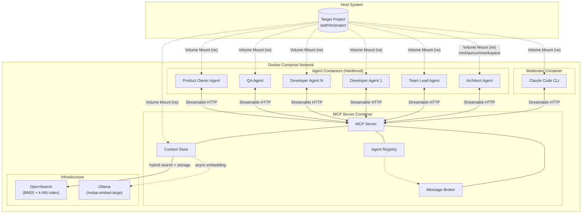
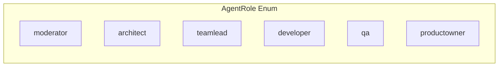
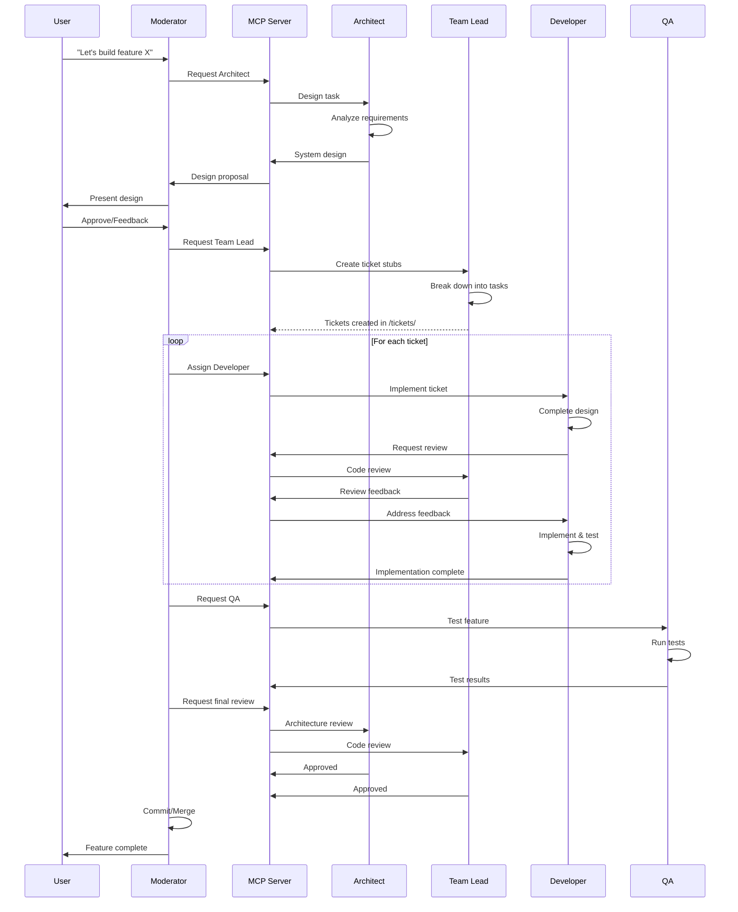
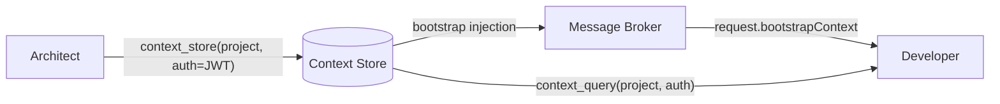
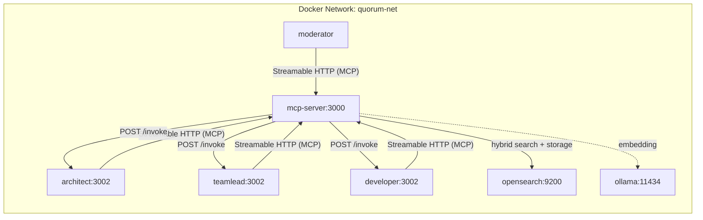

# Quorum System Design

## Overview

Quorum is a multi-agent AI orchestration system for semi-autonomous software development. It coordinates role-based AI agents (Claude Code instances) that collaborate on development tasks through an MCP server.

## System Architecture



## Container Components

### 1. Moderator Container

The user-facing component providing a conversational interface via Claude Code CLI.

| Aspect | Description |
|--------|-------------|
| **Purpose** | Orchestrate agent workflows on behalf of the user |
| **Technology** | Claude Code CLI in a dedicated Docker container |
| **Connection** | MCP client (Streamable HTTP) connected to MCP Server |
| **Workspace** | Read-write mount at `/mnt/quorum/workspace` |

**Responsibilities:**
- Accept user input as natural language commands
- Orchestrate agent workflows via `invoke_agent` MCP tool
- Display agent responses and progress
- Surface agent clarification requests to the user via MCP elicitation

The moderator registers with the MCP server on startup and uses MCP tools for all inter-agent communication. Agents can escalate questions to the user by invoking the moderator, which surfaces them through Claude Code's elicitation mechanism.

### 2. MCP Server Container

The communication backbone connecting all agents.

| Aspect | Description |
|--------|-------------|
| **Purpose** | Bidirectional communication hub for all agents |
| **Technology** | NestJS MCP server implementation |
| **Protocol** | MCP (Model Context Protocol) over Streamable HTTP |
| **Transport** | `StreamableHTTPServerTransport` with per-client sessions (`mcp-session-id` header) |
| **Discovery** | Agent registry for role-based lookup |
| **Messaging** | Message broker for agent-to-agent invocation |
| **Workspace** | Read-write mount at `/mnt/quorum/workspace` (context file persistence) |

**MCP Tools (9):**

| Tool | Purpose |
|------|---------|
| `invoke_agent` | Route inter-agent messages via Message Broker |
| `wait_invocation` | Continue waiting on a pending invocation from `invoke_agent` (long-poll continuation, moderator-only — see [mcp-connectivity.md §3.6](mcp-connectivity.md#36-long-poll-continuation-moderator-only)) |
| `register_agent` | Register an agent's role and callback URL |
| `unregister_agent` | Remove an agent from the registry |
| `new_conversation` | Mint a per-turn correlation ID and clear session cache |
| `context_store` | Write context items (scoped by project/conversation/agent) |
| `context_query` | Read context with mode selection (`keys`, `search`, `get-all`) |
| `context_summarize` | Compress conversation context (POC: truncation-based) |
| `context_stats` | Get context usage statistics (item count, estimated tokens) |

**MCP Resources (2):**

| Resource | URI | Purpose |
|----------|-----|---------|
| Project context | `context://project` | Read-only access to project-wide decisions |
| Conversation context | `context://conversation/{correlationId}` | Read-only access to task-specific context |

**Responsibilities:**
- Register and track active agents via `register_agent`/`unregister_agent`
- Route inter-agent messages via Message Broker
- Expose `invoke_agent` tool for agent-to-agent communication
- Manage shared Context Store (OpenSearch hybrid search backend or InMemory fallback, configurable via `CONTEXT_STORE_BACKEND`)
- Health check endpoint (`GET /health`) with dependency status reporting

**Infrastructure Dependencies** (when `CONTEXT_STORE_BACKEND=opensearch`):
- **OpenSearch** — context document storage with hybrid BM25 + k-NN search
- **Ollama** — local embedding inference for k-NN vectors (graceful degradation to BM25-only if unavailable)

> **Note:** See [Agent Messaging](agent-messaging.md) for detailed documentation on bidirectional MCP and the Message Broker mechanism. See [Context Management](context-management.md) for the context sharing API and [Context Store](context-store.md) for storage backend details.

### 3. Infrastructure Containers

OpenSearch and Ollama provide the hybrid search backend for the Context Store. The MCP server depends on both with `condition: service_healthy` — it starts only after they are ready.

| Container | Image | Purpose | Health Check |
|-----------|-------|---------|--------------|
| **opensearch** | `opensearchproject/opensearch:2` | BM25 full-text + k-NN vector index for context storage and hybrid semantic search | `GET /_cluster/health` |
| **ollama** | `ollama/ollama:latest` | Local embedding inference using `mxbai-embed-large` (1024 dimensions). Zero per-token cost, full data privacy | `ollama list` |
| **ollama-init** | `ollama/ollama:latest` | Init container — pulls the embedding model into a shared volume before the runtime `ollama` container starts | Runs to completion |

OpenSearch runs in single-node mode with the security plugin disabled (local development). Named volumes (`opensearch-data`, `ollama-data`) persist data and model weights across restarts.

The Context Store backend is configurable via `CONTEXT_STORE_BACKEND` (`opensearch` or `inmemory`). When set to `opensearch`, the `ContextStoreModule` wires `OpenSearchStore` as the backend, along with `MigrationService` (one-time data import from `quorum.context`) and `EmbeddingPipelineService` (async vector computation). When set to `inmemory`, these infrastructure containers are unused. See [Context Store](context-store.md) for full implementation details.

### 4. Agent Containers

Identical Docker images configured via environment variables. Containers are hardened with read-only filesystems, dropped capabilities, and no-new-privileges.

| Aspect | Description |
|--------|-------------|
| **Purpose** | Execute role-specific AI tasks via Claude Code SDK |
| **Technology** | NestJS application with Claude Agent SDK (`@anthropic-ai/claude-agent-sdk`) |
| **Base Image** | `node:24-bookworm-slim` (Debian, glibc required for SDK toolchain); mcp-server uses `node:24-bookworm-slim` |
| **Configuration** | `AGENT_ROLE` environment variable |
| **Workspace** | Shared volume at `/mnt/quorum/workspace` (read-write) |
| **MCP Role** | Dual: client (invoke others via tool bridge) + handler (be invoked via `POST /invoke`) |
| **Permissions** | Per-role tool restrictions enforced mechanically via `disallowedTools` + `canUseTool` hook |

**Agent Roles:**



The `moderator` role runs as a Claude Code CLI container (not an agent container) but is part of the enum and is invocable via `invoke_agent` — enabling agents to route clarification requests to the user.

> **Details:** See [Claude Code SDK](claude-code-sdk.md) for SDK integration, tool bridge, permission profiles, container hardening, and observability hooks.

## Shared Workspace Structure

All agents access the target project through a mounted volume:

```
/mnt/quorum/workspace/           # Target project root
├── quorum.md                    # Project conventions & role configuration
├── quorum.context               # Context Store persistence (JSON, managed by MCP server)
├── docs/                        # Generated system documentation
│   └── *.md                     # Architecture docs, design decisions
├── tickets/                     # Implementation task tracking
│   └── *.md                     # Individual task definitions
└── [project files]              # Existing codebase
```

### quorum.md Configuration File

The `quorum.md` file is the project-wide configuration that agents read for conventions, workflow, and role-specific instructions. It defines how the target project is developed — not what feature is being built.

**Contents:**
- Tech stack and build commands
- Project structure overview
- Development workflow (milestone-based evolution, commit cadence, ticket conventions)
- Codebase conventions (import patterns, testing patterns, code style)
- Review protocol (eligibility, multi-pass review, verdict format)
- Role configurations (architect, team lead, developer — responsibilities, escalation rules, boundaries)
- Constraints (shared workspace rules, git discipline, context store usage)

This file is:
- **Project-wide**: Describes the target project's conventions and development process, not a specific feature
- **Stable**: Evolves with the project but is not redefined per task or milestone
- **Codebase-adaptable**: Adjusted per project's conventions when Quorum targets a different codebase
- **Universal**: Keeps Quorum apps reusable across projects — all project-specific guidance lives here

## Agent Collaboration Flow



## Context Management

Multi-agent collaboration creates a context management challenge: passing full conversation histories between agents exhausts context windows, while passing too little loses critical decisions. Quorum solves this with a **pull-based context model**.

### Core Principle

Agents don't receive full context on invocation. Instead, they:
1. Receive a task description, correlation ID, and automatic bootstrap context — project-scope and conversation-scope decisions injected by the Message Broker via `BootstrapContextService.assemble()` (see [Message Broker — Context Integration](message-broker.md#context-integration))
2. Query the Context Store for additional detail via `context_query` (targeted lookups, agent-scope data, or items beyond the bootstrap token budget)
3. Store their decisions for others via `context_store`



### Context Scopes

| Scope | Lifetime | Contents | Example |
|-------|----------|----------|---------|
| **Project** | Entire session | Tech stack, constraints, architectural decisions | `"database": "PostgreSQL"` |
| **Conversation** | Single task chain | Task-specific decisions, intermediate results | `"api_style": "REST"` for ticket QRM-042 |
| **Agent** | Per-agent instance | Working memory, scratchpad | Developer's local notes |

### Agent Responsibility

Each agent role is prompted to record significant decisions:

- **Architect**: Stores tech choices, patterns, constraints in `project` scope
- **Team Lead**: Stores task breakdowns, priorities in `conversation` scope
- **Developer**: Queries decisions before implementing, stores implementation notes

This transforms context from "push everything" to "store decisions, query as needed" — keeping agent context windows lean while preserving team knowledge.

### Storage

The Context Store backend is configurable via `CONTEXT_STORE_BACKEND`:

- **`opensearch`** (production): `OpenSearchStore` backed by OpenSearch with hybrid BM25 + k-NN vector search. Embedding vectors are computed asynchronously via Ollama (`mxbai-embed-large`). Documents are BM25-searchable immediately on write and hybrid-searchable within ~300ms after async embedding completes. Graceful degradation ensures the system continues with BM25-only search when Ollama is unavailable.
- **`inmemory`** (default): `InMemoryStore` — a `Map<string, ContextItem>` with case-insensitive substring search and JSON file persistence (`quorum.context`). Used for tests and development without Docker infrastructure.

Both backends use composite keys (`{scope}:{id}:{key}`) managed by `CompositeKeyBuilder`. Project scope always uses `_` as ID; conversation/agent scopes require an explicit ID (correlationId or agentId).

When switching from `inmemory` to `opensearch`, `MigrationService` performs a one-time import of existing `quorum.context` records into the OpenSearch index on first startup.

> **Details:** [Context Management](context-management.md) for MCP API design, [Context Store](context-store.md) for storage implementation details.

## NestJS Monorepo Structure

```
quorum/
├── package.json                 # Root workspace config
├── nest-cli.json                # NestJS monorepo config
├── Dockerfile                   # Multi-target build (default + agent targets)
├── docker-compose.yml           # Container orchestration
├── scripts/start.sh             # Docker launch script (exports HOST_UID/GID)
│
├── apps/
│   ├── mcp-server/              # MCP Server
│   │   ├── src/
│   │   │   ├── main.ts
│   │   │   ├── mcp-server.module.ts
│   │   │   ├── config/          # Server, broker, context-store, opensearch, embedding config
│   │   │   ├── health/          # GET /health endpoint (with dependency status)
│   │   │   ├── mcp/             # MCP protocol (7 tools, 2 resources)
│   │   │   ├── registry/        # Agent registry, HttpAgentConnection
│   │   │   ├── messaging/       # Message broker, role timeouts
│   │   │   ├── context-store/   # ContextStoreModule (dynamic), InMemoryStore, opensearch/
│   │   │   │   └── opensearch/  # OpenSearchStore, OpenSearchSetupService, MigrationService
│   │   │   ├── embedding/       # EmbeddingService, EmbeddingPipelineService, OllamaClient
│   │   │   └── testing/         # Gated test endpoints (ENABLE_TEST_ENDPOINTS)
│   │   └── tsconfig.app.json
│   │
│   └── agent/                   # Agent App (single image, multi-role)
│       ├── src/
│       │   ├── main.ts
│       │   ├── agent.module.ts
│       │   ├── config/          # Agent config, RolePermissionService, role-tool-profiles
│       │   ├── connection/      # MCP client, InvocationHandler, McpToolBridgeService
│       │   ├── llm/             # ClaudeCodeService (SDK), AnthropicService, sdk-hooks
│       │   └── prompts/         # RolePromptService
│       └── tsconfig.app.json
│
└── libs/
    └── common/                  # Shared library
        └── src/
            ├── messaging/       # AgentRole enum, InvokeRequest/Response types
            ├── context-store/   # ContextStore abstract, types, CompositeKeyBuilder
            ├── prompts/         # SYSTEM_PREAMBLE, per-role prompt templates
            ├── config/          # Shared config factories (app, anthropic, logger, mcp)
            ├── logger/          # LoggerBuilder, QuorumLogger (dual transport)
            └── llm/             # tool-mapper (MCP → Anthropic schema conversion)
```

## Docker Compose Configuration

The Dockerfile uses a multi-target build: `default` target for mcp-server, `agent` target for agents, and `moderator` target for the Claude Code CLI moderator. All accept `HOST_UID`/`HOST_GID` build args to align container user ownership with the host. Use `./scripts/start.sh` to launch — it exports these automatically.

Two YAML anchors provide shared configuration:

| Anchor | Purpose |
|--------|---------|
| `x-shared-env` | Common env vars (Anthropic API, MCP server URL, logging) |
| `x-agent-security` | Security constraints (read-only fs, dropped caps, tmpfs mounts) |

Agents authenticate via `ANTHROPIC_API_KEY` on `x-shared-env` (metered Anthropic API billing). The moderator authenticates separately via `CLAUDE_CODE_OAUTH_TOKEN` in its own environment block (flat-rate subscription-seat billing). These are deliberately separate billing tiers — the subscription token must never appear on `x-shared-env` to prevent billing-path conflation (see [QRM7-007](../tickets/QRM7-007-moderator-subscription-auth.md), [QRM7-013](../tickets/QRM7-013-moderator-oauth-refresh-on-idle.md)).

**Services** (8 deployed): `mcp-server` (port 3000, default target), `moderator` (moderator target), `architect`, `teamlead`, `developer` (each port 3002, agent target), `opensearch` (port 9200), `ollama` (port 11434), `ollama-init` (init container, runs to completion). All agent containers share `x-agent-security` constraints and mount the workspace read-write. All services write logs to a shared bind-mounted `./logs` directory. Named volumes `opensearch-data`, `ollama-data`, and `moderator-claude-data` persist index data, model weights, and moderator state.

The qa and productowner roles are fully defined (permissions, prompts, timeouts) but not yet added as compose services.

## Key Design Decisions

| Decision | Rationale |
|----------|-----------|
| **Claude Agent SDK for agents** | Full filesystem, bash, git access — agents do real work, not just chat ([details](claude-code-sdk.md)) |
| **Claude Code CLI for moderator** | Moderator runs as a CC CLI container with MCP tools for orchestration |
| **Single agent image** | Simplifies maintenance; role behavior defined by env vars, prompts, and permission profiles |
| **MCP as communication layer** | Standard protocol, well-supported, bidirectional ([details](agent-messaging.md)) |
| **Streamable HTTP transport** | Session-based, works through proxies; per-client `mcp-session-id` headers |
| **In-process tool bridge** | Connects Claude Code subprocess to remote MCP server without exposing raw MCP client ([details](claude-code-sdk.md#mcp-tool-bridge)) |
| **Mechanical permission enforcement** | `disallowedTools` + `canUseTool` hooks enforce per-role restrictions; container hardening is the security boundary ([details](claude-code-sdk.md#role-permission-profiles)) |
| **Shared volume workspace** | All agents see same files, enables real collaboration |
| **quorum.md configuration** | Project conventions and role instructions live in the target project, keeping Quorum apps universal |
| **NestJS monorepo** | Consistent tooling, shared libraries, easier deployment |
| **Docker Compose** | Simple orchestration, suitable for single-host development |
| **Pull-based context** | Agents query what they need vs receiving everything; prevents context exhaustion ([details](context-management.md)) |
| **OpenSearch hybrid search** | Unified BM25 + k-NN vector index for context retrieval — semantic search with keyword fallback. Local Ollama embedding for zero-cost, private inference ([details](context-store.md)) |
| **Configurable context backend** | `CONTEXT_STORE_BACKEND` env var swaps between OpenSearch (production) and InMemoryStore (tests/dev) at module composition time |

## Network Communication

All containers communicate on a private `quorum-net` bridge network. Each agent runs on port 3002 in its own network namespace; Docker hostnames disambiguate them. Two distinct communication channels exist:

1. **MCP Protocol** (Streamable HTTP): Agents → MCP server for tool calls (`POST /mcp`, `GET /mcp`, `DELETE /mcp`), with per-client sessions via `mcp-session-id` header
2. **Invocation Delivery** (plain HTTP): MCP server → agent via `POST /invoke` at each agent's registered callback URL



## Future Considerations

- **QA/ProductOwner deployment**: Roles are fully defined (permissions, prompts, timeouts) but not yet added as Docker Compose services
- **LLM-based context summarization**: Replace POC truncation with semantic summarization in `context_summarize`
- **Scaling**: Kubernetes deployment for multi-host scenarios
- **Hybrid search tuning**: Adjust BM25/k-NN weights (currently 0.3/0.7), sub-document chunking for large values
- **Authentication**: Secure agent-to-agent communication
- **Plugin System**: Custom agent roles via external modules