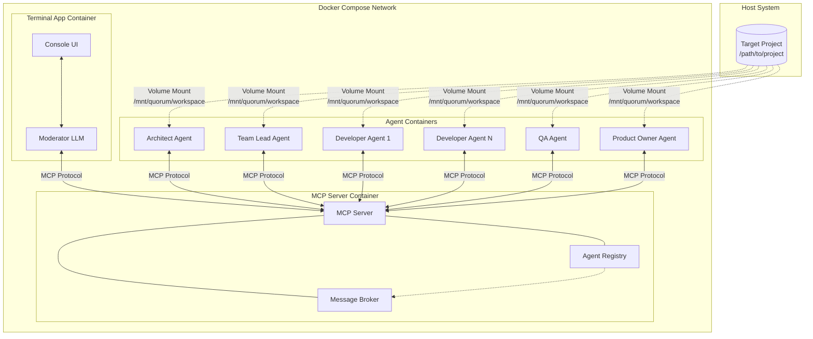
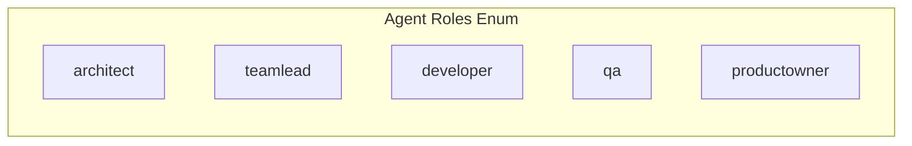
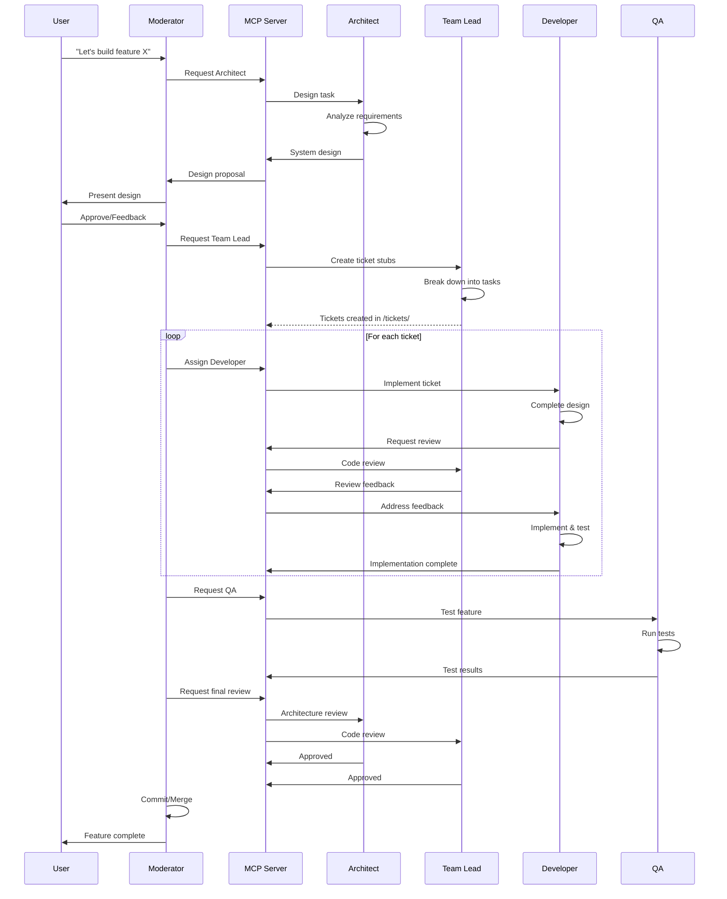
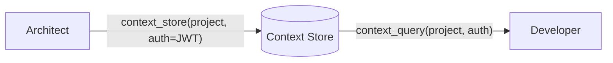
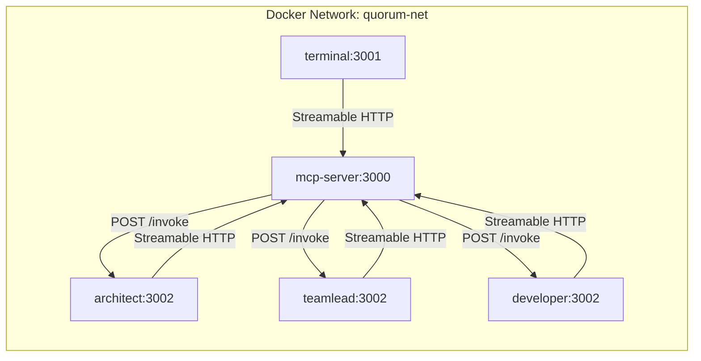

# Quorum System Design

## Overview

Quorum is a multi-agent AI orchestration system for semi-autonomous software development. It coordinates role-based AI agents (Claude Code instances) that collaborate on development tasks through an MCP server.

## System Architecture



## Container Components

### 1. Terminal App Container

The user-facing component providing a conversational interface.

| Aspect | Description |
|--------|-------------|
| **Purpose** | Console UI for chat-based interaction with the Moderator |
| **Technology** | NestJS application with terminal UI |
| **LLM Integration** | Built-in Moderator LLM that orchestrates other agents |
| **Connection** | MCP client connected to MCP Server |

**Responsibilities:**
- Accept user input as natural language commands
- Display agent responses and progress
- Manage conversation context with Moderator
- Relay orchestration commands to MCP Server

#### Moderator LLM vs Clarification Handler

The Terminal App contains two distinct communication paths:

| | Moderator LLM | Clarification Handler |
|---|---|---|
| **Who initiates** | User sends a message | Agent escalates mid-task via `invoke_agent(moderator, ...)` |
| **Intelligence** | Full LLM reasoning — interprets intent, selects agents, sequences workflow | None — passthrough relay between agent and user |
| **Scope** | Entire workflow orchestration | Single decision point |
| **Context** | Full conversation history with the user | Just the question and the user's answer |

The **Moderator LLM** is the orchestration brain: it decomposes user requests into agent workflows ("build auth" → architect designs → team lead creates tickets → developer implements), synthesizes multi-agent results into coherent responses, and makes judgment calls about agent output.

The **Clarification Handler** is a direct agent-to-user channel that bypasses the Moderator LLM. When an agent needs a user decision mid-task (e.g., "push or pull architecture?"), the handler surfaces the question in the console, collects the answer, auto-persists it to the Context Store, and returns it to the calling agent. This avoids a synchronous call-chain deadlock that would occur if the agent tried to invoke the Moderator LLM while it's already blocked waiting for that agent.

### 2. MCP Server Container

The communication backbone connecting all agents.

| Aspect | Description |
|--------|-------------|
| **Purpose** | Bidirectional communication hub for all agents |
| **Technology** | NestJS MCP server implementation |
| **Protocol** | MCP (Model Context Protocol) |
| **Discovery** | Agent registry for role-based lookup |
| **Messaging** | Message broker for agent-to-agent invocation |

**Responsibilities:**
- Register and track active agents
- Route inter-agent messages via Message Broker
- Expose `invoke_agent` tool for agent-to-agent communication
- Manage agent lifecycle (health checks, reconnection)

> **Note:** See [Agent Messaging](agent-messaging.md) for detailed documentation on bidirectional MCP and the Message Broker mechanism. See [Context Management](context-management.md) for the context sharing API and [Context Store](context-store.md) for storage backend details.

### 3. Agent Containers

Identical Docker images configured via environment variables.

| Aspect | Description |
|--------|-------------|
| **Purpose** | Execute role-specific AI tasks |
| **Technology** | NestJS shell wrapping Claude Code CLI |
| **Configuration** | `AGENT_ROLE` environment variable |
| **Workspace** | Shared volume at `/mnt/quorum/workspace` |
| **MCP Role** | Dual: client (invoke others) + handler (be invoked) |

**Agent Roles:**



## Shared Workspace Structure

All agents access the target project through a mounted volume:

```
/mnt/quorum/workspace/           # Target project root
├── quorum.md                    # Feature definition & role configuration
├── docs/                        # Generated system documentation
│   └── *.md                     # Architecture docs, design decisions
├── tickets/                     # Implementation task tracking
│   └── *.md                     # Individual task definitions
└── [project files]              # Existing codebase
```

### quorum.md Configuration File

The `quorum.md` file serves as the primary configuration mechanism:

```markdown
# Feature: [Feature Name]

## Description
[What the feature should accomplish]

## Role Configurations

### Architect
[Custom instructions for architect behavior]

### Team Lead
[Custom instructions for team lead behavior]

### Developer
[Custom instructions for developer behavior]

### QA
[Custom instructions for QA behavior]

### Product Owner
[Custom instructions for product owner behavior]

## Constraints
[Technical constraints, deadlines, dependencies]
```

This file is:
- **Feature-specific**: Redefined for each new development task
- **Codebase-adaptable**: Adjusted per project's conventions
- **Universal**: Keeps Quorum apps reusable across projects

## Agent Collaboration Flow



## Context Management

Multi-agent collaboration creates a context management challenge: passing full conversation histories between agents exhausts context windows, while passing too little loses critical decisions. Quorum solves this with a **pull-based context model**.

### Core Principle

Agents don't receive full context on invocation. Instead, they:
1. Receive minimal bootstrap context (task description + correlation ID)
2. Query the Context Store for what they need via `context_query`
3. Store their decisions for others via `context_store`



### Context Scopes

| Scope | Lifetime | Contents | Example |
|-------|----------|----------|---------|
| **Project** | Entire session | Tech stack, constraints, architectural decisions | `"database": "PostgreSQL"` |
| **Conversation** | Single task chain | Task-specific decisions, intermediate results | `"api_style": "REST"` for ticket QRM-042 |
| **Agent** | Per-agent instance | Working memory, scratchpad | Developer's local notes |

### Agent Responsibility

Each agent role is prompted to record significant decisions:

- **Architect**: Stores tech choices, patterns, constraints in `project` scope
- **Team Lead**: Stores task breakdowns, priorities in `conversation` scope
- **Developer**: Queries decisions before implementing, stores implementation notes

This transforms context from "push everything" to "store decisions, query as needed" — keeping agent context windows lean while preserving team knowledge.

> **Details:** [Context Management](context-management.md) for MCP API design, [Context Store](context-store.md) for storage implementation.

## NestJS Monorepo Structure

```
quorum/
├── package.json                 # Root workspace config
├── nest-cli.json                # NestJS monorepo config
├── Dockerfile                   # Unified multi-stage build (APP_NAME build arg)
├── docker-compose.yml           # Container orchestration
│
├── apps/
│   ├── terminal/                # Terminal App
│   │   ├── src/
│   │   │   ├── main.ts
│   │   │   ├── app.module.ts
│   │   │   ├── chat/            # Interactive chat loop
│   │   │   ├── config/          # Terminal-specific config (callbackUrl)
│   │   │   ├── connection/      # MCP client, registration
│   │   │   └── llm/             # Anthropic service
│   │   └── tsconfig.app.json
│   │
│   ├── mcp-server/              # MCP Server
│   │   ├── src/
│   │   │   ├── main.ts
│   │   │   ├── mcp-server.module.ts
│   │   │   ├── config/          # Server-specific config
│   │   │   ├── health/          # GET /health endpoint
│   │   │   ├── mcp/             # MCP protocol (tools, resources)
│   │   │   ├── registry/        # Agent registry
│   │   │   ├── messaging/       # Message broker
│   │   │   └── context-store/   # In-memory context store
│   │   └── tsconfig.app.json
│   │
│   └── agent/                   # Agent App (single image, multi-role)
│       ├── src/
│       │   ├── main.ts
│       │   ├── agent.module.ts
│       │   ├── config/          # Agent-specific config (role, callbackUrl)
│       │   ├── connection/      # MCP client, invocation handler
│       │   ├── llm/             # Anthropic service
│       │   └── prompts/         # Role prompt system
│       └── tsconfig.app.json
│
└── libs/
    └── common/                  # Shared types, config, prompts, LLM utilities
```

## Docker Compose Configuration

All apps share a single `Dockerfile` at the project root, parameterized by `APP_NAME` build arg. A `x-shared-env` YAML anchor provides common environment variables (Anthropic API, MCP server URL, logging) inherited by all services.

```yaml
x-shared-env: &shared-env
  ANTHROPIC_API_KEY: ${ANTHROPIC_API_KEY}
  ANTHROPIC_MODEL: ${ANTHROPIC_MODEL:-claude-sonnet-4-5-20250929}
  ANTHROPIC_MAX_TOKENS: ${ANTHROPIC_MAX_TOKENS:-4096}
  MCP_SERVER_URL: http://mcp-server:3000
  LOG_JSON_DIR: /app/logs
  LOG_LEVEL: ${LOG_LEVEL:-log}

services:
  mcp-server:
    build:
      context: .
      args: { APP_NAME: mcp-server }
    environment:
      <<: *shared-env
      PORT: 3000
    healthcheck:
      test: ["CMD-SHELL", "node -e \"fetch('http://localhost:3000/health')...\""]
    volumes: [quorum-logs:/app/logs]

  terminal:
    build:
      context: .
      args: { APP_NAME: terminal }
    depends_on:
      mcp-server: { condition: service_healthy }
    environment:
      <<: *shared-env
      PORT: 3001
      MCP_CALLBACK_URL: http://terminal:3001
    volumes: [quorum-logs:/app/logs]

  architect:  # APP_NAME: agent, AGENT_ROLE: architect
  teamlead:   # APP_NAME: agent, AGENT_ROLE: teamlead
  developer:  # APP_NAME: agent, AGENT_ROLE: developer
    # Each: depends_on mcp-server (service_healthy), shared-env,
    #        PORT: 3002, AGENT_CALLBACK_URL: http://{service}:3002,
    #        workspace + log volumes

volumes:
  quorum-logs:
```

QRM1 scope includes 5 services: mcp-server, terminal, architect, teamlead, developer. Additional roles (qa, productowner) will be added in QRM2.

## Key Design Decisions

| Decision | Rationale |
|----------|-----------|
| **Single agent image** | Simplifies maintenance; role behavior defined by env vars and prompts |
| **MCP as communication layer** | Standard protocol, well-supported, bidirectional ([details](agent-messaging.md)) |
| **Shared volume workspace** | All agents see same files, enables real collaboration |
| **quorum.md configuration** | Keeps Quorum universal, configuration lives in target project |
| **NestJS monorepo** | Consistent tooling, shared libraries, easier deployment |
| **Docker Compose** | Simple orchestration, suitable for single-host development |
| **Pull-based context** | Agents query what they need vs receiving everything; prevents context exhaustion ([details](context-management.md)) |

## Network Communication

Each agent container runs on port 3002 in its own network namespace. Docker hostnames (`architect`, `teamlead`, `developer`) disambiguate them on `quorum-net`. The MCP server uses each agent's `AGENT_CALLBACK_URL` (e.g., `http://architect:3002`) to deliver invocations.



## Future Considerations

- **Scaling**: Kubernetes deployment for multi-host scenarios
- **Persistence**: Database for conversation history and task state
- **Authentication**: Secure agent-to-agent communication
- **Monitoring**: Observability stack for agent performance
- **Plugin System**: Custom agent roles via external modules