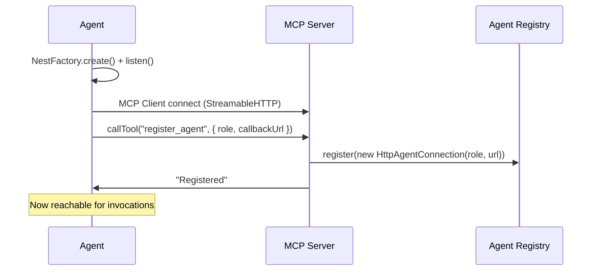
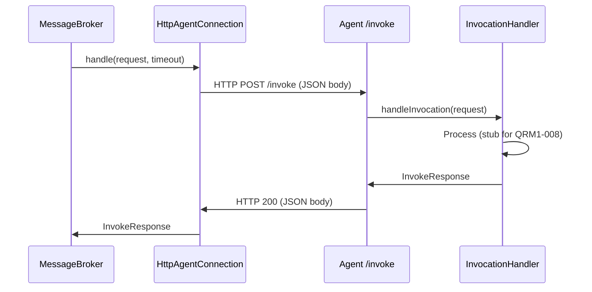

# QRM1-007: Agent-to-Server Connection — MCP Client, Registration & Invocation Delivery

## Summary

Implement bidirectional communication between agent containers and the MCP server. Agent-side: MCP client for outbound tool calls + HTTP invocation endpoint for inbound task delivery. Server-side: `register_agent`/`unregister_agent` tools, concrete `HttpAgentConnection` implementation that delivers invocations via HTTP POST. This ticket transforms isolated agent containers into connected participants in the Quorum messaging network.

## Problem Statement

The MCP server is fully operational (QRM1-005): 5 tools registered, 2 resources available, Streamable HTTP transport accepting connections at `/mcp`. The Message Broker routes invocations through the `AgentRegistry` (QRM1-004). But no agent can actually connect to any of this:

- **No MCP client exists** — the `@modelcontextprotocol/sdk` `Client` class is installed (QRM1-001) but unused. No agent creates a client or connects to the server's `/mcp` endpoint.
- **No concrete `AgentConnection`** — the abstract class (QRM1-004) has `role`, `isConnected()`, and `handle()`, but no implementation exists. The registry has nothing to register.
- **No registration mechanism** — no tool or API for agents to announce themselves to the server. Even if connections existed, agents can't join the registry.
- **No invocation delivery** — the broker can route an `InvokeRequest` to a registered `AgentConnection`, but there's no transport to actually deliver it to a running agent process.
- **No invocation reception** — agent containers have no endpoint to receive incoming tasks. The invocation handler described in `docs/agent-messaging.md` doesn't exist.

The agent app is a placeholder (Hello World controller + config). Every ticket from QRM1-008 onward depends on agents being connected to the server. This is the critical path — without it, the QRM1 milestone's multi-agent communication cannot be demonstrated.

## Design Context

### Bidirectional Communication Architecture

`docs/agent-messaging.md` describes dual-role agents with two connections:

| Connection | Direction | Purpose |
|------------|-----------|---------|
| MCP Client | Agent → Server | Call tools: `invoke_agent`, `context_*` |
| Invocation Handler | Server → Agent | Receive tasks from other agents |

The MCP client direction is straightforward: the SDK's `Client` + `StreamableHTTPClientTransport` connects to the server's `/mcp` endpoint. Agent calls tools like any MCP client.

The invocation delivery direction is less obvious. The MCP protocol is client-initiated — clients call servers, not the other way around. The `StreamableHTTPServerTransport` supports server-sent events (SSE) for notifications, but not for delivering arbitrary requests to specific clients with response tracking.

### Why HTTP Callbacks (Not MCP Server-to-Client Requests)

This ticket uses **HTTP POST callbacks** for invocation delivery rather than trying to push through the MCP protocol's SSE channel:

1. **Simplicity** — each agent already runs a NestJS HTTP server. Adding a POST endpoint is trivial.
2. **Decoupling** — the MCP client is purely for outbound tool calls. Inbound invocations arrive on a separate, simple channel. Single responsibility per transport direction.
3. **Testability** — HTTP endpoints are easy to test with standard tools (supertest, fetch mocks). No need to simulate MCP server-to-client request flows.
4. **SDK independence** — doesn't depend on undocumented or internal SDK mechanisms for server-initiated requests. The MCP client handles protocol evolution; the HTTP callback is plain HTTP.

The trade-off is that agents have two connection mechanisms instead of one. But the complexity is well-contained: the MCP client handles the complex protocol (tool calls, sessions, reconnection), and the HTTP endpoint is a simple POST handler.

### Registration Flow

Agents register by calling a `register_agent` MCP tool:



Registration happens in `main.ts` AFTER `app.listen()` — the agent's HTTP endpoint must be accepting connections before telling the server where to reach it. This ordering avoids a race where the server tries to deliver an invocation before the agent is listening.

Unregistration happens on graceful shutdown (`onApplicationShutdown` lifecycle hook) via the `unregister_agent` tool.

### Invocation Delivery Flow

When the broker routes to a registered agent:



The `HttpAgentConnection.handle()` method converts between the broker's in-process call and an HTTP request-response cycle. It uses `fetch()` with an `AbortController` for timeout enforcement.

### Scope Boundary

| In scope | Out of scope |
|----------|-------------|
| MCP `Client` + `StreamableHTTPClientTransport` connection | LLM integration in invocation handler (QRM1-008) |
| `register_agent` / `unregister_agent` MCP tools | Role-specific prompt loading (QRM1-009) |
| `HttpAgentConnection` (concrete `AgentConnection`) | Docker networking and Compose config (QRM1-011) |
| Agent-side `POST /invoke` endpoint | Health check endpoint (QRM1-011) |
| `InvocationHandler` stub (echo acknowledgment) | Invocation queueing for offline agents |
| Connection retry with backoff | Session-based agent identity tracking |
| Graceful shutdown (unregister on SIGTERM) | Agent-to-agent callback URL discovery |
| Remove placeholder agent controller/service | |

### Configuration

The agent already has all needed config namespaces (QRM1-003): `app.port`, `mcp.serverUrl`, `agent.role`. One new field is needed:

- `agent.callbackUrl` from `AGENT_CALLBACK_URL` — the base URL where the server reaches this agent. Defaults to `http://localhost:${PORT}`. Docker Compose sets this per service (e.g., `http://architect:3002`). The `/invoke` path is appended by the connection logic, not included in the config value.

No new shared config factories needed. No server-side config changes.

## Implementation Details

### 1. Agent Config Update — `apps/agent/src/config/agent.config.ts`

Add `callbackUrl` to the Zod schema:

```typescript
const schema = z.object({
  role: z.enum(DEPLOYABLE_AGENT_ROLES),
  workspaceDir: z.string().min(1),
  callbackUrl: z.string().url(),
});
```

Default derivation: `process.env.AGENT_CALLBACK_URL || \`http://localhost:${process.env.PORT || '3000'}\``.

This keeps the config factory self-contained (no dependency on other config values). The default works for local development. Docker Compose overrides it per service.

### 2. Server-Side: `HttpAgentConnection` — `apps/mcp-server/src/registry/http-agent-connection.ts`

Concrete implementation of `AgentConnection` that delivers invocations via HTTP POST.

Constructor accepts `role: AgentRole` and `callbackUrl: string` (base URL without path).

**`isConnected()`**: Returns `true` always (optimistic). The broker discovers unreachability when `handle()` fails. This avoids the complexity of proactive health checks — if the agent is down, the HTTP POST fails fast, and the broker returns a clear error. The next successful re-registration overwrites the connection.

**`handle(request, timeout)`**: Sends `POST {callbackUrl}/invoke` with JSON-serialized `InvokeRequest`. Uses Node.js native `fetch()` with an `AbortController` for timeout. Returns the parsed `InvokeResponse` on success. On any failure (network error, non-2xx status, parse error), returns `{ success: false, error: '...' }` — never throws. This contract matches the broker's expectation that `handle()` always resolves to an `InvokeResponse`.

Error categorization in the response:
- Network failure (ECONNREFUSED, DNS, etc.): `"Agent {role} unreachable: {reason}"`
- HTTP error (4xx/5xx): `"Agent {role} returned HTTP {status}"`
- Timeout (AbortError): `"Agent {role} invocation timed out"`
- Parse error: `"Agent {role} returned invalid response"`

### 3. Server-Side: Registration Tools — `apps/mcp-server/src/mcp/mcp.service.ts`

Two new tools registered in `onModuleInit()`. `McpService` now also injects `AgentRegistry`.

**`register_agent`** — agent announces its presence:

Schema:
- `role: z.enum(DEPLOYABLE_AGENT_ROLES)` — which agent role is registering
- `callbackUrl: z.string().url()` — base URL for invocation delivery

Handler:
1. Create `new HttpAgentConnection(role, callbackUrl)`.
2. Call `this.registry.register(connection)`.
3. Log registration with role and callback URL.
4. Return confirmation: `"Agent {role} registered at {callbackUrl}"`.

Re-registration (same role, new URL) is handled naturally — `registry.register()` overwrites the previous connection. This supports agent restarts and reconnections.

**`unregister_agent`** — agent announces departure:

Schema:
- `role: z.enum(DEPLOYABLE_AGENT_ROLES)` — which agent role is leaving

Handler:
1. Call `this.registry.unregister(role)`.
2. Log unregistration.
3. Return confirmation: `"Agent {role} unregistered"`.

Both tools use `z.enum(DEPLOYABLE_AGENT_ROLES)` (not `z.nativeEnum(AgentRole)`) because only deployable roles can register — the moderator is the Terminal App, not a registerable agent.

### 4. Server-Side: Module Update — `apps/mcp-server/src/mcp/mcp.module.ts`

Add `RegistryModule` to the `imports` array. `McpService` now injects `AgentRegistry` directly (in addition to `MessageBroker` and `ContextStore`). NestJS deduplicates the `RegistryModule` import (already transitively imported via `MessagingModule`).

### 5. Agent-Side: MCP Client Service — `apps/agent/src/connection/mcp-client.service.ts`

`@Injectable()` service managing the MCP client connection lifecycle.

**Constructor injections:**
- `AgentConfigService` — for `mcp.serverUrl`, `agent.role`, `agent.callbackUrl`

**State:**
- `client: Client` — MCP SDK client instance
- `transport: StreamableHTTPClientTransport` — HTTP transport
- `registered: boolean` — registration state flag

**`connect()` method**:
1. Create `StreamableHTTPClientTransport` pointing to `${config.mcp.serverUrl}/mcp`.
2. Create `Client` with name `${role}-agent` and version `0.1.0`.
3. Call `client.connect(transport)` — this performs the MCP initialize handshake.
4. Set up `transport.onclose` callback for reconnection.

**Reconnection strategy** — `connectWithRetry(maxRetries, initialDelayMs)`:
Linear backoff: attempt 1 waits `initialDelayMs`, attempt 2 waits `2 * initialDelayMs`, etc.

Defaults: `maxRetries = 10`, `initialDelayMs = 2000` (max wait ~20s). These are code constants, not config — reconnection tuning doesn't vary between deployment environments in the POC.

The `transport.onclose` callback triggers reconnection followed by re-registration. A `reconnecting` flag prevents concurrent reconnection attempts.

**`register()` method** (called from `main.ts` after `app.listen()`):
Calls `client.callTool({ name: 'register_agent', arguments: { role, callbackUrl } })`.

**`connectAndRegister()` method**:
Convenience method that calls `connectWithRetry()` then `register()`. Used for both initial startup and reconnection.

**`unregister()` method**:
Calls `client.callTool({ name: 'unregister_agent', arguments: { role } })`. Catches errors silently (server may already be down during shutdown).

**`callTool(name, args)` method**:
Public method exposing `client.callTool()` for future use by `InvocationHandler` (QRM1-008 will use this so agents can call `invoke_agent` and `context_*` tools mid-task).

**`onApplicationShutdown(signal)`**:
1. Call `unregister()` (best-effort).
2. Call `transport.close()`.

### 6. Agent-Side: Invocation Handler — `apps/agent/src/connection/invocation-handler.service.ts`

`@Injectable()` service that processes incoming invocations. For QRM1-007, this is a **stub** — it acknowledges receipt without LLM processing. QRM1-008 replaces the stub body with Anthropic API integration.

**Constructor injections:**
- `AgentConfigService` — for `agent.role`

**`handle(request: InvokeRequest): Promise<InvokeResponse>`**:
1. Log the invocation: correlationId, caller, action, depth.
2. Return `{ success: true, result: \`[${role}] Acknowledged: "${request.action}"\` }`.

The stub is deliberately minimal. It proves the full round-trip (caller → broker → connection → HTTP → endpoint → handler → response) works without any LLM dependency. This makes QRM1-012 smoke testing possible with just this ticket and its prerequisites.

### 7. Agent-Side: Invocation Controller — `apps/agent/src/connection/invocation.controller.ts`

NestJS controller handling `POST /invoke`.

**`@Post('/invoke')` handler**:
1. Receive `@Body() body` — the raw JSON body.
2. Validate with a Zod schema matching the `InvokeRequest` shape. Return 400 if invalid.
3. Call `invocationHandler.handle(request)`.
4. Return the `InvokeResponse` as JSON (NestJS auto-serializes).

Validation uses a Zod schema with `z.nativeEnum(AgentRole)` for caller/target, `z.string()` for action, etc. This catches malformed requests early (bad role values, missing fields) before they reach the handler.

### 8. Agent-Side: Connection Module — `apps/agent/src/connection/connection.module.ts`

```typescript
@Module({
  imports: [AgentConfigModule],
  providers: [McpClientService, InvocationHandler],
  controllers: [InvocationController],
  exports: [McpClientService],
})
export class ConnectionModule {}
```

Exports `McpClientService` so that `main.ts` can call `connectAndRegister()` and future modules (QRM1-008) can use `callTool()`.

### 9. Agent App Integration

**`AgentModule`** — updated:
- Imports: `AgentConfigModule`, `ConnectionModule`
- Remove: `AgentController`, `AgentService` (placeholders)

**`main.ts`** — updated:

```typescript
async function bootstrap() {
  const logger = LoggerBuilder.fromEnv();
  const app = await NestFactory.create(AgentModule, { logger });
  app.enableShutdownHooks();

  const config = app.get(AgentConfigService);
  await app.listen(config.app.port);

  // Connect to MCP server and register AFTER app is listening
  const mcpClient = app.get(McpClientService);
  await mcpClient.connectAndRegister();
}
```

The `enableShutdownHooks()` call activates NestJS lifecycle hooks (`onApplicationShutdown`), enabling graceful unregistration on SIGTERM/SIGINT.

### 10. Placeholder Removal

Delete:
- `apps/agent/src/agent.controller.ts` — placeholder Hello World
- `apps/agent/src/agent.service.ts` — placeholder service
- `apps/agent/src/agent.controller.spec.ts` — placeholder test

These served as scaffolding; their functionality is fully replaced by `ConnectionModule`.

### 11. File Structure

```
apps/agent/src/
  connection/
    mcp-client.service.ts              # MCP SDK client — connect, register, reconnect, shutdown
    mcp-client.service.spec.ts         # Connection, registration, reconnection, shutdown tests
    invocation-handler.service.ts      # Stub handler — acknowledges invocations (QRM1-008 replaces)
    invocation-handler.service.spec.ts # Handler tests
    invocation.controller.ts           # POST /invoke endpoint — validates & delegates
    invocation.controller.spec.ts      # Controller tests — validation, delegation, error responses
    connection.module.ts               # Module wiring
    index.ts                           # Barrel export
  config/
    agent.config.ts                    # Modified — adds callbackUrl
    agent.config.spec.ts               # Modified — new test cases for callbackUrl
    agent-config.service.ts            # Unchanged
    agent-config.module.ts             # Unchanged
    index.ts                           # Unchanged
  agent.module.ts                      # Modified — imports ConnectionModule, removes placeholders
  main.ts                             # Modified — enableShutdownHooks, listen then connectAndRegister

  # Removed:
  agent.controller.ts                  # Placeholder
  agent.service.ts                     # Placeholder
  agent.controller.spec.ts            # Placeholder test

apps/mcp-server/src/
  registry/
    http-agent-connection.ts           # Concrete AgentConnection — HTTP POST delivery
    http-agent-connection.spec.ts      # Delivery tests — success, timeout, errors
    index.ts                           # Updated barrel
  mcp/
    mcp.service.ts                     # Modified — 2 new tools, inject AgentRegistry
    mcp.service.spec.ts                # Modified — new tool handler tests
    mcp.module.ts                      # Modified — import RegistryModule
```

### 12. Testing Strategy

**HttpAgentConnection tests** (`http-agent-connection.spec.ts`):
- Happy path: `handle()` sends POST, receives 200, returns parsed `InvokeResponse`
- HTTP error: non-2xx status returns `{ success: false }` with status code in error
- Network error: fetch rejects, returns `{ success: false }` with "unreachable" error
- Timeout: abort fires before response, returns `{ success: false }` with "timed out" error
- `isConnected()` always returns `true`
- Callback URL construction: `/invoke` appended to base URL

Mock `fetch` using `jest.spyOn(global, 'fetch')`.

**Registration tool tests** (in `mcp.service.spec.ts`):
- `register_agent` creates `HttpAgentConnection` and registers it in the registry
- `register_agent` with same role overwrites previous registration
- `unregister_agent` removes from registry
- `unregister_agent` for unregistered role succeeds silently

**McpClientService tests** (`mcp-client.service.spec.ts`):
- Connection: creates transport with correct URL, connects client
- Registration: calls `register_agent` tool with correct role and callback URL
- Reconnection: `onclose` triggers `connectAndRegister()`
- Retry: retries on connection failure with backoff
- Shutdown: calls `unregister_agent` and closes transport
- Shutdown resilience: unregister failure is caught silently

Mock `Client` and `StreamableHTTPClientTransport` from the SDK.

**InvocationHandler tests** (`invocation-handler.service.spec.ts`):
- Returns success with acknowledgment message containing role and action
- Logs correlationId, caller, and action

**InvocationController tests** (`invocation.controller.spec.ts`):
- Valid `InvokeRequest` body: delegates to handler, returns `InvokeResponse`
- Invalid body (missing required fields): returns 400
- Invalid body (bad enum value): returns 400

**Agent config tests** (updated `agent.config.spec.ts`):
- `AGENT_CALLBACK_URL` parsed correctly
- Default callback URL uses `http://localhost:${PORT}`

## Acceptance Criteria

- [x] `HttpAgentConnection` extends `AgentConnection` — delivers invocations via HTTP POST with timeout
- [x] `HttpAgentConnection.handle()` never throws — always returns `InvokeResponse`
- [x] `HttpAgentConnection.isConnected()` returns `true` (optimistic availability)
- [x] `register_agent` MCP tool creates `HttpAgentConnection` and registers in `AgentRegistry`
- [x] `register_agent` accepts `role` (deployable roles only) and `callbackUrl`
- [x] `unregister_agent` MCP tool removes agent from `AgentRegistry`
- [x] `McpModule` imports `RegistryModule` — `AgentRegistry` injectable in `McpService`
- [x] `McpClientService` connects via `StreamableHTTPClientTransport` to server's `/mcp` endpoint
- [x] `McpClientService.connectAndRegister()` called from `main.ts` after `app.listen()`
- [x] Connection retry: linear backoff, max 10 retries, initial delay 2s
- [x] `transport.onclose` triggers automatic reconnection and re-registration
- [x] `onApplicationShutdown` calls `unregister_agent` (best-effort) and closes transport
- [x] `app.enableShutdownHooks()` called in `main.ts`
- [x] `InvocationController` at `POST /invoke` — validates body with Zod, delegates to handler
- [x] `InvocationHandler` returns stub response: `[{role}] Acknowledged: "{action}"`
- [x] `InvocationHandler` logs: correlationId, caller, action, depth
- [x] `agent.config.ts` updated with `callbackUrl` from `AGENT_CALLBACK_URL` (default: `http://localhost:${PORT}`)
- [x] Placeholder `AgentController` and `AgentService` removed
- [x] `ConnectionModule` wires `McpClientService`, `InvocationHandler`, `InvocationController`
- [x] `AgentModule` imports `ConnectionModule`
- [x] `McpClientService` exposes `callTool()` for future module use (QRM1-008)
- [x] All new code uses structured logging via NestJS `Logger` with correlationId where available
- [x] Unit tests cover: HTTP delivery (success, timeout, errors), registration tools, MCP client lifecycle, invocation endpoint, config validation
- [x] `npm run build` succeeds, `npm run lint` passes, `npm run test` passes

## Dependencies and References

### Prerequisites
- QRM1-004 — `AgentConnection` abstract class, `AgentRegistry`, `MessageBroker`, shared types (`AgentRole`, `InvokeRequest`, `InvokeResponse`, `DEPLOYABLE_AGENT_ROLES`)
- QRM1-005 — MCP Server with Streamable HTTP transport at `/mcp`, existing tools (`invoke_agent`, `context_*`)
- QRM1-006 — Structured logger (`LoggerBuilder.fromEnv()` in agent `main.ts`)

### What This Blocks
- QRM1-008 — Agent LLM Integration (needs `McpClientService.callTool()` and `InvocationHandler` to wire Anthropic API)
- QRM1-009 — Role Prompt System (needs connected agents to inject prompts into)
- QRM1-010 — Terminal Moderator Bootstrap (needs `McpClientService` pattern for moderator's MCP connection)
- QRM1-011 — Docker Containerization (needs agent connection logic to validate in containers)
- QRM1-012 — End-to-End Smoke Test (needs agents registered and invocable)

### References
- [docs/agent-messaging.md](../docs/agent-messaging.md) — Dual-role agents, bidirectional MCP, invocation handler concept
- [docs/message-broker.md](../docs/message-broker.md) — Broker routing, `AgentConnection.handle()` contract, transport section
- [docs/system-design.md](../docs/system-design.md) — Agent container architecture, Docker Compose config, network communication
- [@modelcontextprotocol/sdk](https://github.com/modelcontextprotocol/typescript-sdk) — `Client`, `StreamableHTTPClientTransport` APIs

## Implementation Notes

**Status:** Complete

**Date:** 2026-02-15

### Files Created/Modified

| File | Action | Notes |
|------|--------|-------|
| `apps/agent/src/config/agent.config.ts` | Modified | Added `callbackUrl` field with `AGENT_CALLBACK_URL` env var, defaults to `http://localhost:${PORT}` |
| `apps/agent/src/config/agent.config.spec.ts` | Modified | 3 new tests: explicit URL, default from PORT, invalid URL rejection |
| `apps/agent/src/connection/connection.module.ts` | Created | Wires `McpClientService`, `InvocationHandler`, `InvocationController`; exports `McpClientService` |
| `apps/agent/src/connection/index.ts` | Created | Barrel export for connection module |
| `apps/agent/src/connection/mcp-client.service.ts` | Created | MCP SDK client — connect, register, reconnect with linear backoff, graceful shutdown |
| `apps/agent/src/connection/mcp-client.service.spec.ts` | Created | 6 tests: connect+register, retry with backoff, max retries, callTool proxy, shutdown, reconnection |
| `apps/agent/src/connection/invocation-handler.service.ts` | Created | Stub handler — acknowledges invocations with `[{role}] Acknowledged: "{action}"` |
| `apps/agent/src/connection/invocation-handler.service.spec.ts` | Created | 2 tests: acknowledgment format, role-dependent response |
| `apps/agent/src/connection/invocation.controller.ts` | Created | `POST /invoke` endpoint with Zod validation, delegates to handler |
| `apps/agent/src/connection/invocation.controller.spec.ts` | Created | 4 tests: valid request, missing fields, bad enum, optional context passthrough |
| `apps/agent/src/agent.module.ts` | Modified | Imports `ConnectionModule`, removed placeholder controller/service |
| `apps/agent/src/main.ts` | Modified | Added `enableShutdownHooks()`, post-listen `connectAndRegister()` |
| `apps/agent/src/agent.controller.ts` | Deleted | Placeholder Hello World controller |
| `apps/agent/src/agent.service.ts` | Deleted | Placeholder service |
| `apps/agent/src/agent.controller.spec.ts` | Deleted | Placeholder test |
| `apps/mcp-server/src/registry/http-agent-connection.ts` | Created | Concrete `AgentConnection` — HTTP POST delivery with `AbortController` timeout |
| `apps/mcp-server/src/registry/http-agent-connection.spec.ts` | Created | 7 tests: role, isConnected, success, HTTP error, network error, timeout, invalid response, URL construction |
| `apps/mcp-server/src/registry/index.ts` | Modified | Added `HttpAgentConnection` barrel export |
| `apps/mcp-server/src/mcp/mcp.service.ts` | Modified | 2 new tools (`register_agent`, `unregister_agent`), injected `AgentRegistry`, added inline comment on SDK Zod cast |
| `apps/mcp-server/src/mcp/mcp.service.spec.ts` | Modified | 4 new tests: register creates connection, re-registration overwrites, unregister removes, unregister for unknown role |
| `apps/mcp-server/src/mcp/mcp.module.ts` | Modified | Added `RegistryModule` import |

### Deviations from Ticket Spec

- **`DEPLOYABLE_AGENT_ROLES` cast in MCP tool schemas.** The ticket spec shows `z.enum(DEPLOYABLE_AGENT_ROLES)` directly. In practice, the MCP SDK's `registerTool` uses its own bundled Zod which expects mutable `[string, ...string[]]`, while our `DEPLOYABLE_AGENT_ROLES` is `readonly`. Required `as unknown as [string, ...string[]]` cast. Added inline comment explaining the SDK/project Zod version mismatch and future simplification path.

- **`invokeRequestSchema` Zod/TypeScript type safety.** The controller's Zod schema mirrors the `InvokeRequest` interface but isn't derived from it — schema and type could drift without a compile-time error. Added a compile-time guard type (`_SchemaMatchesInvokeRequest`) that breaks the build if the schema output diverges from `InvokeRequest`. Also added an inline comment noting the idiomatic fix (move schema to `libs/common` as single source of truth, derive type via `z.infer`) is deferred since it would touch every `InvokeRequest` consumer.

### Review Notes

- **Reconnection failure is silent.** If `handleReconnection()` exhausts all retries after a transport close, the error is logged but the agent remains running in a disconnected state. Acceptable for POC — Docker restart recovers. QRM1-011 should consider whether the container should exit on persistent disconnection to trigger orchestrator restart.

- **No trailing-slash normalization on `callbackUrl`.** If configured as `http://host:3000/`, the URL becomes `http://host:3000//invoke`. Low risk since Docker Compose sets clean values and `z.string().url()` validates format, but a normalizing constructor would make it robust.

- **Reconnection test uses `setImmediate`.** The `mcp-client.service.spec.ts` reconnection test relies on `setImmediate` to flush the async reconnection triggered by `onclose`. Works because mocks resolve synchronously, but could flake if intermediate async steps are added later.

### Verification

- `npm run build` — compiles successfully
- `npm run lint` — 0 errors, 0 warnings
- `npm run test` — 142 tests passing (27 new + 115 existing, 0 regressions)