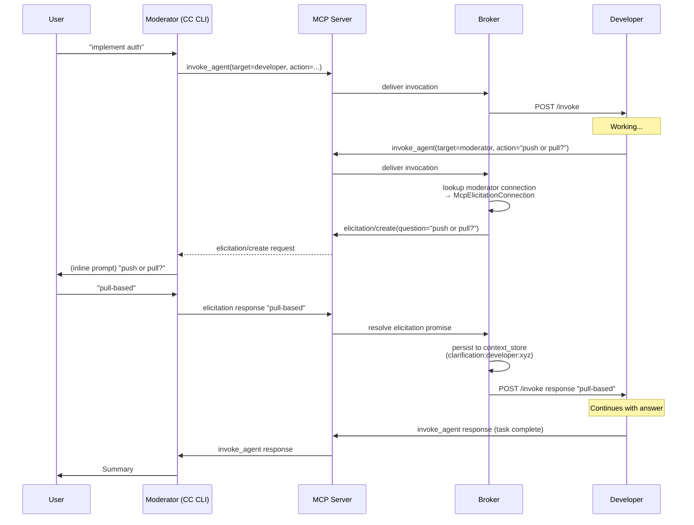
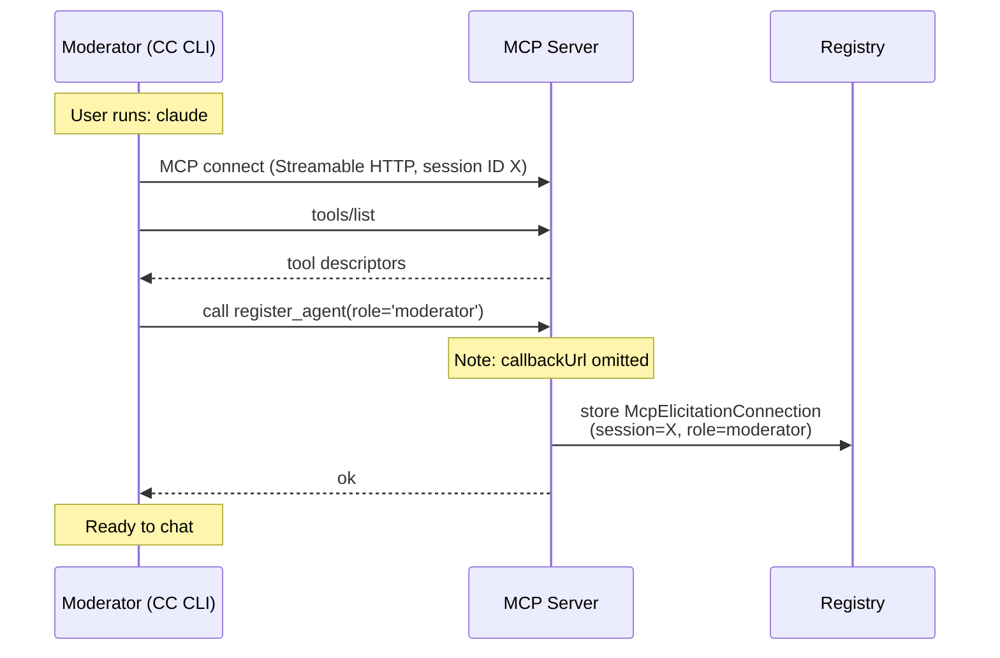

# QRM6 Roadmap — Containerized Moderator via Claude Code CLI

> **Post-Spike Update (2026-04-22):** QRM6-001 closed GO. MCP elicitation works end-to-end on CC CLI 2.1.117. D1 is cleared; the "cut the back-channel" fallback is no longer on the critical path. See [`tmp/QRM6-001-elicitation-spike-findings.md`](tmp/QRM6-001-elicitation-spike-findings.md) for the empirical record and implications for QRM6-003/-007.

## Goal

Replace the custom terminal app (NestJS + raw Anthropic SDK + manual tool loop + `ClarificationHandler`) with a **Claude Code CLI moderator running in its own Docker container**, connected to the Quorum MCP server as a standard MCP client. The moderator gains the full CC CLI capability surface — filesystem inspection, activity feed, slash commands, skills, permission enforcement — and the clarification back-channel is preserved through **MCP elicitation**, a server-to-client primitive in the existing MCP session.

After QRM6, the moderator is no longer a bespoke NestJS app. It is Claude Code talking to Quorum through the MCP layer that every other agent already uses. `docker compose up -d` brings the full system online; `docker compose exec -it moderator claude` attaches the user to the moderator.

## Problem

The current terminal app is ~700 LOC of custom scaffolding that duplicates capabilities CC CLI provides natively:

| Component | File | What it does | What CC CLI already provides |
|-----------|------|--------------|-----------------------------|
| `ChatService` | `apps/terminal/src/chat/chat.service.ts` (605 LOC) | Readline loop, 15-round agentic tool loop, activity feed, cost tracking, session-resume tracking per role | Interactive loop, tool use rendering, cost display, session history |
| `AnthropicService` | `apps/terminal/src/llm/anthropic.service.ts` | Raw Anthropic SDK wrapper with prompt caching | CC CLI manages caching internally |
| `McpClientService` | `apps/terminal/src/connection/mcp-client.service.ts` (279 LOC) | Streamable HTTP MCP client, register/unregister, reconnect, stale-session recovery | CC CLI is a first-class MCP client |
| `ClarificationHandler` | `apps/terminal/src/clarification/clarification.service.ts` | POST /invoke endpoint for agent→user back-channel (bypasses moderator LLM) | Would be unnecessary with MCP elicitation |
| `StdinLockService` | `apps/terminal/src/clarification/stdin-lock.service.ts` | Async mutex for stdin contention between chat loop and clarification prompt | No stdin sharing needed — single CC CLI process |
| `TERMINAL_MODERATOR_PROMPT` | `chat.service.ts:206` (~300 lines inline) | Moderator role definition, skill dispatch rules, failure recovery, session resume | Replaced by `CLAUDE.md` + `--append-system-prompt` |

**Concrete gaps the current design imposes:**

1. **Moderator cannot directly inspect files.** It must delegate even trivial "what's in `quorum.md`?" questions to an agent. The whole collaboration loop incurs an invocation round-trip for tasks the moderator could answer in one tool call.
2. **Prompt drift risk** — `TERMINAL_MODERATOR_PROMPT` and `ROLE_PROMPT_TEMPLATES[AgentRole.moderator]` in `libs/common/src/prompts/role-prompt-templates.ts` both define moderator behavior. Past regressions (QRM5-BUG-002 skill dispatch; commit 5a5581f failure recovery) shipped to the wrong prompt and had to be ported. The inline guard comment at `chat.service.ts:186–205` is a symptom, not a fix.
3. **Duplicate MCP client logic** — `McpClientService` in `apps/terminal/` and `apps/agent/` diverged over time; QRM5-BUG-003 (fetch headers timeout) and QRM5-BUG-005 (session-not-found reconnect) had to be fixed in two places.
4. **Custom UI is perpetually behind CC CLI.** Activity-feed formatting, slash commands, skill invocation (`/code-review`, `/simplify`), plan mode, diagnostics, Monitor — all come free with CC CLI and would need custom implementation otherwise.
5. **No mechanical permission enforcement for the moderator.** Role boundary ("delegate, do not implement") is prompt-only today. CC CLI's `allowedTools`/`disallowedTools` let us enforce the boundary in code.
6. **Deployment asymmetry** — agents run in containers, moderator requires a separate `apps/terminal/` build + volume mounts. One more thing to keep in sync.

**Why now:**

Three QRM5 deliverables make the switch viable that wasn't earlier:

- **Session resume (QRM5-001)** — per-role session persistence means a clarification round-trip through the moderator can re-enter an agent's partial work without losing state. Without this, cutting the synchronous clarification chain would have been a hard regression.
- **Bootstrap context (QRM4)** — re-invocations are cheap because the agent starts with prior decisions injected, not a blank slate.
- **OpenSearch context store (QRM5-005)** — checkpoints written mid-task are semantically searchable, so the moderator can pick up interrupted work even across container restarts.

## Research Summary

### MCP Back-Channel Options

The existing `ClarificationHandler` exists because `invoke_agent(target=moderator)` needs somewhere to land when an agent wants the user's input mid-task. Without a terminal app listening on `POST /invoke`, we need another mechanism. Four were considered:

| Mechanism | How it works | Verdict |
|-----------|-------------|---------|
| **MCP elicitation** (`elicitation/create`) | Server-initiated structured input request on the existing MCP session. CC CLI prompts the user inline, returns the answer through the same session. | **Chosen** — already in MCP spec, zero extra infrastructure, preserves synchronous chain semantics |
| Sidecar HTTP + named pipe | Companion process in the moderator container exposes `POST /invoke`, writes to a FIFO that CC CLI reads via `user-prompt-submit-hook` | Rejected — hacky, races with CC CLI mid-turn, reinvents what elicitation already solves |
| Cut the back-channel | Agents return `{needs_clarification: "..."}` as a normal response; moderator asks the user, re-invokes with the answer (relies on session resume to unwind the chain) | Fallback — use if elicitation support in CC CLI turns out insufficient |
| Persistent websocket | Long-lived ws from CC CLI to MCP server | Rejected — not native to CC CLI, would require wrapper |

The elicitation path preserves today's "agent asks mid-task, user types answer, agent continues" UX with no prompt rewrites and no double round-trips.

### Containerized vs Host CC CLI

A "CC CLI on the host" variant was considered and rejected:

| Aspect | Host CC CLI | Containerized CC CLI |
|--------|-------------|---------------------|
| Deployment | User installs CC CLI locally, runs against `localhost:3000` | `docker compose up` — full system in one command |
| Back-channel | No sidecar possible; elicitation still works | Same (elicitation) |
| Permission enforcement | User's `~/.claude/settings.json` — outside project control | `settings.json` baked into image |
| Workspace mount | User runs in target project dir | Explicit `:rw` volume — same as agents |
| Logs | Scattered in `~/.claude/projects/` on user's host | Shared `quorum-logs` volume, compatible with `tools/session-report/` |
| Reproducibility | Depends on user's local CC CLI version | Version pinned in Dockerfile |

Container wins on all axes except "user doesn't have to install anything new" — but `docker compose up` already establishes that the user accepts Docker as a prerequisite.

### Lifecycle Model

Two attach models were evaluated:

| Model | Command | Trade-off |
|-------|---------|-----------|
| **Long-lived service + exec** | `docker compose up -d` then `docker compose exec -it moderator claude` | **Chosen** — multiple sessions possible, reconnect/detach works, matches mental model ("MCP+agents are always-on; moderator is how I talk to them") |
| One-shot interactive service | `docker compose run --rm -it moderator` | Rejected — container dies with the session; no reattach |

A convenience wrapper `scripts/moderator.sh` calls `docker compose exec -it moderator claude` to hide the flags.

## Design Decisions

All design decisions are resolved. This section consolidates findings from pre-planning research and clarification sessions.

### D1: Back-Channel — MCP Elicitation

**Decision:** When an agent calls `invoke_agent(target=moderator, action=...)`, the broker translates the invocation into an `elicitation/create` request on the moderator's MCP session. The user answers inline; CC CLI returns the response through the same session; the broker returns that answer to the calling agent as the `invoke_agent` result.

**Implications:**

- No `POST /invoke` endpoint on the moderator — CC CLI is not a server.
- `register_agent` for `moderator` records the `mcp-session-id`, not a callback URL. `callbackUrl` becomes optional in the tool schema.
- `HttpAgentConnection` for moderator is replaced by a new `McpElicitationConnection` that implements the `AgentConnection` abstract using elicitation instead of HTTP POST.
- The `ClarificationHandler.persistDecision()` auto-store logic (writing `clarification:{caller}:{correlationId}` to project scope) moves into the broker's elicitation-response path — behavior preserved, location changed.

**Risk:** CC CLI elicitation client support needs empirical verification before committing. QRM6-001 is a spike ticket that answers the question before any other work starts. If elicitation is unsupported or broken, the fallback is the "cut the back-channel" plan (agents return structured clarification requests as normal responses).

> **Resolved 2026-04-22 (QRM6-001):** Verified on CC CLI 2.1.117 — accept/decline/cancel actions round-trip, rich form schemas supported, decline UX is weakly discoverable (surface in QRM6-007). Full findings: [`tmp/QRM6-001-elicitation-spike-findings.md`](tmp/QRM6-001-elicitation-spike-findings.md).

### D2: Moderator Deployment — Docker Container, Exec-Attach

**Decision:** Add a `moderator` service to `docker-compose.yml` alongside agents. The container runs CC CLI configured to connect to `http://mcp-server:3000/mcp`. User attaches via `docker compose exec -it moderator claude`.

**Rationale:**

- Unified deployment story — `docker compose up -d` starts the whole system.
- Version-pinned CC CLI in the image — no "works on my machine" drift.
- Workspace mount matches agent pattern (`/mnt/quorum/workspace:rw` — moderator gets read-write; tool-level restrictions preserve the role boundary per D5).
- Shared `quorum-logs` volume — session logs compatible with existing tooling.
- CC CLI session history persisted via bind-mount (`~/.claude` on host) so the moderator remembers previous conversations across container restarts.

**Base image:** `node:24-bookworm-slim` with `@anthropic-ai/claude-code` installed globally. Same toolchain as the `agent` target — git, bash, ripgrep, curl, jq. Non-root `quorum` user with `HOST_UID`/`HOST_GID` build args (same pattern as agents).

### D3: Moderator Prompt — CLAUDE.md in Workspace

**Decision:** Port `TERMINAL_MODERATOR_PROMPT` from `apps/terminal/src/chat/chat.service.ts:206` to `CLAUDE.md` at the workspace root. Additionally, `--append-system-prompt` can layer a moderator-specific preamble that reinforces skill dispatch, session resume, and failure recovery guidance.

**Why CLAUDE.md:**

- CC CLI auto-loads `CLAUDE.md` from the working directory and parent dirs — zero extra config.
- `quorum.md` (project conventions) can be referenced from `CLAUDE.md` via `@quorum.md` import syntax — eliminates the `initSystemPrompt()` manual read at `chat.service.ts:331`.
- The inline prompt and the libs/common moderator template collapse into a single source: `libs/common/src/prompts/role-prompt-templates.ts` for the agent-to-moderator clarification path (when another agent ever queries the moderator's role prompt) and `CLAUDE.md` for the user-facing moderator. **The drift trap described at `chat.service.ts:186–205` disappears** — the terminal-specific prompt is gone, and the libs/common template is the fallback for any edge case.

**Prompt content migration checklist:**

- Agent Capabilities Awareness — keep
- Clarification Flow — **update** to reference elicitation (agents can ask via `invoke_agent(moderator, ...)`, user sees the question in CC CLI inline)
- Responsibilities / Collaboration — keep
- Skill Dispatch — keep (unchanged)
- Context Management — keep
- Communication Style — keep
- Failure Recovery — keep
- Session Resume — **simplify** (server-side tracking per D6 means CC CLI no longer passes `sessionId` explicitly)
- Constraints — keep

### D4: Caller Identity — Server-Side Binding via MCP Session ID

**Decision:** The MCP server derives `callerRole='moderator'` automatically from the MCP session ID when an unregistered/moderator-identified client invokes tools. The moderator's LLM does not need to remember to pass `callerRole` on every tool call.

**Mechanism:**

- On `register_agent(role='moderator')`, the MCP server records the association `mcp-session-id → moderator`.
- For any tool call (`invoke_agent`, `context_store`, `context_query`, …) the MCP service looks up the session's associated role and injects it as `callerRole` if the client did not provide one.
- Default `depth=0` applied for moderator-originated calls.
- This replaces the `augmentArgs()` logic in `apps/terminal/src/chat/chat.service.ts:565`.

**Why not prompt the LLM to pass `callerRole` explicitly:** LLMs drop required fields across long conversations. Server-side binding is deterministic and removes a class of bugs.

### D5: Correlation ID — Per-Turn, Minted by the Moderator

**Decision:** The moderator's LLM mints a fresh correlation ID at the start of each user turn via a lightweight `new_conversation` tool (or equivalent mechanism) and passes it through subsequent tool calls in that turn.

**Rationale:**

- Today `ChatService` mints a UUID on every user input (`chat.service.ts:390`). We need an equivalent signal for "this is a new conversation; new `correlationId`; agent `sessionId` tracking resets if the user chose to start fresh."
- Two alternatives considered:
  - **MCP session = conversation:** Ties correlation ID to the MCP session lifetime. Simplest but conflates "moderator reconnected" with "user started a new topic."
  - **Moderator-minted per turn:** User turn = conversation. Matches current terminal behavior. Requires a signal from the LLM that a new conversation has started.
- Chosen: moderator-minted. The `new_conversation` tool returns a fresh UUID and instructs the broker to reset the per-role session cache (D6). The CLAUDE.md prompt guides the moderator to call it at the start of each user turn.
- Fallback if the moderator forgets: the server auto-mints a correlation ID when none is provided — the same context-leakage risk exists today and is acceptable.

### D6: Agent Session Tracking — Server-Side, Not Moderator-Side

**Decision:** The MCP server tracks `lastSessionId[mcpSessionId][targetRole]` and auto-injects `sessionId` into `invoke_agent` calls unless the caller explicitly sets `sessionId=""` to force a fresh session.

**Migration from current state:**

- Today: `ChatService.agentSessions: Map<role, sessionId>` at `chat.service.ts:303`, updated in `trackAgentSession()` at `chat.service.ts:594`.
- After QRM6: the broker reads the response's `sessionId`, updates its per-MCP-session cache, and passes the stored `sessionId` on the next `invoke_agent(target=role)` from the same MCP session.
- `new_conversation` (D5) clears the per-MCP-session cache.
- The CLAUDE.md prompt guidance for "pass `sessionId: \"\"` to start fresh" is preserved — agents can still override explicitly.

This is the cleanest place for the logic: it's already the broker's job to know about agent sessions (for delivery), and moving it server-side removes the equivalent bookkeeping from every MCP client that wants session resume.

### D7: Moderator Tool Restrictions — Deny Write by Default

**Decision:** The moderator container launches CC CLI with `--deny Write,Edit,NotebookEdit` in its default configuration (`~/.claude/settings.json` baked into the image). Read, Grep, Glob, Bash (restricted), and MCP tools remain available.

**Rationale:**

- The moderator's role boundary ("delegate, do not implement") becomes mechanically enforceable — not just prompt-level.
- Read-only filesystem inspection gives the moderator the "check `quorum.md` directly" capability we want without violating role boundary.
- Bash restrictions follow the same role-permission model as agents (deny `git commit`, `git push`, `rm -rf`, `npm publish`).
- Users who want a "power moderator" that can edit can override settings at runtime.

This is a change in scope from the current terminal, which has no mechanical write restriction at all — it just doesn't have Write/Edit tools available through the Anthropic SDK.

### D8: Delete `apps/terminal/` Entirely — No Legacy Mode

**Decision:** Remove `apps/terminal/` in the final cleanup ticket. No legacy-mode flag, no toggle, no parallel code path.

**Rationale:**

- Maintaining two moderator implementations doubles the prompt-drift surface.
- The terminal app's behavior is fully subsumed by CC CLI + the server-side changes above.
- If a user needs the old terminal behavior, they can check out a pre-QRM6 commit.

**Scope of deletion:**

- `apps/terminal/` — entire directory (~12 files including tests)
- `nest-cli.json` — remove `terminal` project entry
- `docker-compose.yml` — replace `terminal` service with `moderator` service
- `Dockerfile` — remove terminal-specific branch; moderator uses the same multi-target pattern with a new `moderator` target
- `docs/system-design.md` — update container diagram, replace "Terminal App Container" section
- `docs/agent-messaging.md` — update clarification section to describe elicitation

### D9: Docker Compose — Moderator as a Third Build Target

**Decision:** Extend the existing multi-target Dockerfile to include a `moderator` target alongside `default` (mcp-server) and `agent`.

**Structure:**

```
Dockerfile
  FROM node:24-alpine AS default      # mcp-server (existing)
  FROM node:24-bookworm-slim AS agent # agents (existing)
  FROM node:24-bookworm-slim AS moderator
    # install @anthropic-ai/claude-code globally
    # bake ~/.claude/settings.json with MCP config + tool restrictions
    # bake CLAUDE.md for moderator prompt
    # non-root quorum user with HOST_UID/HOST_GID
```

The moderator image is leaner than the agent image (no NestJS app to build) but shares the toolchain (git, bash, ripgrep) needed for CC CLI's filesystem tools.

## Technical Architecture

### System Overview — After QRM6

```
┌─────────────────────────────────────────────────────────────────────┐
│  Host                                                                │
│                                                                      │
│  $ docker compose up -d                                              │
│  $ docker compose exec -it moderator claude                          │
└──────────────────────────────────┬───────────────────────────────────┘
                                   │ TTY attach
┌──────────────────────────────────▼───────────────────────────────────┐
│  Docker Compose Network: quorum-net                                   │
│                                                                      │
│  ┌─────────────────────────┐        ┌──────────────────────────────┐ │
│  │ moderator container      │        │ mcp-server container          │ │
│  │                          │◀──────▶│                               │ │
│  │  Claude Code CLI         │  MCP   │  ┌────────────────────────┐  │ │
│  │  (interactive user       │  HTTP  │  │ McpService              │  │ │
│  │   session)               │────────┼─▶│  • session ↔ role map   │  │ │
│  │                          │        │  │  • caller auto-inject   │  │ │
│  │  ~/.claude/settings.json │        │  │  • new_conversation tool│  │ │
│  │  CLAUDE.md (prompt)      │        │  └────────┬───────────────┘  │ │
│  │  workspace:/mnt/...:rw   │        │           │                  │ │
│  │                          │        │  ┌────────▼───────────────┐  │ │
│  │                          │◀───────┤  │ MessageBroker           │  │ │
│  │   elicitation/create     │        │  │  • elicitation routing  │  │ │
│  │   (mid-session)          │        │  │  • session-ID tracking  │  │ │
│  │                          │        │  │  • auto-inject sessionId│  │ │
│  └─────────────────────────┘        │  └────────┬───────────────┘  │ │
│                                      │           │                  │ │
│                                      │  ┌────────▼───────────────┐  │ │
│                                      │  │ AgentRegistry           │  │ │
│                                      │  │  McpElicitationConn ←── │◀─┤ moderator (via sessionId)
│                                      │  │  HttpAgentConnection ← │◀─┤ agents (via callbackUrl)
│                                      │  └─────────────────────────┘  │ │
│                                      └──────────────────────────────┘ │
│                                                                      │
│  ┌──────────────────────────┐  ┌──────────────────────────┐          │
│  │ architect / teamlead /   │  │ opensearch / ollama       │          │
│  │ developer / qa / ...     │  │                           │          │
│  └──────────────────────────┘  └──────────────────────────┘          │
└─────────────────────────────────────────────────────────────────────┘
```

### Clarification Flow via Elicitation



### Moderator Registration — No Callback URL



### Tool Call Auto-Augmentation

Every tool call the moderator's CC CLI makes passes through `McpService` handlers. The server looks up the session's role from the registry and injects context:

| Tool | Server-side injection for moderator caller |
|------|-------------------------------------------|
| `invoke_agent` | `callerRole='moderator'`, `depth=0`, `sessionId` from per-session cache if present |
| `context_store` | `agentRole='moderator'`, `correlationId` from current-turn binding |
| `context_query` | `correlationId` from current-turn binding |
| `context_summarize` | `correlationId` from current-turn binding |
| `context_stats` | no injection |
| `new_conversation` | **new tool** — returns a fresh correlation ID, clears per-role session cache for this MCP session |

Explicit values in the tool call always win over injected defaults — the moderator can pass `sessionId=""` to force a fresh agent session, or pass a specific `correlationId` to target a prior conversation.

### Correlation ID Lifecycle

```
User turn N starts
  └─ Moderator calls new_conversation() → returns correlationId = C_N
     └─ Moderator calls invoke_agent(target=developer, action=...)
        └─ Server auto-injects correlationId=C_N, callerRole='moderator', sessionId=(cached or null)
           └─ Developer works, writes context_store(conversation, C_N, ...)
              └─ Developer returns with sessionId=S_dev
                 └─ Broker caches sessionId: lastSessionId[X][developer] = S_dev
        └─ Moderator calls context_query(scope=conversation, ...)
           └─ Server auto-injects correlationId=C_N
  └─ Moderator responds to user

User turn N+1 starts
  └─ Moderator calls new_conversation() → returns C_{N+1}
     └─ Broker clears lastSessionId[X] (new conversation)
```

### Agent Session Resume — Server-Side

```
invoke_agent(target=developer, action=...) arrives at MCP server
  │
  ├─ sessionId not in request?
  │   ├─ Look up lastSessionId[mcpSessionId][developer]
  │   ├─ Inject if found
  │   └─ Leave null if not found (fresh session)
  │
  ├─ sessionId === "" in request?
  │   └─ Force fresh — do NOT inject, do NOT auto-resume
  │
  ├─ sessionId provided explicitly?
  │   └─ Pass through as-is
  │
  └─ Deliver to agent; on response, update cache with returned sessionId
```

### Graceful Degradation

| Scenario | Behavior |
|----------|----------|
| Moderator container down | User cannot chat; agents keep running; `invoke_agent(moderator)` returns "not registered" error |
| MCP server down | Moderator CC CLI reports MCP connection failure on tool use; agents also disconnected |
| Elicitation unsupported by a future CC CLI version | Broker falls back to returning `{needs_clarification: "..."}` in the invoke_agent response; moderator handles it via prompt guidance (fallback mode configured via env var) |
| Agent session resume requested but session expired | Agent starts fresh; server logs the cache invalidation |
| User detaches from `docker compose exec` mid-invocation | Agent continues; moderator session history preserved; user can reattach via the same command |

## Success Criteria

- `docker compose up -d` brings up MCP server, OpenSearch, Ollama, moderator, and all agent containers
- `docker compose exec -it moderator claude` drops the user into an interactive CC CLI session connected to the Quorum MCP server
- All 7 MCP tools (plus `new_conversation`) are discoverable and callable from CC CLI
- Agents can invoke the moderator via `invoke_agent(target=moderator, ...)` and the user sees the question inline in CC CLI (via elicitation)
- Clarification answers are auto-persisted to the context store (project scope, `clarification:{caller}:{correlationId}` key) — preserves current behavior
- The moderator can read workspace files, grep, and run restricted bash commands directly — no delegation for simple inspection
- Moderator cannot Write or Edit by default (mechanical permission enforcement)
- Slash commands (`/code-review`, `/simplify`) dispatch correctly when passed as the `action` argument to `invoke_agent`
- Agent session resume works across multiple invocations in a user turn, without the moderator explicitly passing `sessionId`
- `new_conversation` correctly resets per-role session cache for a new user turn
- `apps/terminal/` is deleted; no references remain in `nest-cli.json`, `docker-compose.yml`, or `Dockerfile`
- `TERMINAL_MODERATOR_PROMPT` content is fully migrated to `CLAUDE.md` / `--append-system-prompt`
- System documentation reflects the new architecture
- Session logs from the moderator container land in the shared `quorum-logs` volume and are parseable by `tools/session-report/`

## Scope Exclusions

- **Web UI / GUI moderator** — CLI only; web-based interfaces are a future milestone
- **Multi-user concurrent moderator sessions** — one user at a time per moderator container; multi-user scaling is out of scope
- **Authentication / authorization** — local dev assumption; same as current system
- **Moderator write access by default** — reserved tools (Write/Edit/NotebookEdit) denied in default config; users can override
- **Replacement of agent containers** — agents continue to use Claude Agent SDK with `POST /invoke`; only the moderator changes
- **Cross-project moderator sessions** — the moderator container is scoped to one workspace at a time
- **Voice / alternate I/O modalities** — terminal only
- **Elicitation for agents** — only the moderator path uses elicitation; agent-to-agent clarifications continue to use synchronous `invoke_agent` chains
- **Persisting moderator conversation history across container rebuilds** — CC CLI history bind-mount handles this for restarts, but rebuilding the image with a different `~/.claude` path loses history (same caveat as current terminal)

---

## Milestone Scope

### QRM6-001 — Elicitation Support Spike

Empirically verify that Claude Code CLI, as an MCP client, correctly handles `elicitation/create` requests from a server. This is a spike — a short, time-boxed investigation that answers the go/no-go question before any other QRM6 work commits.

**Key activities:**

- Stand up a minimal MCP server (outside the Quorum codebase, or via a test-only branch) that registers a tool which triggers `elicitation/create` against the calling session
- Connect CC CLI via `.mcp.json` and verify: (a) elicitation request surfaces as an inline user prompt, (b) user's typed answer flows back to the server as a structured response, (c) the tool call that triggered elicitation returns the answer to the LLM
- Measure round-trip latency and UX (does CC CLI interrupt the assistant's output cleanly, or does it look broken?)
- Document any schema requirements (elicitation uses JSON Schema for requested input — note whether CC CLI supports only simple strings or full schemas)

**Go/no-go criteria:**

- **Go:** Elicitation round-trips work in < 1s, user prompt is legible, response is structured. Proceed with D1.
- **No-go:** Elicitation unsupported, broken, or UX-hostile. Switch to fallback plan (agents return `{needs_clarification: "..."}`; moderator prompt guides the re-invocation flow).

**Touches:**

- `tickets/tmp/QRM6-001-elicitation-spike-findings.md` — spike report (decision record, not implementation)

**Depends on:** —

### QRM6-002 — Moderator Container Image

Add a `moderator` build target to the Dockerfile and a `moderator` service to `docker-compose.yml`.

**Key decisions:**

- Base image: `node:24-bookworm-slim` (matches agent target toolchain for git/bash/ripgrep)
- Install `@anthropic-ai/claude-code` globally via npm
- Non-root `quorum` user with `HOST_UID`/`HOST_GID` build args (same pattern as agents)
- Bake `~/.claude/settings.json` with MCP server config pointing at `http://mcp-server:3000/mcp` and `allowedTools`/`disallowedTools` restrictions per D7
- Bake `CLAUDE.md` for moderator prompt (stub; full content in QRM6-007)
- Workspace mount: `/mnt/quorum/workspace:rw`
- Bind-mount `~/.claude` to a named volume for session history persistence
- Health check: `claude --version` or a simple MCP connection probe
- Service depends on `mcp-server` with `condition: service_healthy`
- Service runs with `stdin_open: true` and `tty: true` so `docker compose exec -it` attaches cleanly

**Configuration (env vars):**

| Variable | Default | Purpose |
|----------|---------|---------|
| `ANTHROPIC_API_KEY` | — | API key for CC CLI |
| `ANTHROPIC_MODEL` | `claude-opus-4-7` | Moderator model |
| `MCP_SERVER_URL` | `http://mcp-server:3000` | Used by the baked `.mcp.json` |

**Touches:**

- `Dockerfile` — add `moderator` target
- `docker-compose.yml` — add `moderator` service, depends_on, volumes, security settings
- `scripts/moderator.sh` — convenience wrapper for `docker compose exec -it moderator claude`

**Depends on:** QRM6-001

### QRM6-003 — MCP Elicitation Connection & Broker Routing

Implement the server-side plumbing to translate `invoke_agent(target=moderator, ...)` into `elicitation/create` on the moderator's MCP session.

**Key decisions:**

- New class `McpElicitationConnection` in `apps/mcp-server/src/registry/` implementing the `AgentConnection` abstract. `handle(request)` calls `mcpServer.createElicitation(sessionId, request.action)` and awaits the response.
- `register_agent` tool schema: `callbackUrl` becomes optional; when absent and `role === 'moderator'`, the registry stores an `McpElicitationConnection` keyed by the caller's `mcp-session-id`.
- Elicitation request payload: JSON Schema with a single string field `answer`, description populated from `request.action`. Caller role and correlation ID surface in the description for user context.
- Elicitation response → `InvokeResponse`: `{success: true, result: answer}` on user reply; `{success: false, error: "..."}` on timeout or session drop.
- Auto-persist clarification to context store on success (`clarification:{caller}:{correlationId}` key, project scope) — moved from `ClarificationHandler.persistDecision()`.
- Timeout behavior: role timeout for `moderator` (currently `ROLE_TIMEOUTS[moderator]`) still applies — long-idle users yield a timeout error to the calling agent.

**Touches:**

- `apps/mcp-server/src/registry/mcp-elicitation-connection.ts` — new connection type
- `apps/mcp-server/src/registry/agent-registry.service.ts` — support both connection types
- `apps/mcp-server/src/mcp/mcp.service.ts` — `register_agent` schema update, session-ID extraction
- `apps/mcp-server/src/messaging/message-broker.service.ts` — clarification auto-persist (moved from terminal)

**Depends on:** QRM6-001

### QRM6-004 — Server-Side Caller Identity & Session Tracking

Implement automatic injection of `callerRole`, `correlationId`, and `sessionId` for moderator-originated tool calls, based on the MCP session identity.

**Key decisions:**

- `McpService` maintains `Map<mcpSessionId, {role, correlationId, agentSessions: Map<role, sessionId>}>`
- Tool handlers (`invoke_agent`, `context_store`, `context_query`, `context_summarize`) consult the map and inject defaults that the client did not provide
- Explicit client-provided values always win (agent can override defaults)
- `sessionId=""` in `invoke_agent` means "force fresh" — do not auto-inject from cache
- On `invoke_agent` response, the broker updates `agentSessions` cache with the returned `sessionId` (if present)
- Map entries expire when the MCP session closes

**Touches:**

- `apps/mcp-server/src/mcp/mcp.service.ts` — session-indexed state, auto-injection in tool handlers
- `apps/mcp-server/src/messaging/message-broker.service.ts` — session-ID cache update on response

**Depends on:** QRM6-003

### QRM6-005 — `new_conversation` Tool

Add a new MCP tool that mints a correlation ID for the current user turn and resets the per-MCP-session agent session cache.

**Key decisions:**

- Tool name: `new_conversation` (or `start_conversation` — pick based on CC CLI's natural slash-command discoverability)
- Input: none (optional `description` field for logging)
- Output: `{correlationId: "<uuid>"}`
- Side effect: clears `agentSessions` map for the caller's MCP session
- Moderator CLAUDE.md guidance: "call `new_conversation` at the start of each user turn to establish a fresh conversation scope"
- Server fallback: if the moderator forgets to call `new_conversation`, the server auto-generates a correlation ID on the first tool call of a new MCP session — same behavior as today

**Touches:**

- `apps/mcp-server/src/mcp/mcp.service.ts` — tool registration and handler

**Depends on:** QRM6-004

### QRM6-006 — Agent Prompt Alignment

Review agent prompts to ensure moderator invocation guidance still aligns with the elicitation flow. The actual clarification primitive (`invoke_agent(target=moderator, ...)`) does not change — agents send a question, the user answers — but any prompt language referring to "a terminal handler" or "clarification controller" is updated to generic wording.

**Key decisions:**

- `libs/common/src/prompts/role-prompt-templates.ts` — audit developer, architect, teamlead, qa, productowner role prompts for references to terminal-specific clarification UX
- Update `ROLE_PROMPT_TEMPLATES[AgentRole.moderator]` (the fallback template served when another agent queries moderator's role prompt — see drift note in `chat.service.ts:186`). This template now becomes the only moderator prompt outside of CLAUDE.md
- Preserve the clarification encouragement: agents should still escalate user-facing decisions via `invoke_agent(moderator, ...)`

**Touches:**

- `libs/common/src/prompts/role-prompt-templates.ts` — prompt language audit

**Depends on:** —

### QRM6-007 — Moderator CLAUDE.md

Port `TERMINAL_MODERATOR_PROMPT` content from `apps/terminal/src/chat/chat.service.ts:206` to `CLAUDE.md` at the workspace root, updated per D3.

**Key decisions:**

- `CLAUDE.md` lives at `/mnt/quorum/workspace/CLAUDE.md` — same workspace all containers share
- Uses `@quorum.md` import syntax so project-level conventions merge with moderator prompt naturally
- Sections preserved: Identity, Agent Capabilities Awareness, Clarification Flow (updated), Responsibilities, Collaboration, Skill Dispatch, Context Management, Communication Style, Failure Recovery, Session Resume (simplified — server tracks), Constraints
- Clarification Flow section updated to reference elicitation: "Agents may send you clarification questions via `invoke_agent(moderator, ...)`. The question appears inline; type your answer; it flows back to the agent."
- Session Resume section simplified: "Session IDs are tracked server-side. To force a fresh agent session, pass `sessionId: \"\"` in `invoke_agent`."
- Moderator-specific override via `--append-system-prompt` arg (baked into `~/.claude/settings.json` launch config) for rules that should never be edited by the user (skill dispatch enforcement, context management rules)

**Touches:**

- `CLAUDE.md` — new file at workspace root
- Moderator image's `~/.claude/settings.json` — `appendSystemPrompt` with moderator-specific preamble
- `apps/terminal/src/chat/chat.service.ts:206` — delete inline prompt (as part of QRM6-009)

**Depends on:** QRM6-006

### QRM6-008 — Tests

Comprehensive test coverage for the new server-side components.

**Test coverage:**

| Component | Key test scenarios |
|-----------|-------------------|
| `McpElicitationConnection` | `handle()` calls `createElicitation`, resolves on response, rejects on timeout, rejects on session drop |
| `AgentRegistry` | Register moderator without `callbackUrl` stores `McpElicitationConnection`; register agent with `callbackUrl` stores `HttpAgentConnection` |
| `McpService` tool handlers | `invoke_agent` auto-injects `callerRole`/`correlationId`/`sessionId` from session cache; explicit values override; `sessionId=""` forces fresh |
| `new_conversation` tool | Returns fresh UUID, clears `agentSessions` cache for the calling session |
| `MessageBroker` | Clarification auto-persists to context store (project scope, `clarification:{caller}:{correlationId}`); does not persist on error responses |
| `MessageBroker` | `sessionId` cache updated from response; applies to subsequent `invoke_agent` to same role |
| Integration | End-to-end: agent invokes moderator → elicitation round-trip via mocked MCP client → response flows back |

**Testing strategy:**

- Unit tests mock the MCP SDK server and client
- Integration tests use an in-memory MCP server pair (connected via `InMemoryTransport`) — same pattern as existing MCP tests
- End-to-end smoke test uses the real moderator container against the test MCP server via testcontainers

**Touches:**

- `apps/mcp-server/src/registry/mcp-elicitation-connection.spec.ts`
- `apps/mcp-server/src/registry/agent-registry.service.spec.ts`
- `apps/mcp-server/src/mcp/mcp.service.spec.ts` — extend for session-indexed state, new_conversation
- `apps/mcp-server/src/messaging/message-broker.service.spec.ts` — extend for clarification auto-persist, session cache

**Depends on:** QRM6-003, QRM6-004, QRM6-005

### QRM6-009 — Remove `apps/terminal/`

Delete the terminal app and all references.

**Deletion scope:**

- `apps/terminal/` — entire directory
- `nest-cli.json` — remove `terminal` project entry
- `docker-compose.yml` — remove `terminal` service (replaced by `moderator` service in QRM6-002)
- `Dockerfile` — remove terminal-specific branch (if any)
- `package.json` — clean up terminal-specific scripts
- `scripts/start.sh` — update if it references terminal

**Key decisions:**

- No legacy-mode toggle (per D8)
- Run on a feature branch until smoke tests pass
- Final commit is a pure deletion — no behavioral changes in this ticket

**Touches:**

- `apps/terminal/` (deleted)
- `nest-cli.json`, `docker-compose.yml`, `Dockerfile`, `package.json`, `scripts/start.sh`

**Depends on:** QRM6-002, QRM6-003, QRM6-004, QRM6-005, QRM6-007, QRM6-008

### QRM6-010 — Documentation

> **Status (2026-05-01):** Skip — QRM6-009 already updated all doc files (system-design, agent-messaging, claude-code-sdk, message-broker, CLAUDE.md, quorum.md). `context-management.md` and `knowledge-management.md` had no stale content. One minor gap: `CLAUDE.md` Build Commands section lacks a pointer to `scripts/moderator.sh` — fold into a future commit.

Update system documentation to reflect the new architecture.

**Touches:**

- `docs/system-design.md` — replace "Terminal App Container" section with "Moderator Container"; update container diagram; update decision table
- `docs/agent-messaging.md` — rewrite "User Clarification" section to describe elicitation flow; remove references to `ClarificationHandler` and `POST /invoke` on moderator
- `docs/claude-code-sdk.md` — update "Terminal Moderator Exception" section — it is no longer an exception; moderator uses CC CLI like agents
- `docs/context-management.md` — update clarification-persist section (mechanism moved from terminal to broker)
- `docs/knowledge-management.md` — no changes expected, verify no outdated references
- `CLAUDE.md` at repo root — add pointer to moderator setup and `scripts/moderator.sh`

**Depends on:** QRM6-002, QRM6-003, QRM6-009

### QRM6-011 — Unified Moderator Log Adapter

Bridge the moderator's CC CLI session log into the project's structured-logger format so `tools/session-report/parse-logs.mjs` can ingest it on equal terms with agent logs.

**Background — why the moderator breaks log uniformity.**

Agents run as NestJS processes that embed the Claude Agent SDK as a library. `ClaudeCodeService` (`apps/agent/src/llm/claude-code.service.ts`) iterates the SDK's async `SDKMessage` stream and translates each message into a `QuorumLogger` call, producing canonical `{timestamp, level, context, message, agentRole}` JSONL at `logs/{role}-{timestamp}.jsonl`. `InvocationHandler`, `McpClientService`, `MessageBroker`, `AgentRegistry`, `InMemoryStore` all log through the same logger — that is why `parse-logs.mjs` can key on `context` to classify events (`SESSION-REPORT.md:181–190`).

The post-QRM6 moderator has no such app-code wrapper. CC CLI is a standalone binary; the JSONL it writes to `~/.claude/projects/-app/<sessionId>.jsonl` is a per-turn session transcript with a different schema (`{type: user|assistant|tool_use_result|summary|permission-mode, message, ...}`). When QRM6-009 deletes `apps/terminal/`, the legacy `logs/terminal-*.jsonl` stream (produced by the NestJS terminal app's `QuorumLogger`) disappears entirely — `parse-logs.mjs` is left without a moderator-side input in its expected format.

**Decision: post-process, do not redirect or repurpose `terminal-*.jsonl`.** Three bridges were considered:

| Option | Verdict |
|--------|---------|
| Reuse the `terminal-*.jsonl` filename for the CC CLI session JSONL | Rejected — reuses a name for unrelated content; breaks `parse-logs.mjs` (different field schema); confuses historical session reports |
| Run an out-of-band adapter that reads `<sessionId>.jsonl` and emits `logs/moderator-{timestamp}.jsonl` in QuorumLogger shape | **Chosen** — does not touch the moderator process; keeps the raw CC CLI log intact for forensics; lets `parse-logs.mjs` continue to key on `context` |
| CC CLI hooks (`UserPromptSubmit`, `Stop`, `PostToolUse`, …) emitting structured lines on each turn | Rejected as the primary path — hooks fire on a fixed event set, miss internal events, and diverge from the SDK message stream the agent path uses; viable as a complement if specific events are missing |

**Why not folded into QRM6-009.** QRM6-009 is scoped as a pure deletion ("no behavioral changes in this ticket" — D8). Adding adapter plumbing, a `parse-logs.mjs` rewrite, a volume change, and a docs migration breaks that property and tangles the revert path. QRM6-011 lands after QRM6-009 so the adapter targets the post-deletion world directly.

**Key decisions:**

- **Raw log storage:** switch the `quorum_moderator-claude-data` named volume to a bind-mount under `logs/moderator-sessions/`, so raw CC CLI session JSONLs land on the host directly. Retires the `docker run --rm -v ... alpine cat` recipe currently in `SESSION-REPORT.md:79–98`.
- **Adapter location:** `tools/session-report/cc-session-adapter.mjs` (sibling of `parse-logs.mjs`). Reads `logs/moderator-sessions/*.jsonl`, emits `logs/moderator-{timestamp}.jsonl` in `{timestamp, level, context, message, agentRole: 'moderator'}` shape. Idempotent — safe to re-run as a session grows.
- **Event mapping (initial):**
    - `type=user` → `context: 'UserPrompt'`
    - `type=assistant` text → `context: 'ModeratorResponse'`
    - `type=assistant` with `tool_use` blocks → `context: 'ToolCall'`, message includes tool name + correlationId
    - `type=tool_use_result` → `context: 'ToolResult'`
    - `type=summary` → `context: 'SessionSummary'`
    - Refine during implementation against actual session captures.
- **Run mode:** invoked by `parse-logs.mjs` as a pre-step (or explicit `node tools/session-report/cc-session-adapter.mjs` invocation). No daemon, no in-container process.
- **Filename convention:** `logs/moderator-{timestamp}.jsonl`. The legacy `terminal-*.jsonl` name is retired with `apps/terminal/`.
- **`parse-logs.mjs` updates:** treat `moderator-*.jsonl` as a first-class input; remove the moderator-gap caveat ("Does not cover the moderator" in `SESSION-REPORT.md:70`); fold user prompts and moderator narration into the agent-activity table.
- **`SESSION-REPORT.md` updates:** rewrite the "Moderator Session Log (post-QRM6-002)" section to describe the adapter; remove the manual `jq` recipes; update the "Tips for Claude Code" bullet that currently sources the Goal/User Prompt from a separate manual extraction.

**Touches:**

- `tools/session-report/cc-session-adapter.mjs` — new adapter
- `tools/session-report/parse-logs.mjs` — ingest moderator-shaped logs as first-class
- `tools/session-report/SESSION-REPORT.md` — rewrite moderator section, drop manual recipes
- `docker-compose.yml` — moderator log volume from named volume to bind-mount under `logs/moderator-sessions/`
- `docs/system-design.md` — note moderator log flow if applicable

**Depends on:** QRM6-009 (terminal deletion retires the legacy filename), QRM6-010 (docs reflect post-QRM6 architecture before the adapter rewrites the SESSION-REPORT section)

---

## Dependency Graph

```
QRM6-001 (Elicitation Spike) ─┐
                              │
QRM6-002 (Moderator Image) ◀──┤                             ┌── QRM6-008 (Tests)
                              │                             │
QRM6-003 (Elicitation Conn) ◀─┴──▶ QRM6-004 (Caller ID) ────┼── QRM6-005 (new_conversation)
                                                            │
QRM6-006 (Agent Prompts) ──────────▶ QRM6-007 (CLAUDE.md) ──┤
                                                            │
                                                            └──▶ QRM6-009 (Delete terminal) ──▶ QRM6-010 (Docs) ──▶ QRM6-011 (Unified logs)
```

**Parallel tracks:**

- QRM6-001 (spike) is the gate — all downstream work depends on its go verdict. Time-box to 1–2 days.
- Once QRM6-001 passes, QRM6-002 (image), QRM6-003 (elicitation connection), and QRM6-006 (agent prompts) can run in parallel.
- QRM6-004 (caller identity) depends on QRM6-003 — shared server-side infrastructure.
- QRM6-005 (`new_conversation`) depends on QRM6-004 — needs the session cache to clear.
- QRM6-007 (CLAUDE.md) depends on QRM6-006 — prompt language alignment first.
- QRM6-008 (tests) consolidates test coverage for QRM6-003, QRM6-004, QRM6-005.
- QRM6-009 (terminal deletion) is the final behavioral change — all alternatives must be working first.
- QRM6-010 (docs) lands after deletion to avoid documenting a transient state.
- QRM6-011 (unified logs) lands after deletion + docs — once `apps/terminal/` is gone, the moderator becomes the only "moderator-shaped" log producer and the adapter can replace the missing `terminal-*.jsonl` stream with parser-compatible output.

## Implementation Notes for Agents

### Existing Code References

| Component | File | Purpose |
|-----------|------|---------|
| `ChatService` (inline TERMINAL_MODERATOR_PROMPT) | `apps/terminal/src/chat/chat.service.ts:206` | Source prompt to port into CLAUDE.md |
| `ClarificationHandler` | `apps/terminal/src/clarification/clarification.service.ts` | Source logic for clarification auto-persist (moves to broker) |
| `ClarificationController` | `apps/terminal/src/clarification/clarification.controller.ts` | POST /invoke endpoint — deleted in QRM6-009 |
| `StdinLockService` | `apps/terminal/src/clarification/stdin-lock.service.ts` | Deleted in QRM6-009 — no stdin sharing in CC CLI |
| `McpClientService` (terminal) | `apps/terminal/src/connection/mcp-client.service.ts` | Reference for MCP connect/register patterns (but deleted) |
| `augmentArgs()` | `apps/terminal/src/chat/chat.service.ts:565` | Source logic for server-side caller injection in QRM6-004 |
| `agentSessions` map | `apps/terminal/src/chat/chat.service.ts:303` | Source logic for server-side session tracking in QRM6-004 |
| `AnthropicService` (terminal) | `apps/terminal/src/llm/anthropic.service.ts` | Deleted in QRM6-009 |
| `AgentConnection` abstract | `apps/mcp-server/src/registry/agent-connection.abstract.ts` | Contract to implement for `McpElicitationConnection` |
| `HttpAgentConnection` | `apps/mcp-server/src/registry/http-agent-connection.ts` | Reference implementation for agent path (kept for agents) |
| `AgentRegistry` | `apps/mcp-server/src/registry/agent-registry.service.ts` | Extend to accept both connection types |
| `McpService` | `apps/mcp-server/src/mcp/mcp.service.ts` | Tool registration, session-ID extraction, caller auto-injection |
| `MessageBroker` | `apps/mcp-server/src/messaging/message-broker.service.ts` | Add session-ID cache, clarification auto-persist |
| `register_agent` tool schema | `apps/mcp-server/src/mcp/mcp.service.ts` | Update to make `callbackUrl` optional |
| `ROLE_TIMEOUTS` | `apps/mcp-server/src/messaging/role-timeouts.ts` | Moderator timeout still applies to elicitation |
| `ROLE_PROMPT_TEMPLATES[moderator]` | `libs/common/src/prompts/role-prompt-templates.ts` | Fallback moderator prompt (kept for agent-to-moderator prompt queries) |
| `quorum.md` | Workspace root | Referenced from CLAUDE.md via `@quorum.md` |
| `Dockerfile` | Root | Multi-target: default, agent, (new) moderator |
| `docker-compose.yml` | Root | Add moderator service, remove terminal service |

### Codebase Conventions

- **MCP SDK idioms:** `McpServer.tool()` registration, `createElicitation` for server-initiated prompts, `mcp-session-id` header extraction in request context
- **NestJS module pattern:** `@Injectable()` services wired in `*.module.ts`, `EventEmitter2` via `EventEmitterModule.forRoot()`, config via `registerAs` + Zod
- **Testing:** `Test.createTestingModule()`, mock MCP SDK client/server via `InMemoryTransport` for integration tests
- **Connection abstraction:** Implement `AgentConnection` abstract rather than coupling to HTTP or elicitation in broker logic
- **Error handling:** Broker-level handlers return `{success: false, error}` envelopes; never throw to MCP tool callers
- **Graceful degradation:** Elicitation failure falls back to returning an error — downstream agents handle timeouts today; behavior preserved

### Risk Assessment

| Risk | Severity | Mitigation |
|------|----------|------------|
| CC CLI elicitation support missing/broken | ~~**High**~~ **Mitigated (2026-04-22)** | QRM6-001 closed GO on CC CLI 2.1.117 — see [`tmp/QRM6-001-elicitation-spike-findings.md`](tmp/QRM6-001-elicitation-spike-findings.md); fallback plan archived |
| Moderator prompt drift during CLAUDE.md migration | Medium | Single-source: delete inline `TERMINAL_MODERATOR_PROMPT` in same PR that adds CLAUDE.md (QRM6-009) |
| Correlation ID confusion across turns (moderator forgets `new_conversation`) | Medium | Server fallback auto-mints a correlation ID; prompt guidance strong; log warning on missed turn |
| User attaches to moderator, mid-turn disconnect, reattaches — does CC CLI resume its session? | Medium | CC CLI session history bind-mount persists across detach/reattach; verify in QRM6-002 smoke test |
| Multiple concurrent `docker compose exec` attaches to the same moderator | Low | Document single-user assumption; CC CLI process locking prevents concurrent sessions from same container |
| MCP session drops mid-elicitation (agent still waiting) | Low | Broker treats as timeout; returns error to calling agent; current behavior for agent timeouts applies |
| Workspace mount read-write enables role-boundary drift (moderator edits code) | Low | D7: `--deny Write,Edit` by default; role boundary becomes mechanical |
| CC CLI version skew between development and production images | Low | Version-pin `@anthropic-ai/claude-code` in Dockerfile |
| Session log format mismatch with `tools/session-report/parse-logs.mjs` (CC CLI session JSONL is a per-turn transcript, not the structured-logger schema; legacy `terminal-*.jsonl` disappears with QRM6-009) | Medium | QRM6-011 introduces a post-processor that emits QuorumLogger-shaped `moderator-{timestamp}.jsonl` from the raw CC CLI session JSONL; `parse-logs.mjs` ingests it as a first-class agent-style input |

## Phase Forward References

QRM6 sets up infrastructure that future milestones can build on:

| Future Capability | QRM6 Foundation |
|-------------------|-----------------|
| Web UI moderator | MCP elicitation works for any client with elicitation support — a web UI MCP client would plug into the same server path |
| Multi-moderator sessions (multiple users, multiple workspaces) | `AgentRegistry` indexed by MCP session ID already supports multiple moderator connections if role uniqueness is relaxed |
| Moderator-initiated agent management (kill/restart agents) | CC CLI can call new MCP tools (e.g., `restart_agent`) without any client-side changes |
| Richer elicitation schemas (multi-field forms, option selection) | Elicitation JSON Schema already supports structured input; prompt rendering evolves without protocol changes |
| Knowledge Base MCP tools (Phase B per QRM5 roadmap) | Moderator becomes a first-class KB client via the same MCP layer agents use |

## References

- [QRM5-000 Roadmap](QRM5-000-roadmap.md) — Semantic search foundation (prerequisite for cheap re-entry during clarification chains)
- [QRM5-001 Agent Session Resume](QRM5-001-agent-session-resume.md) — Session resume primitive (prerequisite for server-side session tracking)
- [docs/system-design.md](../docs/system-design.md) — Overall architecture, container topology, terminal-moderator exception (updated in QRM6-010)
- [docs/agent-messaging.md](../docs/agent-messaging.md) — Bidirectional MCP, clarification flow (updated in QRM6-010)
- [docs/claude-code-sdk.md](../docs/claude-code-sdk.md) — SDK integration, moderator exception (eliminated by QRM6)
- [docs/context-management.md](../docs/context-management.md) — Context store API, clarification auto-persist mechanism
- [Anthropic MCP specification — Elicitation](https://modelcontextprotocol.io/) — Server-to-client structured input requests

---

*Pre-planning artifacts to consolidate into this roadmap if spike findings warrant: `tickets/tmp/QRM6-001-elicitation-spike-findings.md` (post-spike) will be superseded by QRM6-001 ticket's post-implementation notes.*